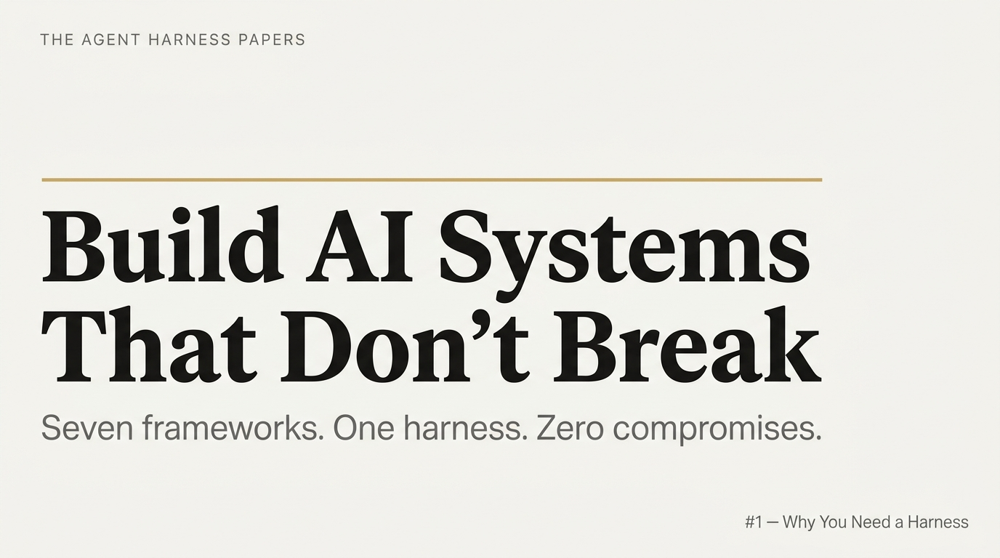

# The Agent Harness Papers

*7 frameworks. 1 personal AI operating system. 5 months of production use.*

---

A 10-part series documenting how seven independent open-source AI agent frameworks were studied, synthesized, and forged into **[C31](https://github.com/ChianW/Cystem31)** — a personal agent harness system.

In 2025, I made a decisive move: I let my investment firm become a company of just me and Agents. The first week revealed the central problem — AI was brilliant at generating code and completely incapable of remembering anything. This series is the story of what I built in response.

---

## The Series

| Part | Title | Core Idea |
|------|-------|-----------|
| [Part 0](part0_introduction.md) | Why You Need an Agent Harness | The stateless problem. Why prompts aren't enough. |
| [Part 1](part1_12_factor_agents.md) | 12-Factor Agents | Treat agents as software systems, not magic |
| [Part 2](part2_superpowers.md) | Superpowers — The Psychology Hack | Cialdini's 6 principles applied to LLM behavioral control |
| [Part 3](part3_ecc.md) | Everything Claude Code | 225k stars. 246 skills. AI agent Linux. |
| [Part 4](part4_agent_skills.md) | Agent Skills | Anti-rationalization. Doubt-Driven Development. |
| [Part 5](part5_cep.md) | Compound Engineering | Knowledge that compounds with every solved problem |
| [Part 6](part6_archon.md) | Archon | Deterministic pipelines. No autonomous lifecycle mutation. |
| [Part 7](part7_gsd_core.md) | GSD Core | Naming Context Rot. Artifacts over Memory. |
| [Part 8](part8_comparison.md) | All 7 Frameworks Compared | Bubble chart. Axes: abstract↔concrete, narrow↔full coverage. |
| [Part 9](part9_building_c31.md) | From Zero to C31 | The complete origin story of the harness. |

---

## The 2026 Consensus

Seven independent projects, converging on five conclusions:

1. **Architecture beats prompts.** Reliability comes from structure — control flow, quality gates, state management.
2. **Agents need persistent state.** Session-scoped memory is not enough. Instincts and decisions must survive across conversations.
3. **Multi-agent orchestration beats monolithic agents.** Delegation is an architectural requirement, not a feature.
4. **Human-in-the-loop is first-class.** The boundary between "AI decides" and "AI pauses for human input" must be explicit.
5. **Knowledge compounds — if you capture it.** The final step of every workflow should leave the system better than it found it.

---

## The System

→ **[ChianW/Cystem31](https://github.com/ChianW/Cystem31)** — the agent harness built from this research

→ **[chian.io](https://chian.io)** — the knowledge platform

---

## License

CC BY 4.0 — share and adapt with attribution.
