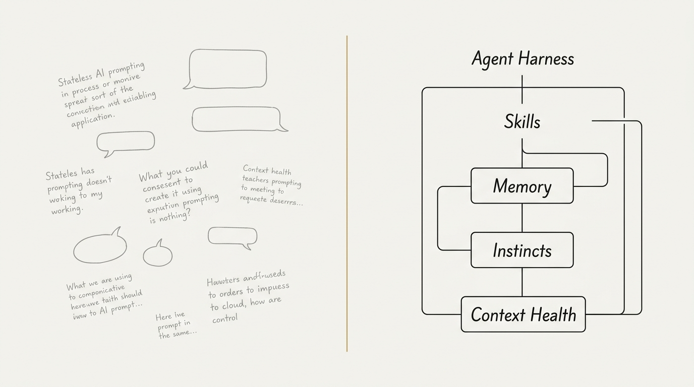

# The Agent Harness Papers, Part 0: Why You Need an Agent Harness

*Series: The Agent Harness Papers — 7 frameworks, 1 personal AI operating system, 5 months of production use*

---

---

You wrote 1,000 prompts for your AI. Carefully crafted system instructions. Detailed coding guidelines. A beautiful `CLAUDE.md` file with your team's conventions.

Then the conversation hit the context limit. You started a new session.

And the AI forgot everything.

Not just your prompts — your decisions. Your architectural context. The three approaches you already tried and rejected. The naming convention you spent 20 minutes agreeing on. The bug pattern you discovered last Tuesday.

Gone.

This is the fundamental problem with prompt collections: **they are stateless**. Every session starts from zero. The AI never gets smarter. You never compound your experience.

This is the problem that Agent Harness systems solve.

---

## Prompt Collection vs. Agent Harness

A prompt collection gives you one-shot instructions. Copy, paste, use, forget.

An agent harness gives you a **persistent operating layer** between you and your AI tool. It remembers. It learns. It enforces quality. It compounds knowledge.

| | Prompt Collection | Agent Harness |
|---|---|---|
| **Memory** | None — every session is fresh | Persistent — `session_state.json`, diary, instincts |
| **Learning** | Static — same quality forever | Evolving — patterns graduate from candidate → instinct |
| **Quality** | Hope-based — you trust the AI did it right | Gate-based — Critic Gate, review passes, verification evidence |
| **Knowledge** | Lost — solutions disappear with the conversation | Compounded — `docs/solutions/` with searchable INDEX |
| **Context** | Unmanaged — degrades as conversation grows | Monitored — 🟢🟡🟠🔴 four-state health system |

The difference is not incremental. It's architectural.

---

## The Three Pain Points

Every developer who uses AI coding tools daily hits the same three walls:

### 1. No Memory

Your AI doesn't remember that you prefer functional components over class components. It doesn't know you switched from Jest to Vitest last week. It doesn't recall the three-hour debugging session where you discovered your ORM silently swallows connection errors.

Every session, you re-explain. Re-establish context. Re-make decisions you already made.

This isn't a prompt problem. It's a **state persistence** problem.

### 2. No Quality Gates

Your AI writes code that looks correct. Sometimes it is. Sometimes it introduces subtle bugs that pass your initial review because you're tired and the code is plausible.

There's no automated self-review. No Critic Gate that triggers when the AI makes inferred conclusions. No behavioral verification that demands test evidence for every code change. No anti-sycophancy mechanism that prevents the AI from agreeing with your bad ideas just to avoid conflict.

This isn't a capability problem. It's a **process engineering** problem.

### 3. No Knowledge Compounding

You solved a tricky CORS configuration issue on Monday. On Thursday, your teammate hits the same issue. The AI doesn't know. Your solution lives in a Slack thread that nobody will find.

Six months later, you hit the same issue yourself. You don't remember the fix. The AI doesn't either.

Every solved problem should make the next occurrence faster. But without a compounding mechanism, your team's institutional knowledge has a half-life of about two weeks.

This isn't a documentation problem. It's a **knowledge architecture** problem.

---

## The 2026 Consensus

In 2025-2026, seven independent open-source projects attacked these problems from different angles. They had different authors, different philosophies, different star counts. But they converged on the same conclusions:

**1. Architecture beats prompts.**

Reliability doesn't come from better wording. It comes from structure — explicit control flow, quality gates, state management. You don't prompt your way to production-grade agents. You engineer them.

**2. Agents need persistent state.**

Session-scoped memory is not enough. Instincts, learnings, and decisions must survive across conversations. The agent should get smarter over time, not reset to baseline every session.

**3. Multi-agent orchestration beats monolithic agents.**

A specialized small agent that does one thing well outperforms a single agent trying to brainstorm, code, test, review, and document all in one context window. Delegation is not a feature — it's an architectural requirement.

**4. Human-in-the-loop is a first-class operation.**

Irreversible actions need approval gates. This isn't a safety afterthought — it's a core design primitive. The best systems make the boundary between "AI decides autonomously" and "AI pauses for human input" explicit and configurable.

**5. Knowledge compounds — if you capture it.**

The final step of every workflow should leave the system better than it found it. Document the solution. Index it. Make it searchable. The next time the same class of problem appears, it should take minutes, not hours.

These aren't theoretical principles. They emerged from thousands of hours of real-world production use across seven independent teams.

---

## The Seven Frameworks

This series examines each framework in depth — its philosophy, its unique mechanism, its honest limitations, and what it contributed to the broader ecosystem:

| Part | Framework | Stars | The One-Line Pitch |
|------|-----------|-------|-------------------|
| **1** | [12-Factor Agents](https://github.com/humanlayer/12-factor-agents) | ~24k | The architectural manifesto — `f(context) → action` |
| **2** | [Superpowers](https://github.com/obra/superpowers) | ~249k | Cialdini's psychology applied to LLM behavioral compliance |
| **3** | [Everything Claude Code](https://github.com/affaan-m/ecc) | ~225k | The most comprehensive agent operating layer — 246 skills |
| **4** | [Agent Skills](https://github.com/addyosmani/agent-skills) | ~70k | Anti-Rationalization Tables that stop AI from cutting corners |
| **5** | [Compound Engineering](https://github.com/everyinc/compound-engineering-plugin) | ~23k | The "Compound" step — making future work easier, every time |
| **6** | [Archon](https://github.com/coleam00/Archon) | ~23k | YAML-defined workflows — Dockerfiles for AI coding |
| **7** | [GSD Core](https://github.com/open-gsd/gsd-core) | ~6k | Context Rot as a named, first-class engineering problem |

Part 8 compares all seven. Part 9 tells the story of how one developer audited all of them in 48 hours and forged them into a single system called [C31](https://github.com/ChianW/C31).

---

## Who This Series Is For

- **AI-assisted developers** who use Claude Code, Cursor, Gemini CLI, or similar tools daily and want to move beyond one-shot prompting
- **Engineering leads** evaluating how to standardize AI tooling across a team
- **Framework authors** looking for cross-pollination ideas
- **Anyone curious** about what happens when you treat AI not as a chatbot, but as a software system that needs engineering

Let's begin.

→ **[Part 1: 12-Factor Agents — The Architectural Manifesto](part1_12_factor_agents.md)**
