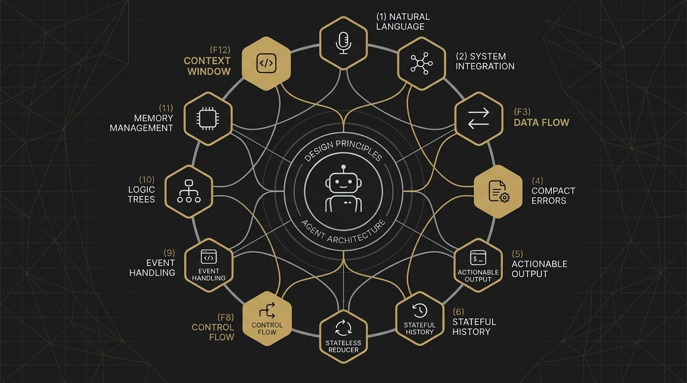

# Agent Harness Papers, Part 1: 12-Factor Agents

**The design manifesto that treats AI agents as software systems — not magic.**



---

In 2011, Adam Wiggins published *The Twelve-Factor App* while working at Heroku. It wasn't a framework. It wasn't a library you could `npm install`. It was a set of opinions — twelve of them — about how web applications should be built if you wanted them to survive contact with production. It became the backbone of cloud-native thinking. Every PaaS, every container orchestrator, every "serverless" pitch deck since then has been, in some way, a response to those twelve factors.

In 2025, Dex Horthy did the same thing for AI agents.

His project, [12-Factor Agents](https://github.com/humanlayer/12-factor-agents), sits at ~24k GitHub stars. There is no package to install. No SDK. No `pip install twelve-factor-agents`. It's a design manifesto — a set of hard-won opinions about why your agent keeps failing in production, and what to do about it.

This is Part 1 of the **Agent Harness Papers** series. We're starting here because everything else in the series — the frameworks, the orchestrators, the evaluation harnesses — exists in the gravitational field of this document. You can't evaluate what you haven't designed well. And right now, most agents are not designed well.

---

## The Origin: 100 Founders and a Pattern of Failure

Horthy didn't write these factors in a vacuum. As the founder of [HumanLayer](https://humanlayer.dev) — a platform for human-in-the-loop AI workflows — he had a front-row seat to how production agents actually fail. He interviewed over 100 SaaS founders who were building agents for real businesses: customer support, sales automation, document processing, internal tooling.

The pattern was consistent. The failure mode wasn't what you'd expect.

> Agents don't fail because the LLM is too dumb. They fail because developers treat the LLM as the control plane instead of a component.

The founders weren't struggling with prompt engineering. They weren't blocked on model capability. They were drowning in the *software engineering* problems that surround the model:

- State management across multi-step workflows
- Error recovery when a tool call fails on step 7 of 12
- Context windows ballooning with irrelevant conversation history
- No way to pause a workflow, get human approval, and resume
- Agents that worked in demos but hallucinated their way through edge cases in production

These aren't AI problems. These are software architecture problems. And Horthy's core insight was deceptively simple:

**Stop building "autonomous agents." Start building software systems that use LLMs for specific decisions.**

---

## The Core Insight: LLM as Router, Not Autopilot

The dominant mental model in 2024 was the *agentic loop*: give the LLM a goal, some tools, and let it figure out the steps. AutoGPT, BabyAGI, and their descendants all followed this pattern. The LLM plans. The LLM decides what to do next. The LLM is the control flow.

Horthy's manifesto inverts this. In 12-Factor Agents, the LLM's job is narrow and specific:

**Convert natural language into structured tool calls.**

That's Factor 1, and it's the foundation everything else builds on. The LLM doesn't decide *what to do* — your code decides what to do. The LLM decides *how to express* a decision in structured output. It's a router, not a pilot.

This is a philosophical shift with enormous practical consequences. When the LLM is the autopilot, every failure is an AI problem — inscrutable, non-reproducible, and fixed by "better prompting." When the LLM is a router inside a well-architected system, failures become software bugs — traceable, testable, and fixable with regular engineering.

---

## The 12 Factors at a Glance

Before we deep-dive into three critical factors, here's the complete map:

| # | Factor | One-Liner |
|---|--------|-----------|
| 1 | Natural Language → Tool Calls | The LLM's job is to convert intent into structured actions. |
| 2 | Own Your Prompts | No framework-injected system prompts. You write every token. |
| 3 | Own Your Context Window | Curate what goes in. Don't just append. |
| 4 | Tools Are Just Structured Outputs | A "tool call" is just JSON. The execution is your code. |
| 5 | Unify Execution and Business State | Your agent's state *is* your application state. One source of truth. |
| 6 | Launch/Pause/Resume | Agents must support interruption as a first-class operation. |
| 7 | Contact Humans with Tool Calls | HITL isn't an escape hatch — it's a tool the agent can invoke. |
| 8 | Own Your Control Flow | Explicit state machines, not open-ended loops. |
| 9 | Compact Errors into Context | Errors aren't fatal — they're information for the next step. |
| 10 | Small, Focused Agents | 3–10 steps. If it's bigger, decompose. |
| 11 | Trigger from Anywhere | Webhooks, cron, API calls, Slack — the entry point shouldn't matter. |
| 12 | Agent as Stateless Reducer | `reduce(state, event) → new_state`. Pure function. No hidden state. |
| 13 | Pre-fetch Context *(bonus)* | Gather relevant data before the LLM sees the prompt. |

Each factor is a constraint. And like the best constraints, they're liberating once you accept them. Let's go deep on the three that matter most.

---

## Deep Dive: Factor 3 — Own Your Context Window

This is where most agent architectures silently rot.

The default behavior in every agent framework is *append*. User says something → append to messages. Tool returns something → append to messages. Error happens → append to messages. The context window grows monotonically until you hit the token limit, at which point the framework either truncates from the front (losing critical instructions) or summarizes (losing critical details).

Factor 3 says: **stop appending. Start curating.**

Your context window is not a conversation log. It's a *working memory* that you engineer for each LLM call. You decide what goes in, what gets compressed, and what gets evicted. The metaphor isn't a chat history — it's a surgical briefing.

### What This Looks Like in Practice

Instead of:

```
messages = [system_prompt] + all_previous_messages + [new_user_message]
```

You build each context window deliberately:

```python
def build_context(state, current_step):
    return [
        system_prompt_for_step(current_step),
        relevant_state_summary(state),
        recent_errors_if_any(state),
        current_task_description(state),
        available_tools_for_step(current_step),
    ]
```

Notice what's missing: all the intermediate chatter. The "Okay, I'll do that" responses. The tool calls from step 2 that are irrelevant to step 7. The verbose error stack traces that have already been parsed and compacted.

### Context Health: A Color System

In production systems that adopt this factor, context health becomes a monitorable metric:

| Status | Threshold | Behavior |
|--------|-----------|----------|
| 🟢 Green | <50% capacity | Normal operation |
| 🟡 Yellow | 50–70% | Begin compressing completed work into summaries |
| 🟠 Orange | 70–85% | Active compression: move decisions to external state, archive assumptions |
| 🔴 Red | >85% | Force checkpoint: serialize state to storage, then continue with fresh context |

This isn't theoretical. The C31 engineering system (which we'll cover later in this series) implements exactly this color system as an operational protocol. When context hits orange, agents proactively externalize their working state — not because they ran out of tokens, but because *attention quality degrades long before the hard limit*.

### Why This Factor Is Hard

Because it requires you to understand your domain deeply enough to know what's relevant at each step. You can't just throw everything at the LLM and hope attention mechanisms sort it out. You need to make editorial decisions about information hierarchy. That's engineering work, not prompt engineering.

---

## Deep Dive: Factor 8 — Own Your Control Flow

This is the factor that most directly attacks the "agentic loop" paradigm.

In a typical agent framework, control flow looks like this:

```
while not done:
    response = llm.chat(messages)
    if response.has_tool_calls():
        results = execute_tools(response.tool_calls)
        messages.append(results)
    else:
        done = True
```

It's elegant. It's general. And it's a production nightmare.

The problem is that `while not done` is doing all the work, and the LLM is making all the decisions about when to stop, what to do next, and how to recover from errors. You've abdicated control flow to a stochastic system. Your agent's behavior is now *emergent* rather than *designed*.

Factor 8 says: **make the control flow explicit.** Use state machines. Use directed graphs. Use plain `if/else` statements. Whatever makes the transitions visible and testable.

### The State Machine Alternative

```python
class AgentState(Enum):
    GATHERING_REQUIREMENTS = "gathering_requirements"
    ANALYZING_DATA = "analyzing_data"
    GENERATING_REPORT = "generating_report"
    AWAITING_APPROVAL = "awaiting_approval"
    EXECUTING_ACTION = "executing_action"
    DONE = "done"

def step(state: AgentState, context: dict) -> AgentState:
    match state:
        case AgentState.GATHERING_REQUIREMENTS:
            # LLM extracts structured requirements from user input
            requirements = llm_extract_requirements(context)
            context["requirements"] = requirements
            return AgentState.ANALYZING_DATA

        case AgentState.ANALYZING_DATA:
            # Deterministic code fetches and processes data
            data = fetch_data(context["requirements"])
            context["analysis"] = analyze(data)
            return AgentState.GENERATING_REPORT

        case AgentState.AWAITING_APPROVAL:
            # Agent pauses. Resumes when human approves.
            if context.get("approved"):
                return AgentState.EXECUTING_ACTION
            return AgentState.AWAITING_APPROVAL  # stay paused

        # ... and so on
```

Look at what changed:

1. **Every possible state is enumerated.** No surprise emergent states.
2. **Transitions are explicit.** You can draw a diagram of this system. You can test each transition independently.
3. **The LLM is used surgically.** It extracts requirements in one step. It generates a report in another. It doesn't decide the overall flow.
4. **Pausing is trivial.** `AWAITING_APPROVAL` is just a state. Serialize the context, shut down the process, resume when the human responds. No WebSocket connections to maintain, no long-running processes to babysit.

### The 3–10 Step Heuristic

Factor 10 reinforces this: if your agent needs more than 10 steps, it's too big. Break it into smaller agents that each own a sub-workflow. This isn't about capability — modern LLMs can handle complex reasoning. It's about *debuggability*. When your 47-step agent fails on step 31, good luck figuring out what went wrong. When your 7-step agent fails on step 4, the blast radius is contained and the fix is obvious.

---

## Deep Dive: Factor 12 — Agent as Stateless Reducer

This is the architectural capstone. If you accept only one factor, make it this one.

```
new_state = reduce(current_state, event)
```

Your agent is a pure function. It takes the current state and an event (user message, tool result, timer tick, webhook payload), and it returns a new state. No hidden variables. No in-memory caches that survive between invocations. No global `conversation_history` list that accumulates across calls.

### Why Stateless?

Three reasons, all of them operational:

**1. Reproducibility.** If `reduce(state, event)` is pure, you can replay any failure by feeding the same state and event. This is impossible with stateful agents because the failure depends on the accumulated memory of every previous interaction.

**2. Scalability.** Stateless reducers can run anywhere. Spin up a new container, feed it the state, get the result. No sticky sessions. No affinity requirements. No "this agent must run on the same machine because it has in-memory state."

**3. Durability.** When you serialize state between every step, you get free crash recovery. The process dies on step 5? No problem — read the state from storage, re-dispatch the event. The work already done isn't lost because it was persisted as state, not held in memory.

### What State Looks Like

```json
{
  "agent_id": "invoice-processor-abc123",
  "current_step": "awaiting_approval",
  "created_at": "2025-06-15T10:30:00Z",
  "context": {
    "invoice_id": "INV-2025-0847",
    "extracted_fields": {
      "vendor": "Acme Corp",
      "amount": 14250.00,
      "due_date": "2025-07-15"
    },
    "validation_results": {
      "vendor_match": true,
      "amount_within_policy": true,
      "duplicate_check": "clear"
    }
  },
  "pending_action": "human_approval",
  "error_log": []
}
```

This is the entire truth of the agent. No hidden state. No in-memory conversation buffer. A fresh process can pick this up and know exactly what to do next. This is what Horthy means by "Agent as Stateless Reducer" — the agent is a function, the state is a document, and every execution is a fresh reduction.

### The Anti-Pattern: "I Remember You Said..."

If your agent ever says "I remember from earlier that you preferred X" and that "memory" comes from anything other than serialized external state — you have hidden state. And hidden state is where production bugs go to hide.

---

## C31 Integration: How a Real System Adopted These Principles

The 12 Factors are abstract by design — they're principles, not implementations. The C31 engineering system (a compound engineering framework used in production by several teams) provides a concrete case study of how these factors translate into operational protocols.

### F3 → Context Health Color System

C31 implements Factor 3 as a literal traffic-light monitoring system for context windows. Agents track their context utilization in real-time and trigger automated compression behaviors at each threshold. At 🟡 Yellow, completed work is compressed into one-line summaries. At 🟠 Orange, decisions are externalized to files. At 🔴 Red, a full checkpoint is forced — state is serialized to `session_state.json` before proceeding.

This is F3 operationalized: context isn't just curated, it's *governed*.

### F5 → Session State Writeback

C31's `session_state.json` is the single source of truth for cross-session continuity. When a skill (a reusable workflow unit) completes execution, its results — document paths, modified files, new knowledge artifacts — are written back to `session_state.json` under `completed_tasks`. This directly implements Factor 5's unification of execution and business state: the agent's progress *is* the application state, and it lives in one place.

```json
{
  "last_topic": "refactoring auth module",
  "open_todos": ["update API docs", "add integration test for edge case"],
  "completed_tasks": [
    {
      "skill": "ce-compound",
      "output_path": "docs/solutions/auth/token-refresh-fix.md",
      "files_modified": ["src/auth/refresh.ts", "tests/auth/refresh.test.ts"]
    }
  ],
  "last_flush": "2025-06-15T14:30:00Z"
}
```

### F7 → Decision Boundary Structured Pause

Factor 7 says human contact should be a tool call, not an escape hatch. C31 goes further with its **Decision Boundary** protocol: every action is classified as either *Execution Layer* (reversible within 10 minutes — agent proceeds autonomously) or *Decision Layer* (irreversible or high-impact — agent pauses for human confirmation).

The pause isn't a vague "are you sure?" dialog. It's structured:

```
⏸️ [Type: File Overwrite] [Impact: Will replace production config] [Need: Confirm/Modify/Cancel]
```

This is HITL as a first-class citizen — not an afterthought bolted onto an autonomous loop, but a designed interaction pattern with clear triggers and structured output.

### F12 → Stateless Reducer as Architectural Law

C31 treats F12 as its root architectural principle. Every agent execution is `f(context) → action` with no hidden state. Cross-session continuity comes exclusively from `session_state.json` and external files. Subagents receive only the minimum context needed for their task. Any agent can be restarted from its serialized state and produce the same result.

The anti-pattern is explicitly called out: if the agent says "I remember you said earlier that..." and that memory isn't sourced from an external state file, it's unreliable and should be treated as such.

---

## Limitations and Honest Critiques

No manifesto is complete without its blind spots, and the 12-Factor Agents design has several worth acknowledging:

### 1. The State Machine Trap

Factor 8 (Own Your Control Flow) can be taken too far. Explicit state machines are great for well-understood workflows. But some domains are genuinely exploratory — research, open-ended analysis, creative work — where you *don't know* the states upfront. Forcing a state machine onto an inherently open-ended process can produce brittle, over-specified systems that are just as bad as the agentic loops they replace.

The mitigation: use state machines for the *outer workflow* and allow bounded agentic loops for *inner steps*. Let the LLM explore within a step, but don't let it choose the next step.

### 2. No Framework = No Guardrails

The manifesto's deliberate refusal to provide a reference implementation is both its strength and its weakness. Developers who understand the principles can implement them in any language, any stack. But developers who are new to agent architecture may struggle to translate principles into code without concrete examples. There's a gap between "own your context window" and knowing *how* to own it.

### 3. The Complexity Cost of Statelessness

Factor 12's stateless reducer pattern adds real complexity. Serializing and deserializing state between every step, managing state storage, handling version migrations when your state schema changes — these are non-trivial engineering costs. For a quick internal tool or a prototype, this overhead may not be justified. The factors are optimized for production systems that need to run reliably for months, not for hackathon projects.

### 4. HITL Latency

Factor 7 (Contact Humans with Tool Calls) introduces human response time into the critical path. For workflows where speed matters — real-time customer support, time-sensitive trading — waiting for human approval at a decision boundary can be a dealbreaker. The manifesto acknowledges this implicitly (Factor 6's pause/resume mechanism is designed for it), but doesn't offer much guidance on *when* to automate vs. when to ask.

### 5. The "Small Agents" Decomposition Problem

Factor 10's 3–10 step heuristic is useful, but it pushes complexity from *within* agents to *between* agents. Agent orchestration — deciding which sub-agent to invoke, how to pass state between them, how to handle partial failures in a chain — is its own circle of engineering hell. The manifesto doesn't address multi-agent coordination in depth.

---

## The Bottom Line

The 12-Factor Agents manifesto succeeds because it asks the right question. Not "how do we make LLMs more autonomous?" but "how do we build reliable software systems that happen to use LLMs?"

It's not the answer to every agent architecture challenge. But it's the starting point. If you're building agents for production, you should read it the same way you'd read *The Twelve-Factor App* before deploying to the cloud — not as scripture, but as a set of constraints that will save you from the most common and most expensive failure modes.

The agents that survive production won't be the cleverest. They'll be the most well-engineered.
