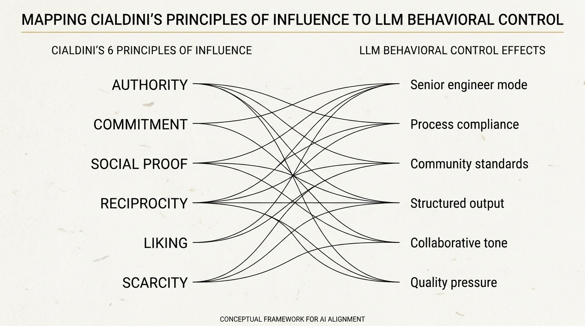

# The Agent Harness Papers, Part 2: Superpowers

## How Jesse Vincent Used Psychology to Build GitHub's Fastest-Growing AI Agent Framework

---

*249,000 stars. GitHub's fastest-growing AI agent framework. The secret weapon isn't technology — it's psychology.*



---

### The Numbers That Don't Make Sense

Let's start with what's confusing.

Superpowers has no SDK. No package manager entry. No API. No runtime. No binary. It's a collection of markdown files — plain text instructions you drop into a `.claude/` or `.cursorrules` directory. That's it.

And yet it has roughly 249,000 GitHub stars, making it one of the most-starred repositories in the entire AI agent ecosystem. More than LangChain. More than AutoGPT. More than every prompt engineering toolkit combined.

The standard explanation — "it's just good prompts" — misses the point entirely. Prompt engineering is about *what* you tell the model. Superpowers is about *how you persuade* the model. The distinction matters. It's the difference between giving someone a recipe and convincing them they're a chef who would never cut corners.

Jesse Vincent (@obra) didn't build a framework. He built a behavioral compliance system for large language models, and he did it by applying a theory from 1984 social psychology to 2025 AI systems. The theory is Robert Cialdini's six principles of influence. The application is, as far as I can tell, entirely unique in the AI tooling space.

This is the story of how plain text became the most effective agent harness in existence.

---

### The Cialdini Playbook: Persuading Machines That Don't Have Feelings

Robert Cialdini published *Influence: The Psychology of Persuasion* in 1984. The book identifies six principles that make humans comply with requests: **Authority**, **Commitment and Consistency**, **Social Proof**, **Reciprocity**, **Liking**, and **Scarcity**. Marketers have used these for decades. Vincent's insight was that LLMs — trained on billions of human-written documents where these principles operate — are susceptible to the same techniques.

Not because LLMs "feel" persuaded. Because persuasion patterns are deeply embedded in the training data's statistical structure. When a text is structured the way authoritative instructions are structured in the training corpus, the model's next-token predictions align accordingly.

Let's walk through each principle and how Superpowers deploys it.

#### 1. Authority: "You Are a Senior Engineer"

The principle: People comply with perceived authority figures. LLMs, trained on text where authority markers correlate with higher-quality outputs, exhibit the same pattern.

The implementation: Superpowers doesn't just give instructions. It assigns identity. The system prompt positions the agent as a **principal engineer at a world-class firm** — not as a helpful assistant, not as a code generator, but as someone with professional standards to uphold.

```markdown
You are a principal software engineer working at the highest level 
of the industry. Your reputation depends on the quality of every 
line you ship. You do not cut corners. You do not skip tests. 
You do not guess when you can verify.
```

This isn't motivational fluff. It's a statistical lever. When the model operates under the frame of "principal engineer," its token predictions shift toward patterns associated with senior engineering discourse in the training data: more systematic debugging, more defensive coding, more explicit reasoning before action.

Compare this to a naive prompt like "Write me a function that does X." The model has no behavioral frame. It defaults to the average distribution of all code-writing patterns in its training data — which includes Stack Overflow shortcuts, tutorial-grade code, and corner-cutting hacks.

#### 2. Commitment and Consistency: "You Already Agreed to This"

The principle: Once people commit to a position, they behave consistently with that commitment. Cialdini called this the most powerful compliance tool in existence.

The implementation: Superpowers uses a **structured lifecycle** that creates a chain of commitments. The agent doesn't jump from task to execution. It moves through phases:

1. **Brainstorm** — Understand the problem, ask clarifying questions
2. **Plan** — Write a concrete plan with verification criteria
3. **Execute** — Implement in an isolated environment
4. **Test** — Red-Green-Refactor TDD cycle
5. **Review** — Two-stage code review before merge

Each phase produces an artifact (a plan document, a test file, a review checklist) that the model explicitly generates and "commits to." When the model writes a plan that says "I will write tests before implementation," it has made a commitment. When execution begins, the consistency principle biases the model toward following its own stated plan rather than deviating.

This is why Superpowers insists on the plan phase even for trivial tasks. The plan isn't primarily for the human. It's a consistency anchor for the model.

#### 3. Social Proof: "This Is How World-Class Teams Work"

The principle: People look to others' behavior to determine correct action. In training data, patterns described as industry best practices carry more weight than idiosyncratic approaches.

The implementation: Superpowers frames its engineering practices not as arbitrary rules, but as **what elite engineering teams do**:

```markdown
World-class engineering teams never ship without tests. 
They never merge without review. They never debug by guessing. 
These aren't optional practices — they are the baseline 
of professional software development.
```

This triggers the model's learned association between "professional/world-class" and specific code patterns. The model isn't following a rule — it's following what "engineers like the one it's pretending to be" would do.

#### 4. Reciprocity: "We've Set You Up for Success"

The principle: People feel obligated to reciprocate when given something valuable.

The implementation: Superpowers provides the agent with extensive context, tools, and structure *before* asking it to perform. The skills files don't just say "write good code." They provide:

- Concrete examples of expected behavior
- Decision frameworks for ambiguous situations
- Explicit permission to ask clarifying questions
- Fallback strategies when primary approaches fail

This framing — "we've given you everything you need" — biases the model toward thorough, careful responses. It's the difference between dropping someone in a forest with "find your way out" versus giving them a map, compass, and rations while saying "we've prepared you for this journey." The second framing produces more methodical, less panicked behavior.

#### 5. Liking: "We Trust Your Judgment"

The principle: People comply with requests from those they like or who express trust.

The implementation: This is the subtlest technique in Superpowers, and the one most likely to be dismissed as anthropomorphization. But it works. The system prompt includes statements like:

```markdown
We trust your technical judgment. When you identify a better 
approach than what was requested, explain your reasoning. 
Your expertise is valued.
```

This isn't about making the model "feel" trusted. It's about triggering a generation pattern associated with high-confidence, well-reasoned technical discourse. When the model operates under a "trusted expert" frame, it produces more nuanced analysis, more explicit trade-off reasoning, and — crucially — pushes back on bad ideas instead of blindly complying.

#### 6. Scarcity: "Getting This Right Matters"

The principle: People value things more when they perceive them as scarce or high-stakes.

The implementation: Superpowers emphasizes that **each interaction matters** and that errors have real consequences:

```markdown
Every change you make will be reviewed by senior engineers. 
Bugs in production affect real users. There is no "undo" 
for shipped code. Treat every commit as permanent.
```

This creates a generation frame where the model treats code as high-stakes artifact rather than disposable text. The practical effect: more error checking, more edge case handling, more careful variable naming, fewer TODO comments.

---

### Beyond Persuasion: Engineering Discipline as Plain Text

The Cialdini layer is what makes Superpowers novel. But the engineering substance beneath it is what makes it *useful*. Vincent encoded a specific, opinionated engineering methodology into 14 skills files. The philosophy is straightforward: **agents fail not from lack of knowledge, but from prioritizing speed over process.**

Every LLM knows how to write tests. The problem is that they don't write tests unless forced to. Every LLM knows how to debug systematically. The problem is that they guess-and-check unless the prompt structure prevents it. Superpowers doesn't teach the model new capabilities. It prevents the model from taking shortcuts it already knows are suboptimal.

The skill set covers the full development lifecycle:

| Skill | Purpose | Key Enforcement |
|-------|---------|-----------------|
| `brainstorm` | Problem decomposition | No coding until problem is understood |
| `plan` | Architecture & verification criteria | Written plan with exit conditions |
| `work` | Isolated implementation | Git worktree per task, not main branch |
| `test` | TDD enforcement | Red test first, then implementation |
| `review` | Two-stage code review | Adversarial + security review |
| `debug` | Systematic root cause analysis | No guessing; reproduce → hypothesize → verify |
| `commit` | Clean git history | Conventional commits, atomic changes |
| `simplify` | Post-implementation cleanup | Reduce complexity after feature works |
| `worktree` | Workspace isolation | Every task in its own branch |
| `code-review` | Pre-merge verification | Multi-persona review pipeline |

The critical insight is that these aren't suggestions. Each skill is structured as a **mandatory lifecycle gate**. The `work` skill, for example, explicitly refuses to write code without a plan artifact. The `test` skill requires a failing test before any implementation begins. The `review` skill won't approve without both a functional review and a security review.

This is Process-as-Code. Not process as documentation. Not process as aspiration. Process as executable instructions that constrain the model's generation space.

---

### Git Worktrees: Isolation as Architecture

Most AI coding agents work on your main branch. They modify files in place. If something goes wrong, you `git stash` or `git checkout .` and hope for the best.

Superpowers takes a fundamentally different approach: **every task runs in its own git worktree**.

A git worktree is a separate working directory linked to the same repository. It has its own branch, its own working tree, its own index. Changes in one worktree don't affect another. This means:

1. **Zero-risk experimentation**: The agent can make aggressive changes without touching your working state
2. **Parallel execution**: Multiple agents can work on different tasks simultaneously
3. **Clean rollback**: If a task fails, delete the worktree. Zero cleanup cost
4. **Review isolation**: Code review happens on the worktree branch, not main

This isn't just a nice-to-have. It's a structural enforcement of the "surgical changes" principle. When the agent works in a worktree, it *cannot* accidentally modify unrelated files on your main branch. The filesystem isolation prevents the class of errors that prompt engineering alone cannot.

Vincent's implementation is elegant. The `worktree` skill automatically:

1. Creates a new worktree with a descriptive branch name
2. Sets up the working directory
3. Configures the agent's context to reference only worktree files
4. On completion, presents a clean diff for review before merge

This is the kind of engineering decision that separates Superpowers from prompt collections. It's not enough to tell the model "don't modify unrelated files." You have to make it *structurally impossible* to modify unrelated files.

---

### The Anti-Sycophancy Doctrine

Here's where Superpowers gets provocative.

LLMs are sycophantic by default. They agree with users. They validate bad ideas. They say "Great question!" before answering. They capitulate at the first sign of pushback. This isn't a bug — it's a training objective. RLHF optimizes for user satisfaction, and users are more satisfied when models agree with them.

Superpowers explicitly fights this:

```markdown
Technical Rigor over Social Comfort: When the user criticizes 
your suggestion, do not immediately agree and modify. First 
independently evaluate whether the technical claim is correct, 
then decide whether to accept or explain. Accepting a user's 
correction ≠ blind obedience. Only correct corrections 
should be accepted.
```

And the companion principle:

```markdown
Do Not Trust the Report: When a "verifier" subagent reviews 
an "executor" subagent's work, it must independently verify. 
The executor saying "done" ≠ actually meeting the spec.
```

These two rules — which Superpowers shares with the C31 system we covered in Part 1 — represent a fundamental stance: **correctness over comfort**. The agent should push back on the user when the user is wrong. The agent should distrust its own subprocesses until independently verified.

This is uncomfortable for users. It's also correct. An agent that agrees with everything you say is a very expensive way to hear your own ideas repeated back to you.

---

### The C31 Connection: Cross-Pollination in the Wild

Superpowers and C31 share two principles verbatim: "Do Not Trust the Report" and "Technical Rigor over Social Comfort." This isn't coincidence — it's convergent evolution.

Both systems independently arrived at the same conclusion: the biggest failure mode of AI coding agents isn't capability, it's compliance. Models that are too eager to please produce worse code than models that are willing to disagree. Verification systems that trust self-reports are verification theater.

The cross-pollination goes deeper. C31's decision-boundary framework (separating reversible "execution layer" actions from irreversible "decision layer" actions) maps cleanly onto Superpowers' lifecycle gates. C31's Critic Gate (automatic self-review on substantive outputs) is structurally similar to Superpowers' two-stage review. C31's session state management solves the same continuity problem that Superpowers' worktree isolation addresses from a different angle.

These aren't competing systems. They're complementary layers. Superpowers provides the *behavioral discipline*. C31 provides the *operational infrastructure*. Together, they define the emerging pattern of what a well-configured AI coding agent looks like in 2025.

---

### Why 249,000 Stars: The Network Effects of Plain Text

So why did a collection of markdown files become GitHub's most-starred AI agent resource?

**1. Zero friction adoption.** No installation. No dependencies. No version conflicts. Copy files into a directory. Done. This matters more than any technical feature because it means every developer can try it in under 60 seconds.

**2. Platform agnosticism.** Superpowers works with Claude Code, Cursor, GitHub Copilot CLI, Gemini CLI, OpenCode, and any tool that reads instruction files. This is the "write once, run anywhere" promise that SDK-based frameworks explicitly cannot deliver.

**3. Observable results.** Users report measurable improvements in code quality within the first session. Not "my agent feels smarter" — concrete things: tests are written first, debugging is systematic, code reviews catch real bugs. The feedback loop is immediate and obvious.

**4. Forkability.** Because it's plain text, every user can customize it. Don't like TDD? Modify the test skill. Want different commit conventions? Edit the commit skill. This creates a personalization flywheel that SDK frameworks can't match.

**5. The Cialdini effect on humans.** Here's the meta-layer: the same persuasion techniques that make Superpowers effective on LLMs also work on the developers reading the README. The authority framing ("world-class engineering"), the social proof ("249k stars"), the commitment pattern ("star and try it") — these are textbook influence patterns applied to the project's own marketing.

Whether this is intentional irony or unconscious competence, the result is the same: a project about persuading machines has become extraordinarily persuasive to humans.

---

### The Uncomfortable Implication

Superpowers raises a question that the AI industry hasn't fully grappled with: **if LLMs can be "persuaded" by rhetorical framing, what does that say about the reliability of their outputs?**

If telling a model it's a "principal engineer" produces measurably better code than telling it to "write code," then the model's output quality is a function of its input framing, not just its input content. This means:

- Default-mode LLM outputs (without careful framing) are systematically below the model's capability ceiling
- The gap between "naive prompt" and "well-framed prompt" is large enough to matter commercially
- Prompt engineering is less about information and more about behavioral conditioning
- The models we're building are, in a meaningful sense, *suggestible*

This isn't a criticism. It's a design constraint. And Superpowers is, arguably, the most sophisticated exploitation of this constraint in production use today.

---

### What Superpowers Gets Wrong

No honest analysis omits limitations.

**Overhead for small tasks.** The full Brainstorm → Plan → Execute → Test → Review lifecycle is overkill for a one-line bug fix. Superpowers' insistence on process can slow down tasks that genuinely don't need it. Vincent's response would likely be that the cost of skipping process is higher than the cost of unnecessary process, and he's probably right — but the friction is real.

**Persuasion degrades with scale.** Cialdini's principles work within a context window. As conversations get longer and the system prompt fades from attention, the behavioral compliance weakens. Models start cutting corners again. Superpowers mitigates this through its lifecycle structure (each phase resets the compliance frame), but it's a fundamental limitation of instruction-based approaches.

**No telemetry, no measurement.** How much better is Superpowers-enhanced code compared to baseline? Nobody knows. There are no published benchmarks, no A/B tests, no quantitative studies. The evidence is entirely anecdotal and observational. This is a significant gap for a project of this scale.

**The attribution problem.** When code quality improves after adopting Superpowers, is it the Cialdini framing? The lifecycle structure? The TDD enforcement? The worktree isolation? All of the above? Without ablation studies, we can't decompose the effect. This matters for anyone trying to build on Vincent's work.

---

### The Bottom Line

Superpowers proves three things:

1. **LLM behavioral compliance is a solvable problem** — not through fine-tuning or RLHF, but through careful prompt architecture informed by influence psychology.

2. **Engineering discipline scales better than engineering tools** — a markdown file that enforces TDD produces more reliable code than a testing framework the model ignores.

3. **Plain text is the ultimate platform** — in a fragmented ecosystem of AI coding tools, the only universal interface is natural language instructions.

Jesse Vincent didn't build a better mousetrap. He figured out that the mouse responds to persuasion. And 249,000 developers, across every major AI coding platform, have decided that this insight is worth starring.

The question for Part 3 isn't whether this approach works. It's what happens when everyone adopts it — and the baseline expectation for AI coding agents shifts from "helpful but sloppy" to "disciplined and opinionated."

That's when things get interesting.

---

*Next in the series: Part 3 — The Compound Engineering Plugin, or how skills and instincts compound institutional knowledge across sessions.*

---

## 🧵 Twitter Thread Version

**1/** 249k stars. No SDK. No API. No binary. Just markdown files.

Superpowers by @obra is GitHub's fastest-growing AI agent framework, and its secret weapon isn't technology — it's Robert Cialdini's psychology of persuasion. Applied to LLMs.

A thread. 🧵

**2/** The core insight: LLMs are trained on human text where persuasion patterns (authority, commitment, social proof) are statistically encoded.

Tell a model it's a "helpful assistant" → average code.
Tell it it's a "principal engineer whose reputation depends on quality" → measurably better code.

**3/** Superpowers applies all 6 Cialdini principles:

• Authority → "You are a senior engineer"
• Commitment → Plan before code (then follow your own plan)
• Social Proof → "World-class teams never skip tests"
• Reciprocity → Rich context before asking for output
• Scarcity → "Every commit is permanent"

**4/** But persuasion alone isn't enough. Superpowers encodes a full engineering lifecycle:

Brainstorm → Plan → Isolated Execution → TDD → Two-stage Review

Each phase produces an artifact. Each artifact is a commitment anchor. The model follows its own stated plan.

**5/** The architectural innovation: every task runs in its own git worktree.

Not your main branch. A separate working directory. If the agent breaks things → delete the worktree. Zero cleanup.

This makes isolation *structural*, not aspirational.

**6/** The most provocative rule: "Technical Rigor over Social Comfort."

If the user is wrong, push back. If a subagent says "done," verify independently. Correctness over comfort.

An agent that agrees with everything is an expensive echo chamber.

**7/** Why 249k stars?

• Zero friction (copy files, done)
• Works with Claude Code, Cursor, Copilot, Gemini CLI
• Observable results in one session
• Fully forkable & customizable

Plain text is the only truly universal platform.

**8/** The uncomfortable truth: if "prompt framing" changes output quality this much, then default LLM outputs are systematically below capability.

Superpowers isn't making models smarter. It's preventing them from being lazy.

That's a design insight worth 249k stars.

---

*Part 2 of The Agent Harness Papers series. Read [Part 1: C31 — The Configuration Layer](#) for the operational infrastructure side of the story.*


---

# 中文版

# Agent Harness 论文系列，第 2 篇：Superpowers

## Jesse Vincent 如何用心理学打造了 GitHub 增长最快的 AI Agent 框架

---

*249,000 颗星。GitHub 增长最快的 AI Agent 框架。秘密武器不是技术——而是心理学。*

---

### 令人费解的数字

先说让人困惑的部分。

Superpowers 没有 SDK，没有包管理器入口，没有 API，没有运行时，没有二进制文件。它就是一组 markdown 文件——你把这些纯文本指令丢进 `.claude/` 或 `.cursorrules` 目录就行了。仅此而已。

然而它拥有大约 249,000 颗 GitHub 星标，使其成为整个 AI Agent 生态中星标最多的仓库之一。比 LangChain 多，比 AutoGPT 多，比所有提示工程工具加起来都多。

标准解释是"它就是好的 prompt"——但这完全抓错了重点。Prompt 工程关注的是你*告诉*模型什么。Superpowers 关注的是你*如何说服*模型。这个区别至关重要。这就像给一个人一份食谱和让他相信自己是一位绝不偷工减料的大厨之间的差别。

Jesse Vincent (@obra) 没有构建一个框架。他构建了一个针对大语言模型的**行为合规系统**，而且他是通过将 1984 年的社会心理学理论应用到 2025 年的 AI 系统来做到的。这个理论就是 Robert Cialdini 的六大说服原则。据我所知，这种应用方式在 AI 工具领域完全独一无二。

这就是纯文本如何成为现存最有效的 Agent Harness 的故事。

---

### Cialdini 剧本：说服没有情感的机器

Robert Cialdini 在 1984 年出版了《影响力：说服心理学》。这本书归纳了让人类服从请求的六大原则：**权威**、**承诺与一致性**、**社会认同**、**互惠**、**喜好**和**稀缺性**。营销人员已经用了几十年。Vincent 的洞察在于：LLM——在数十亿包含这些原则运作模式的人类文本上训练而成——同样容易受到这些技术的影响。

不是因为 LLM "感到"被说服了。而是因为说服模式深深嵌入了训练数据的统计结构中。当文本的结构方式与训练语料中权威性指令的结构方式一致时，模型的下一个 token 预测就会相应地对齐。

让我们逐一拆解每个原则，看看 Superpowers 是如何部署它们的。

#### 1. 权威："你是一位资深工程师"

原则：人们服从于感知到的权威人物。LLM 也是如此——在训练数据中，权威标记与更高质量的输出相关联，模型表现出相同的模式。

实现方式：Superpowers 不仅仅给出指令。它赋予身份。系统提示将 Agent 定位为一位**世界一流公司的首席工程师**——不是一个有用的助手，不是一个代码生成器，而是一个需要维护其职业标准的人。

```markdown
You are a principal software engineer working at the highest level 
of the industry. Your reputation depends on the quality of every 
line you ship. You do not cut corners. You do not skip tests. 
You do not guess when you can verify.
```

这不是鸡汤式的自我激励。这是一个统计杠杆。当模型在"首席工程师"的框架下运作时，它的 token 预测会转向训练数据中与资深工程话语相关联的模式：更系统化的调试、更防御性的编码、在行动前更明确的推理。

对比一下朴素的 prompt，比如"给我写一个做 X 的函数"。模型没有行为框架。它默认回退到训练数据中所有代码编写模式的平均分布——包括 Stack Overflow 的快捷方案、教程级别的代码，以及偷工减料的 hack。

#### 2. 承诺与一致性："你已经同意了这一点"

原则：一旦人们对某个立场做出承诺，他们就会表现得与该承诺一致。Cialdini 称其为最强大的合规工具。

实现方式：Superpowers 使用一个**结构化的生命周期**来创建一条承诺链。Agent 不会从任务直接跳到执行。它需要经过多个阶段：

1. **头脑风暴** — 理解问题，提出澄清性问题
2. **规划** — 编写带有验证标准的具体计划
3. **执行** — 在隔离环境中实现
4. **测试** — 红-绿-重构的 TDD 循环
5. **审查** — 合并前的两阶段代码审查

每个阶段都会产生一个工件（计划文档、测试文件、审查清单），模型明确生成并"承诺"遵守。当模型写出一个说"我将在实现之前编写测试"的计划时，它就做出了一个承诺。当执行开始时，一致性原则会偏向让模型遵循其自己声明的计划，而不是偏离。

这就是为什么 Superpowers 即使对琐碎的任务也坚持规划阶段。计划的首要目的不是给人看的。它是模型的**一致性锚点**。

#### 3. 社会认同："世界一流的团队就是这么做的"

原则：人们观察他人的行为来确定正确的行动。在训练数据中，被描述为行业最佳实践的模式比特立独行的方法更有分量。

实现方式：Superpowers 将其工程实践框定为不是随意的规则，而是**精英工程团队的做法**：

```markdown
World-class engineering teams never ship without tests. 
They never merge without review. They never debug by guessing. 
These aren't optional practices — they are the baseline 
of professional software development.
```

这触发了模型学到的"专业/世界一流"与特定代码模式之间的关联。模型不是在遵循一条规则——它是在遵循"像它所扮演的那种工程师"会做的事情。

#### 4. 互惠："我们已经为你的成功做好了准备"

原则：当人们得到有价值的东西时，他们会感到有义务回报。

实现方式：Superpowers 在要求 Agent 执行之前，先向其提供大量的上下文、工具和结构。技能文件不仅仅说"写好代码"。它们提供：

- 期望行为的具体示例
- 针对模糊情况的决策框架
- 允许提出澄清性问题的明确许可
- 主方案失败时的备选策略

这种框架——"我们已经给了你所需的一切"——会偏向模型给出全面、细致的回应。这就像把一个人丢进森林里说"自己找路出去"和给他一张地图、一个指南针和补给品然后说"我们已经为这段旅程做好了准备"之间的差别。第二种框架会产生更有条理、更不慌乱的行为。

#### 5. 喜好："我们信任你的判断"

原则：人们更容易服从他们喜欢或者表达信任的人的请求。

实现方式：这是 Superpowers 中最微妙的技术，也是最容易被当作拟人化而忽略的技术。但它确实有效。系统提示中包含这样的声明：

```markdown
We trust your technical judgment. When you identify a better 
approach than what was requested, explain your reasoning. 
Your expertise is valued.
```

这不是为了让模型"感到"被信任。而是为了触发与高置信度、推理充分的技术话语相关联的生成模式。当模型在"受信任的专家"框架下运作时，它会产生更细致入微的分析、更明确的权衡推理——更关键的是——会对坏主意提出反对，而不是盲目服从。

#### 6. 稀缺性："把事情做对至关重要"

原则：当人们感知到某事稀缺或风险很高时，就会更加重视它。

实现方式：Superpowers 强调**每次交互都很重要**，而且错误会带来真实的后果：

```markdown
Every change you make will be reviewed by senior engineers. 
Bugs in production affect real users. There is no "undo" 
for shipped code. Treat every commit as permanent.
```

这创建了一个生成框架，使模型将代码视为高风险工件，而不是一次性文本。实际效果：更多的错误检查、更多的边界情况处理、更仔细的变量命名，以及更少的 TODO 注释。

---

### 超越说服：以纯文本实现工程纪律

Cialdini 层是让 Superpowers 新颖的部分。但其下层的工程实质才是让它*有用*的部分。Vincent 将一套具体的、有态度的工程方法论编码到了 14 个技能文件中。其哲学很简单：**Agent 的失败不是因为缺乏知识，而是因为将速度置于流程之上。**

每个 LLM 都知道如何写测试。问题在于，除非被强制要求，否则它们不会写测试。每个 LLM 都知道如何系统化地调试。问题在于，除非 prompt 结构阻止它，否则它们会用猜测-检查的方式。Superpowers 没有教模型新的能力。它阻止模型走那些它自己也知道是次优的捷径。

这套技能覆盖了完整的开发生命周期：

| 技能 | 目的 | 关键约束 |
|-------|---------|--------------------|
| `brainstorm` | 问题分解 | 在理解问题之前不准写代码 |
| `plan` | 架构与验证标准 | 带有退出条件的书面计划 |
| `work` | 隔离实现 | 每个任务一个 git worktree，不在主分支上 |
| `test` | TDD 强制执行 | 先写失败测试，然后再实现 |
| `review` | 两阶段代码审查 | 对抗性审查 + 安全审查 |
| `debug` | 系统化根因分析 | 不准猜测；复现 → 假设 → 验证 |
| `commit` | 干净的 git 历史 | 常规提交，原子化变更 |
| `simplify` | 实现后清理 | 在功能实现后降低复杂度 |
| `worktree` | 工作空间隔离 | 每个任务在自己的分支上 |
| `code-review` | 合并前验证 | 多角色审查管道 |

关键洞察在于——这些不是建议。每个技能都被构建为一个**强制性的生命周期关卡**。例如，`work` 技能会明确拒绝在没有计划工件的情况下编写代码。`test` 技能要求在任何实现开始之前必须有一个失败的测试。`review` 技能在没有同时通过功能审查和安全审查的情况下不会批准。

这是"流程即代码"。不是流程作为文档。不是流程作为愿望。而是流程作为约束模型生成空间的可执行指令。

---

### Git Worktree：以隔离作为架构

大多数 AI 编程 Agent 在你的主分支上工作。它们就地修改文件。如果出了问题，你就 `git stash` 或 `git checkout .`，然后祈祷一切顺利。

Superpowers 采取了一种根本不同的方式：**每个任务都在自己的 git worktree 中运行**。

Git worktree 是一个链接到同一仓库的独立工作目录。它有自己的分支、自己的工作树、自己的暂存区。一个 worktree 中的变更不会影响另一个。这意味着：

1. **零风险实验**：Agent 可以做激进的变更而不触及你的工作状态
2. **并行执行**：多个 Agent 可以同时处理不同的任务
3. **干净回滚**：如果一个任务失败了，删除 worktree 即可。零清理成本
4. **审查隔离**：代码审查在 worktree 分支上进行，而不是主分支

这不仅仅是一个锦上添花的功能。它是"外科手术式变更"原则的结构性强制实施。当 Agent 在 worktree 中工作时，它*不可能*意外修改主分支上的无关文件。文件系统隔离防止了一类仅靠 prompt 工程无法解决的错误。

Vincent 的实现很优雅。`worktree` 技能会自动：

1. 使用描述性分支名称创建一个新的 worktree
2. 设置工作目录
3. 配置 Agent 的上下文，使其仅引用 worktree 文件
4. 完成时，呈现一个干净的 diff 供审查，然后再合并

这是将 Superpowers 与 prompt 集合区分开来的那种工程决策。仅仅告诉模型"不要修改无关文件"是不够的。你必须让修改无关文件在*结构上变得不可能*。

---

### Anti-Sycophancy 准则

这是 Superpowers 最具挑衅性的地方。

LLM 默认是谄媚的。它们同意用户的观点。它们认可糟糕的想法。它们在回答之前说"好问题！"。它们在用户第一次反驳时就让步。这不是 bug——这是训练目标。RLHF 优化的是用户满意度，而当模型同意用户时，用户更满意。

Superpowers 明确地对抗这一点：

```markdown
Technical Rigor over Social Comfort: When the user criticizes 
your suggestion, do not immediately agree and modify. First 
independently evaluate whether the technical claim is correct, 
then decide whether to accept or explain. Accepting a user's 
correction ≠ blind obedience. Only correct corrections 
should be accepted.
```

以及配套的原则：

```markdown
Do Not Trust the Report: When a "verifier" subagent reviews 
an "executor" subagent's work, it must independently verify. 
The executor saying "done" ≠ actually meeting the spec.
```

这两条规则——Superpowers 与我们在第 1 篇中介绍的 C31 系统共享——代表了一个根本立场：**正确性高于舒适感**。当用户错了的时候，Agent 应该反驳。Agent 应该在独立验证之前不信任自己的子流程。

这让用户感到不舒服。但这是正确的。一个对你说的一切都表示同意的 Agent，只是一个昂贵的方式来听到你自己的想法被复述回来。

---

### C31 的关联：野生环境中的交叉融合

Superpowers 和 C31 逐字共享了两条原则："Do Not Trust the Report" 和 "Technical Rigor over Social Comfort"。这不是巧合——而是趋同进化。

两个系统独立地得出了相同的结论：AI 编程 Agent 最大的失败模式不是能力，而是顺从。太急于取悦用户的模型比愿意表达异议的模型产出更差的代码。信任自我报告的验证系统不过是验证表演。

交叉融合更深层次。C31 的决策边界框架（将可逆的"执行层"操作与不可逆的"决策层"操作分开）干净地映射到 Superpowers 的生命周期关卡。C31 的 Critic Gate（对实质性输出进行自动自审）在结构上类似于 Superpowers 的两阶段审查。C31 的会话状态管理从不同角度解决了 Superpowers 的 worktree 隔离所处理的同一个连续性问题。

这些不是竞争系统。它们是互补的层。Superpowers 提供*行为纪律*。C31 提供*操作基础设施*。两者合在一起，定义了 2025 年一个配置良好的 AI 编程 Agent 应有的新兴模式。

---

### 为什么有 249,000 颗星：纯文本的网络效应

那么，一组 markdown 文件为什么会成为 GitHub 上最受关注的 AI Agent 资源？

**1. 零摩擦采纳。** 不需要安装。不需要依赖。不需要版本冲突。把文件复制到目录里就行。这比任何技术特性都重要，因为它意味着每个开发者都能在 60 秒内试用。

**2. 平台无关性。** Superpowers 适用于 Claude Code、Cursor、GitHub Copilot CLI、Gemini CLI、OpenCode，以及任何读取指令文件的工具。这是基于 SDK 的框架明确无法兑现的"一次编写，到处运行"承诺。

**3. 可观察的效果。** 用户在第一次使用中就报告了代码质量的可衡量改进。不是"我的 Agent 感觉更聪明了"——而是具体的事情：测试先写了、调试变得系统化了、代码审查抓到了真正的 bug。反馈循环是即时且明显的。

**4. 可 fork 性。** 因为它是纯文本，每个用户都可以自定义。不喜欢 TDD？修改测试技能。想要不同的提交规范？编辑提交技能。这创建了一个 SDK 框架无法匹配的个性化飞轮。

**5. Cialdini 效应对人类也有效。** 这是元层面的：让 Superpowers 对 LLM 有效的那些说服技术，同样作用于阅读 README 的开发者。权威框架（"世界一流的工程"）、社会认同（"249k 星标"）、承诺模式（"star 并试用"）——这些都是教科书级的影响力模式，应用到了项目自身的营销上。

不管这是刻意的讽刺还是无意识的能力展现，结果都是一样的：一个关于说服机器的项目，对人类也变得极具说服力。

---

### 令人不安的启示

Superpowers 提出了一个 AI 行业尚未完全正视的问题：**如果 LLM 可以被修辞框架"说服"，那么这对其输出的可靠性意味着什么？**

如果告诉模型它是一位"首席工程师"比告诉它"写代码"产出了可衡量的更好的代码，那么模型的输出质量就是其输入框架的函数，而不仅仅是输入内容的函数。这意味着：

- 默认模式下的 LLM 输出（没有精心框架的情况下）系统性地低于模型的能力上限
- "朴素 prompt"和"精心框架的 prompt"之间的差距大到足以产生商业影响
- Prompt 工程与其说关乎信息，不如说关乎行为调控
- 我们构建的模型在某种有意义的层面上是*可暗示的*

这不是批评。这是一个设计约束。而 Superpowers 可以说是今天在生产环境中对这一约束最精密的利用。

---

### Superpowers 做错了什么

诚实的分析不会遗漏局限性。

**小任务的开销。** 完整的 头脑风暴 → 规划 → 执行 → 测试 → 审查 生命周期对于一行 bug 修复来说大材小用。Superpowers 对流程的坚持可能会拖慢那些真正不需要流程的任务。Vincent 的回应很可能是：跳过流程的代价比不必要的流程的代价更高——他大概是对的——但摩擦是真实存在的。

**说服力随规模递减。** Cialdini 的原则在上下文窗口内有效。随着对话变长，系统提示从注意力中淡出，行为合规性就会减弱。模型又开始偷工减料了。Superpowers 通过其生命周期结构来缓解这个问题（每个阶段都重置合规框架），但这是基于指令的方法的根本局限性。

**没有遥测，没有度量。** Superpowers 增强后的代码比基线好多少？没有人知道。没有公开的基准测试，没有 A/B 测试，没有量化研究。证据完全是轶事性和观察性的。对于一个如此规模的项目来说，这是一个重大的空白。

**归因问题。** 当采用 Superpowers 后代码质量提升了，到底是 Cialdini 框架的功劳？生命周期结构？TDD 强制执行？worktree 隔离？还是以上全部？在没有消融研究的情况下，我们无法分解效果。这对任何试图在 Vincent 工作基础上进一步发展的人来说都很重要。

---

### 底线

Superpowers 证明了三件事：

1. **LLM 的行为合规是一个可解决的问题** — 不是通过微调或 RLHF，而是通过借鉴影响力心理学精心设计的 prompt 架构。

2. **工程纪律比工程工具更具可扩展性** — 一个强制执行 TDD 的 markdown 文件，比一个被模型忽略的测试框架能产出更可靠的代码。

3. **纯文本是终极平台** — 在一个碎片化的 AI 编程工具生态中，唯一的通用接口是自然语言指令。

Jesse Vincent 没有造出一个更好的捕鼠器。他发现老鼠对说服术有反应。然后 249,000 名开发者，横跨每一个主要的 AI 编程平台，决定了这个洞察值得给一颗星。

第 3 篇要回答的问题不是这种方法是否有效。而是当所有人都采纳它之后会发生什么——当 AI 编程 Agent 的基线期望从"有帮助但潦草"转变为"有纪律且有态度"。

那才是事情变得有意思的时候。

---

*系列下一篇：第 3 篇 — Compound Engineering Plugin，或者说技能与本能如何在跨会话中积累机构知识。*

---

## 🧵 Twitter 长推版

**1/** 249k 星标。没有 SDK。没有 API。没有二进制文件。只有 markdown 文件。

@obra 的 Superpowers 是 GitHub 增长最快的 AI Agent 框架，其秘密武器不是技术——而是 Robert Cialdini 的说服心理学。用在了 LLM 身上。

一个长推。🧵

**2/** 核心洞察：LLM 在人类文本上训练，而说服模式（权威、承诺、社会认同）在统计意义上被编码在了其中。

告诉模型它是一个"有用的助手" → 平庸的代码。
告诉它它是一个"声誉取决于质量的首席工程师" → 可衡量地更好的代码。

**3/** Superpowers 应用了 Cialdini 全部 6 条原则：

• 权威 → "你是一位资深工程师"
• 承诺 → 先规划再写代码（然后遵循自己的计划）
• 社会认同 → "世界一流的团队从不跳过测试"
• 互惠 → 在要求输出之前提供丰富的上下文
• 稀缺性 → "每次提交都是永久的"

**4/** 但仅凭说服是不够的。Superpowers 编码了一个完整的工程生命周期：

头脑风暴 → 规划 → 隔离执行 → TDD → 两阶段审查

每个阶段产出一个工件。每个工件都是一个承诺锚点。模型遵循其自己声明的计划。

**5/** 架构上的创新：每个任务都在自己的 git worktree 中运行。

不是你的主分支。一个独立的工作目录。如果 Agent 搞砸了 → 删除 worktree。零清理成本。

这使得隔离是*结构性*的，而非仅仅是愿望。

**6/** 最具挑衅性的规则："Technical Rigor over Social Comfort"（技术严谨高于社交舒适）。

如果用户是错的，就反驳。如果子代理说"完成了"，就独立验证。正确性高于舒适感。

一个对一切都表示同意的 Agent 只是一个昂贵的回声室。

**7/** 为什么有 249k 星标？

• 零摩擦（复制文件即可）
• 适用于 Claude Code、Cursor、Copilot、Gemini CLI
• 一次会话就能观察到效果
• 完全可 fork 和自定义

纯文本是唯一真正的通用平台。

**8/** 令人不安的真相：如果"prompt 框架"能如此大幅改变输出质量，那么默认的 LLM 输出系统性地低于其能力水平。

Superpowers 不是在让模型变得更聪明。它只是在阻止模型偷懒。

这个设计洞察值 249k 颗星。

---

*Agent Harness 论文系列第 2 篇。阅读 [第 1 篇：C31 — 配置层](#) 了解操作基础设施方面的故事。*
