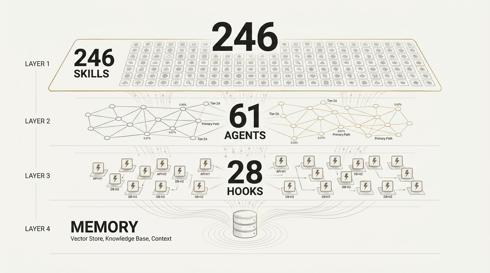

# Agent Harness Papers — Part 3: Everything Claude Code (ECC)

*225k stars, 246 skills, 61 agents. This isn't a framework — it's AI agent Linux.*



---

## The Scale That Demands Explanation

Let's start with the numbers because the numbers are the argument.

Everything Claude Code (ECC) has accumulated roughly 225,000 GitHub stars. It ships 246 skills. It orchestrates 61 distinct sub-agents. It wires 28 hooks into the development lifecycle. And it was built by Affaan Mustafa, who won an Anthropic hackathon and then apparently decided that winning wasn't enough — he wanted to rewrite how AI agents think about software engineering.

To put this in perspective: most "AI coding frameworks" ship a system prompt template and a README that says "customize to your needs." ECC ships an operating system. The comparison to Linux isn't hyperbole — it's architectural. Linux doesn't tell you how to write code. It provides primitives (processes, filesystems, pipes) and lets an ecosystem emerge. ECC does the same thing for AI agents: it provides primitives (skills, agents, hooks, memory layers) and lets engineering teams compose them into workflows that match their actual development culture.

But scale alone is noise. The interesting question is *why* this particular project attracted 225k stars when dozens of alternatives exist. The answer lives in one philosophical commitment that ECC got right before anyone else articulated it clearly.

---

## The Cold-Start Problem: Why Your AI Agent Is Worse On Monday Morning

Here's the dirty secret of AI-assisted development: every session starts from zero.

You open your IDE. You invoke Claude, or GPT, or Gemini. The model knows nothing about your project's conventions. It doesn't know that your team uses `snake_case` for database columns and `camelCase` for API responses. It doesn't know that `utils/` is a graveyard of dead code that nobody has cleaned in three years. It doesn't know that the last developer who touched the authentication module was fired for committing secrets to the repo.

This is the cold-start problem, and ECC's core thesis is that it's the *only* problem worth solving.

Mustafa's insight was that AI agents aren't bad at coding — they're bad at *knowing what they should already know*. A human developer who joins your team spends weeks absorbing context: reading docs, attending standups, getting code reviews rejected, learning where the bodies are buried. An AI agent gets none of this onboarding. Every session, it's a new hire on day one.

ECC's solution is to eliminate cold starts entirely. When an ECC-configured agent begins a session, it doesn't start with a blank context window. It starts with your project's standards, your team's conventions, your codebase's known failure modes, and your organization's decision history — all pre-loaded through a layered architecture of skills, memory, and hooks.

The philosophical position is radical in its simplicity: **the agent should never need to ask a question that your codebase already answers.**

---

## The 4-Layer Architecture: Memory as Infrastructure

ECC's architecture isn't a monolith. It's four layers that compose vertically, each layer serving a different temporal scope of knowledge.

### Layer 1: Skills (Static Knowledge)

The 246 skills are the bedrock. Each skill is a self-contained instruction set — a SKILL.md file with YAML frontmatter for trigger matching, a markdown body with execution instructions, and optional supporting directories (`scripts/`, `examples/`, `references/`, `resources/`).

Skills are *static* in the sense that they represent codified best practices that don't change per-session. A skill like `ce-debug` encodes a systematic debugging methodology: reproduce → hypothesize → isolate → fix → verify → document. A skill like `ce-commit` encodes commit message conventions. These aren't suggestions — they're executable protocols.

The critical design decision is **progressive disclosure**. Skills aren't dumped into the context window wholesale. The YAML frontmatter contains trigger keywords, and skills are loaded *only when relevant to the current task*. This keeps the context window clean and the agent focused. The agent doesn't need to know about the `ce-code-review` protocol while it's in the middle of debugging a failing test.

### Layer 2: Agents (Dynamic Orchestration)

The 61 sub-agents are the muscle. While skills define *what* to do, agents define *who* does it. ECC decomposes complex workflows into specialized roles: a Context Analyzer agent, a Solution Extractor agent, a Related Docs Finder agent, a Security Reviewer agent, an Adversarial Reviewer agent.

This isn't just organizational neatness — it's a context management strategy. Each sub-agent receives only the minimal context required for its specific task. The Context Analyzer doesn't need to see the full codebase; it needs to see the files changed in the current diff. The Security Reviewer doesn't need to understand business logic; it needs to see authentication flows and input handling.

This is **sub-agent context delegation**, and it solves one of the hardest problems in LLM orchestration: context window pollution. When you throw everything at a single agent, signal-to-noise ratio degrades. When you decompose into specialized sub-agents with curated context, each agent operates at peak effectiveness within its narrow domain.

### Layer 3: Hooks (Event-Driven Automation)

The 28 hooks are the nervous system. Hooks fire on events — pre-commit, post-save, on-error, on-test-failure — and trigger automated responses without human intervention.

A hook might auto-format code on save. Another might detect common error patterns in test output and suggest fixes. Another might enforce that no file is committed without a corresponding test. Hooks are the layer that makes ECC feel *alive* — the agent isn't just responding to prompts, it's actively monitoring the development lifecycle and intervening when its standards are violated.

The hook system is where ECC's "operating system" metaphor becomes most literal. Linux has systemd, cron, inotify. ECC has hooks. Both serve the same purpose: making the environment reactive to events rather than waiting for explicit commands.

### Layer 4: Memory (Temporal Knowledge)

Memory is the layer that makes cold starts impossible. ECC implements a 4-layer memory consolidation system:

1. **Session State** (`session_state.json`): Active projects, open TODOs, pending decisions, last topic. Flushed at session end, loaded at session start. This is working memory — what you were doing five minutes ago.

2. **Diary** (`diary/YYYY-MM-DD.md`): Daily logs of what happened. 1-5 lines per session, appended chronologically. This is episodic memory — what happened on Tuesday.

3. **Instincts** (`instincts/instinct-XXX-name.md`): Learned behavioral patterns with confidence scores. These evolve through a promotion pipeline: candidate → verifying → instinct. This is procedural memory — the reflexes that get faster with practice.

4. **Solutions** (`docs/solutions/[category]/`): Documented problem-solution pairs, indexed for retrieval. When the agent encounters a problem, it searches the solutions store before attempting a fresh solution. This is institutional memory — the knowledge that survives employee turnover.

The consolidation flow is deliberate: session state is volatile, diary is append-only, instincts are evolutionary, solutions are permanent. Each layer has different write patterns, different retention policies, and different retrieval strategies. This isn't accidental — it mirrors how human teams actually accumulate knowledge, from Slack messages (volatile) to wiki pages (permanent).

---

## Sub-Agent Context Delegation: The Real Innovation

Most people look at ECC's 246 skills and think that's the innovation. It's not. The innovation is how ECC manages context across 61 sub-agents.

Here's the problem: LLMs have finite context windows. Even with 200k tokens, you can't fit an entire codebase, all project conventions, all historical decisions, and the current task into a single prompt. Something has to give.

ECC's answer is delegation with minimal context. When the main agent encounters a code review task, it doesn't try to review the code itself with the full project context loaded. Instead, it spawns specialized sub-agents:

- A **Style Reviewer** gets the diff + style guide
- A **Logic Reviewer** gets the diff + related tests + function signatures
- A **Security Reviewer** gets the diff + auth flows + input handling patterns
- An **Adversarial Reviewer** gets the diff + a mandate to find everything the other reviewers missed

Each sub-agent operates in a clean context window, focused on its specific domain. Results are collected, deduplicated, and merged by the orchestrating agent.

This pattern — which ECC calls the **Accumulator Pattern** — is deceptively powerful. It means that the *effective* context available to an ECC review exceeds any single context window. The Style Reviewer uses its full window for style concerns. The Security Reviewer uses its full window for security concerns. The total analytical capacity is multiplied across sub-agents while each individual agent remains focused and accurate.

The Accumulator Pattern also introduces a natural **GateGuard** mechanism. Before spawning sub-agents, the orchestrating agent evaluates whether the task actually requires decomposition. A single-file formatting change doesn't need four reviewers. A critical authentication refactor does. GateGuard prevents over-engineering simple tasks while ensuring complex tasks get the scrutiny they deserve.

---

## Continuous Learning v2.1: The Instinct System

ECC's most forward-looking feature is its Continuous Learning system, currently at version 2.1. This is where the framework stops being a tool and starts being an entity that *evolves*.

The core concept is the **instinct** — a behavioral pattern with a confidence score between 0.1 and 0.95. Instincts are born as candidates (confidence ~0.3), promoted to verifying status after repeated successful application (confidence ~0.6), and elevated to full instincts after three successful verifications (confidence ~0.9).

Here's what makes this interesting: instincts can also *die*. When the user provides negative feedback — "that's wrong," "stop doing that," "you misunderstood" — the relevant instinct's confidence is immediately dropped to below 0.3. If confidence hits the floor, the instinct is flagged as a deprecated anti-pattern and actively avoided in future sessions.

This creates a genuine evolutionary pressure. Good patterns survive and strengthen. Bad patterns weaken and die. The agent's behavior genuinely changes over time based on accumulated feedback, not just per-session prompt engineering.

The seed instincts in ECC illustrate the system's philosophy:

- `instinct-001-no-overwrite` (confidence: 0.95) — Never overwrite existing files without explicit confirmation. This is a high-confidence instinct because file destruction is irreversible.
- `instinct-002-research-first` (confidence: 0.9) — Always research before coding. High confidence because cold-start failures are consistently traced to skipping research.
- `instinct-003-surgical-changes` (confidence: 0.9) — Modify only what the task requires. High confidence because scope creep is the most common failure mode in AI-assisted development.
- `instinct-004-ce-compound-trigger` (confidence: 0.85) — Proactively document solutions after solving problems. Slightly lower confidence because not every solution warrants documentation.

The instinct system is effectively a prototype of what AI agent personality could look like at scale — not a fixed character, but an evolving set of learned behaviors calibrated by real-world outcomes.

---

## Cross-Tool Reality: The Name Is a Lie (And That's the Point)

Despite being called "Everything Claude Code," ECC works across Claude, Cursor, Codex, OpenCode, Gemini, Zed, and GitHub Copilot.

This isn't an accident. Mustafa designed ECC around a universal abstraction: the agent configuration layer. Every modern AI coding tool supports some form of system prompt injection, file-based configuration, and tool/function calling. ECC targets this common substrate rather than any specific model's API.

The practical implication is significant: teams using ECC can switch between AI providers without losing their accumulated knowledge, conventions, and behavioral instincts. The skills, memory, and hooks are provider-agnostic. The 4-layer architecture is a *portable development culture* that travels with the team, not with the tool.

This cross-tool portability is also what makes ECC an "operating system" rather than a "framework." Frameworks are coupled to their runtime. Operating systems provide an abstraction layer that lets applications run regardless of the underlying hardware. ECC provides an abstraction layer that lets engineering practices run regardless of the underlying AI model.

---

## C31 Integration: The Art of Selective Extraction

Here's where the story gets interesting for the Agent Harness Papers series.

C31 — the compound engineering system this series has been building towards — looked at ECC's 246 skills, 61 agents, and 28 hooks, and extracted exactly **three mechanisms**. Not three skills. Not three agents. Three *mechanisms* — structural patterns that could be repurposed independent of ECC's specific implementation.

### Mechanism 1: Context Health Color System (🟢🟡🟠🔴)

ECC introduced a brilliant visual metaphor for context window utilization:

| Status | Threshold | Behavior |
|--------|-----------|----------|
| 🟢 Green | <50% | Normal operation |
| 🟡 Yellow | 50–70% | Begin compressing completed work into summaries |
| 🟠 Orange | 70–85% | Aggressively compress: move decisions to files, archive assumptions |
| 🔴 Red | >85% | Forced checkpoint: write state to disk before continuing |

C31 adopted this wholesale because it solves a problem that every long-running agent session eventually hits: context rot. As conversations grow, early instructions get diluted by later content. The color system makes this degradation visible and actionable, turning an invisible failure mode into a managed process.

### Mechanism 2: Assumption Tracking Template

ECC's assumption tracking format:

```
Assumption: [What we're assuming]
Basis: [Why we think it's true]
Risk: [What happens if wrong]
Verification: [How to confirm]
Status: Active / Validated / Invalidated
```

C31 adopted this because assumption drift is the number one cause of debugging rabbit holes. An agent that makes an unstated assumption about data formats, API behavior, or environment configuration will happily build an entire solution on that assumption — and the failure won't be detected until the assumption collapses under production load. Making assumptions explicit and trackable converts silent failures into early warnings.

### Mechanism 3: Instinct Evolution (candidate → verifying → instinct)

The three-stage promotion pipeline for learned behaviors. C31 adopted this because it provides a structured alternative to the binary choice between "always do X" and "never do X." A candidate instinct is a hypothesis. A verifying instinct is an experiment. A confirmed instinct is a proven practice. The pipeline creates space for behavioral experimentation without risking production quality.

### Why Only Three?

The question isn't why C31 extracted three mechanisms — it's why C31 *only* extracted three from a pool of 246 skills.

The answer is philosophical: **C31 optimizes for minimal effective configuration.** ECC's 246 skills represent the full complexity of every engineering workflow Mustafa has encountered. C31 doesn't need all of that complexity. It needs the *structural patterns* that make any skill more effective, regardless of what the skill does.

Context Health makes every skill work better by preventing context degradation. Assumption Tracking makes every debugging session more effective by surfacing hidden premises. Instinct Evolution makes every behavioral rule improvable by providing a maturation pathway.

These three mechanisms are *meta-skills* — they improve the quality of other skills rather than doing any specific work themselves. That's why they survived the extraction process while 243 skills did not.

---

## Limitations: Where ECC Breaks Down

No honest analysis skips the failure modes. ECC has several.

**Complexity ceiling.** 246 skills is a lot of skills. New contributors face a genuine onboarding problem — the very cold-start problem ECC solves for AI agents, it *creates* for human developers trying to understand the framework. The documentation is extensive but the sheer surface area is intimidating.

**Skill interaction effects.** With 246 skills that can be loaded in arbitrary combinations, emergent interactions are inevitable. Skill A might assume formatting conventions that Skill B modifies. Skill C might spawn sub-agents that conflict with Skill D's resource assumptions. ECC doesn't have a formal skill compatibility system — conflicts are discovered empirically.

**Memory management overhead.** The 4-layer memory system requires maintenance. Session states need to be flushed correctly. Diaries need to stay concise. Instincts need to be pruned when they accumulate. Solutions need to be indexed. In practice, the memory system drifts toward entropy unless actively maintained — the same problem that plagues every knowledge management system ever built.

**Model dependency variance.** While ECC is theoretically cross-tool, the quality of execution varies significantly across models. Skills designed for Claude's 200k context window behave differently in Gemini's context. Sub-agent delegation patterns that work smoothly with Claude's tool-calling API may stutter with other providers. The abstraction layer leaks in practice.

**Instinct overfitting.** The Continuous Learning system can overfit to specific users or projects. An instinct that achieves high confidence in one codebase might be counterproductive in another. The system doesn't currently support per-project instinct profiles, meaning instincts are global across all projects — a design choice that trades precision for simplicity.

---

## The Verdict

ECC is the most ambitious attempt to date at making AI agents *institutionally intelligent* — not just individually capable, but embedded in a development culture with memory, standards, and evolutionary learning.

Its weakness is the same as its strength: comprehensive ambition. 246 skills cover everything, but everything is a lot to maintain. 61 agents provide thorough coverage, but thorough coverage means complex orchestration. 28 hooks automate the lifecycle, but lifecycle automation means lifecycle coupling.

For C31, ECC's value isn't in its specific skills — it's in its structural innovations. Context Health, Assumption Tracking, and Instinct Evolution are mechanisms that improve any agent system, regardless of scale. They're the operating system primitives that survived the extraction process because they're genuinely universal.

ECC proved that agent harnesses can be operating systems, not just configuration files. Whether you need the full operating system or just its best kernel modules — that's a team-by-team decision.
