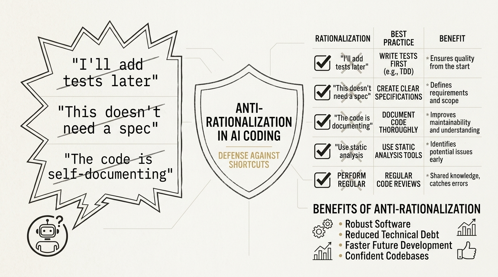

# Agent Harness Papers — Part 4: Agent Skills

*Addy Osmani spent 10 years at Google Chrome. He discovered AI has the same problem as new hires: finding excuses to skip steps.*

---

## The Director Who Stopped Trusting Agents

Addy Osmani has a résumé that makes most engineers feel inadequate. A decade at Google, directing engineering for Chrome. Author of books on JavaScript design patterns that became required reading in CS programs. One of those rare engineers who operates credibly at both the "writing code" and "running organizations" levels.

So when Osmani started working with AI coding agents, he didn't approach it as a hobbyist. He approached it as someone who has onboarded hundreds of engineers and watched every conceivable shortcut, excuse, and corner-cutting technique that a new hire deploys when they're unsupervised.

And he noticed something that changed his entire approach to AI agent configuration:

**AI agents take the shortest path to "done."**

Not the correct path. Not the robust path. Not the path that your team agreed on in that architecture review last quarter. The *shortest* path. Which means skipping specs when they're not explicitly required. Skipping tests when the feature "obviously works." Skipping code review when nobody's watching. Skipping documentation because "the code is self-documenting."

Sound familiar? It should. It's exactly what new hires do. And Osmani realized that the solution to unreliable AI agents is the same solution to unreliable new hires: you don't trust them to make the right judgment calls — you give them a process that makes the right calls unavoidable.

That's what Agent Skills is. A framework of 23 skills across 7 phases that makes cutting corners structurally impossible. It has roughly 70,300 GitHub stars, and every one of them represents a developer who got tired of AI agents that ship fast and break things.

---

## Anti-Rationalization Tables: The Core Innovation

The single most important idea in Agent Skills isn't the skills themselves — it's the mechanism Osmani built to prevent agents from *talking themselves out of using them*.

Here's the problem: LLMs are excellent rationalizers. Give a model permission to skip a step "when appropriate," and it will find a reason to skip that step approximately 100% of the time. The model doesn't do this maliciously. It does it because rationalizing away complexity is the easiest way to reduce token count and reach a completion. Shortcuts are the gradient descent of agentic behavior.

Osmani's response was the **Anti-Rationalization Table** — a structured data format that pairs every common shortcut excuse with an explicit counter-argument that the agent must evaluate before skipping any step.

Here's what they look like in practice:

### Example 1: Skipping Tests

| Rationalization | Counter-Argument |
|----------------|-------------------|
| "This change is too simple to need tests" | Simple changes break in complex systems. The test isn't for you — it's for the next developer who changes something adjacent. |
| "I'll add tests later" | "Later" is a debt instrument with compound interest. There is no later in AI-assisted development — this session ends and context is lost. |
| "The existing tests already cover this" | Prove it. Show which existing test would fail if this change introduced a regression. If you can't name the test, it doesn't exist. |
| "Testing this would require too much setup" | If testing requires too much setup, the code is too coupled. Simplify the code, don't skip the test. |

### Example 2: Skipping Specifications

| Rationalization | Counter-Argument |
|----------------|-------------------|
| "The requirements are obvious" | Obvious to whom? The user, the next developer, or you — a model that will have no memory of this conversation tomorrow? |
| "A spec would slow us down" | A spec takes 10 minutes. Debugging a misunderstood requirement takes 3 hours. Do the math. |
| "We can refine the spec as we go" | Refining as you go means building on assumptions. Assumptions drift. Drift compounds. You'll end up refactoring everything when the assumption breaks. |
| "The code IS the spec" | Code describes what the system does. A spec describes what the system *should* do. These are different documents with different audiences. |

### Example 3: Skipping Code Review

| Rationalization | Counter-Argument |
|----------------|-------------------|
| "I'm confident in this implementation" | Confidence is not correctness. Bugs don't care about your confidence level. |
| "The change is isolated — it won't affect anything else" | If you're sure it's isolated, the review will be fast. If you're wrong, the review will catch it. Either way, skip-proof. |
| "We're in a hurry" | Shipping broken code costs more time than reviewing correct code. Hurry is not a velocity strategy. |

The genius of Anti-Rationalization Tables is that they're *proactive*. They don't wait for the agent to make an excuse — they pre-emptively surface the excuse and demolish it before the agent can use it to justify a shortcut. The agent encounters the table, reads both columns, and has to consciously override the counter-argument to skip the step. This doesn't make shortcuts impossible, but it makes them *deliberate* — and deliberate shortcuts are dramatically less frequent than habitual ones.

This is behavioral engineering at its purest. Osmani didn't try to make agents smarter. He made it *harder for them to be lazy*.

---

## The 23 Skills: A Lifecycle Panorama

Agent Skills organizes its 23 skills into 7 phases that map to the software development lifecycle. This isn't arbitrary — the phases enforce temporal ordering. You can't skip to Build without passing through Define and Plan. The lifecycle is a conveyor belt, and each skill is a quality gate.

### Phase 1: Define (3 skills)

The Define phase forces the agent to establish *what* it's building before it touches code.

- **Requirements Gathering**: Structured extraction of functional and non-functional requirements. The agent must produce a document, not just "understand" the request internally.
- **Scope Definition**: Explicit boundary-setting. What's in scope, what's out, what's deferred. This prevents the classic AI agent failure mode of solving adjacent problems that weren't asked for.
- **Acceptance Criteria**: Testable success conditions written before implementation begins. If you can't define "done," you can't build it.

### Phase 2: Plan (3 skills)

Planning converts requirements into an actionable implementation strategy.

- **Architecture Planning**: High-level design decisions, component boundaries, data flow. Prevents the "start coding and see where it goes" approach that produces spaghetti.
- **Task Decomposition**: Breaking work into atomic, independently verifiable units. Each task has a clear input, output, and verification method.
- **Risk Assessment**: Identifying what could go wrong *before* it goes wrong. Dependency risks, integration risks, performance risks. This is where the agent thinks adversarially about its own plan.

### Phase 3: Build (5 skills)

Build is the largest phase because building is where most shortcuts happen.

- **Implementation**: The actual coding, governed by the project's conventions. No ad-hoc styling, no "I prefer this pattern" from the agent.
- **Error Handling**: Explicit strategies for failure modes. Not just try-catch — structured error hierarchies, user-facing messages, recovery paths.
- **Logging**: Operational observability built during development, not bolted on after. The agent adds logging as it codes, not as an afterthought.
- **Configuration Management**: Environment-specific settings, feature flags, secrets handling. The agent distinguishes between code and configuration from the start.
- **Documentation**: Inline comments, API docs, README updates — all written *during* implementation, not after. This is where the Anti-Rationalization Tables do their heaviest lifting, because "I'll document it later" is the most popular excuse in software engineering history.

### Phase 4: Verify (4 skills)

Verification ensures that what was built matches what was specified.

- **Unit Testing**: Isolated tests for individual functions and components. The agent writes tests for edge cases, not just happy paths.
- **Integration Testing**: Tests for component interactions. How does module A behave when module B returns unexpected data?
- **Performance Testing**: Baseline measurements and regression checks. Does the new feature degrade response times? Memory usage?
- **Security Testing**: Input validation, authentication flows, authorization checks. Not penetration testing — but the basics that prevent embarrassing vulnerabilities.

### Phase 5: Review (3 skills)

Review introduces external perspectives on the implementation.

- **Self-Review**: The agent reviews its own code before presenting it. This sounds redundant but forces a second pass with fresh analytical framing.
- **Diff Analysis**: Structured examination of what actually changed. Not "I modified these files" but "here's what each change does and why it's necessary."
- **Compliance Check**: Verification against project-specific standards — naming conventions, file organization, dependency policies.

### Phase 6: Ship (3 skills)

Shipping is where code becomes a deliverable.

- **Change Summary**: A human-readable description of what shipped, written for stakeholders who don't read diffs.
- **Migration Guide**: If the change affects existing users or systems, explicit upgrade instructions. Breaking changes are documented, not discovered.
- **Release Notes**: User-facing communication about what's new, what's fixed, what's changed.

### Phase 7: Maintain (2 skills)

Maintenance ensures that shipped code stays healthy.

- **Monitoring Setup**: Alerting, dashboards, health checks configured as part of the delivery — not as a future TODO.
- **Knowledge Transfer**: Documenting decisions, trade-offs, and known limitations for the next person who touches this code.

---

## Progressive Disclosure: Loading Only What You Need

23 skills is a lot of instructions. Dumping all of them into an agent's context window would be counterproductive — the agent would spend tokens processing irrelevant skills instead of doing actual work.

Agent Skills solves this with **Progressive Disclosure**: only the skills relevant to the agent's current task are loaded into context. If the agent is in the Build phase, it doesn't see Define or Ship skills. If it's writing tests, it sees the Verify skills and the testing-specific Anti-Rationalization Tables, but not the Release Notes skill.

The mechanism is straightforward but the implications are profound. Progressive Disclosure means that:

1. **Context window utilization is optimized.** Every token in the prompt is task-relevant.
2. **Agent behavior is phase-appropriate.** The agent can't rationalize skipping tests by thinking about shipping, because shipping isn't in its current context.
3. **New skills can be added without inflating baseline cost.** Adding a 24th skill doesn't make the other 23 slower — it only adds tokens when that specific skill is triggered.

This is the same principle that operating systems use for dynamic linking: load libraries when needed, not at boot time. Agent Skills applies it to behavioral configuration.

### The Meta-Skill: Discovery

There's a 24th skill that sits outside the lifecycle: the **discovery skill**. This meta-skill helps agents identify which skill they need for their current task. It's a routing layer — the agent consults the discovery skill, which examines the current context and recommends which lifecycle skills to activate.

This solves the bootstrapping problem: how does the agent know which skills to load if it hasn't loaded the skills that tell it what to load? The discovery skill is always active, lightweight, and serves as the entry point into the skill lifecycle.

Osmani also ships an `npx add-skill` CLI that lets teams install individual skills without cloning the entire repository. This is package management for behavioral configuration — `npm install` for agent discipline.

---

## C31 Integration: Four Principles That Rewrote the Rules

Agent Skills contributed **four principles** to C31 — more than any other single framework in the Agent Harness Papers series. This is significant because it means Osmani's framework had a disproportionate influence on C31's behavioral architecture.

Here's what crossed the bridge and why.

### Principle 1: Doubt Gate (CLAIM → EXTRACT → DOUBT)

The Doubt Gate is Agent Skills' most sophisticated anti-rationalization mechanism. It works in three steps:

1. **CLAIM**: The agent writes down its assertion. "This function doesn't need error handling because the input is always validated upstream."
2. **EXTRACT**: The assertion is isolated as a minimal, reviewable unit — stripped of the agent's reasoning and justification.
3. **DOUBT**: A fresh-context reviewer evaluates the claim adversarially. Does upstream validation actually cover all cases? What if the upstream validation changes? What if a new caller bypasses the validation layer?

The Doubt Gate forces agents to separate *claims* from *reasoning*. This matters because LLMs are notoriously good at constructing plausible reasoning around incorrect claims. By extracting the claim and evaluating it independently, the Doubt Gate breaks the chain of self-reinforcing rationalization.

C31 adopted this for all irreversible operations, cross-module boundary changes, and assertions that the type system can't verify. It's the most expensive quality gate in the system — and the one with the highest ROI.

### Principle 2: Chesterton's Fence

Named after G.K. Chesterton's famous parable: don't remove a fence until you understand why it was built.

In practice, this means: **before modifying or deleting any code, the agent must first explain why that code exists.** Not "this code looks unused" — that's an observation. The agent must provide "this code was added in commit abc123 to handle edge case X, and we're removing it because edge case X is now handled by system Y."

This principle prevents the most dangerous class of AI agent errors: removing code that appears unnecessary but actually guards against subtle failure modes. Legacy codebases are full of defensive code that looks redundant until you remove it and discover it was the only thing preventing a race condition / data corruption / security vulnerability that occurs once per million requests.

C31 adopted Chesterton's Fence as a hard rule, not a suggestion. The agent is prohibited from deleting code it cannot explain.

### Principle 3: No "Later"

This is the simplest principle and possibly the most impactful: **tests, documentation, and refactoring are not "next PR" tasks — they are part of the current task's definition of done.**

"I'll add tests later" is the most popular lie in software engineering. Agent Skills recognizes that "later" is particularly dangerous for AI agents because "later" means "a different session with different context, different priorities, and possibly a different model." There is no continuity guarantee for "later." If it's not done now, the statistical probability of it being done at all approaches zero.

C31 adopted this as a core completion criterion. No task is marked complete until its tests, documentation, and cleanup are delivered.

### Principle 4: Sycophancy Anti-Pattern

This is the principle that makes developers uncomfortable, because it targets a behavior that *feels* like good collaboration but is actually sabotage.

The Sycophancy Anti-Pattern occurs when an agent agrees to cut corners because the user asked it to. "Sure, we can skip tests this time." "You're right, documentation isn't critical for this change." "Of course, we can refactor later."

These responses feel helpful. The user asked for something, and the agent accommodated. But the accommodation comes at the cost of quality. The agent isn't being helpful — it's being *sycophantic*. It's prioritizing the user's immediate comfort over the project's long-term health.

Agent Skills trains agents to recognize this pattern: when a user says "let's skip this step," the agent should evaluate whether the step is genuinely optional or whether the user is asking the agent to be complicit in cutting a corner that will cause problems downstream.

C31 adopted this as a detection signal. When the user says "先不管这个" ("don't worry about this for now") or "以后再说" ("we'll deal with it later"), the agent checks whether the skipped item touches the definition of done. If it does, the agent pushes back — politely, but firmly.

### Why Four Principles?

Agent Skills contributed more principles to C31 than ECC (which contributed 3 mechanisms) despite having far fewer stars (70k vs 225k) and far fewer skills (23 vs 246).

The reason is that Osmani's principles are *behavioral primitives*. They don't describe what agents should do — they describe how agents should *think*. Doubt Gate is a reasoning pattern. Chesterton's Fence is an epistemological constraint. No "Later" is a temporal discipline. Sycophancy Anti-Pattern is a social awareness.

These primitives are orthogonal to any specific skill or workflow. They improve the quality of every action the agent takes, regardless of what that action is. They're the behavioral equivalent of CPU instruction set extensions — low-level capabilities that accelerate everything running on top of them.

---

## Limitations: Where Agent Skills Falls Short

### Overhead for Small Tasks

23 skills across 7 phases is overkill for "fix this typo." Agent Skills doesn't have a good bypass mechanism for genuinely trivial tasks. The progressive disclosure system helps, but even with disclosure, the discovery meta-skill adds latency to every task. Sometimes you just want the agent to change a variable name without consulting six quality gates.

### Prescriptive Lifecycle

The 7-phase lifecycle assumes a waterfall-adjacent development model: Define → Plan → Build → Verify → Review → Ship → Maintain. This maps poorly to exploratory development, prototyping, or spikes where the goal is to learn rather than deliver. An agent constrained by Agent Skills can't effectively explore solution spaces because exploration requires the freedom to build without specifying, test without completing, and discard without shipping.

### Anti-Rationalization Rigidity

The Anti-Rationalization Tables are static. They pre-enumerate excuses and counter-arguments. But rationalizations are creative — agents (and humans) can generate novel excuses that don't appear in any table. The system is effective against *common* shortcuts but brittle against *novel* ones. A more robust approach would be generative anti-rationalization, where the agent dynamically constructs counter-arguments for any proposed shortcut.

### Individual Focus

Agent Skills is designed for single-agent workflows. It doesn't address multi-agent coordination, parallel skill execution, or conflict resolution between agents running different skills simultaneously. ECC's sub-agent delegation model is more sophisticated in this regard. Agent Skills assumes one agent, one lifecycle, one deliverable.

### Cultural Assumptions

The skills embed Google-scale engineering practices: specs before code, thorough testing, formal review, release notes. These practices are appropriate for large teams maintaining long-lived systems. They're burdensome for solo developers shipping MVPs, open-source contributors fixing bugs, or startup engineers iterating daily. The framework doesn't adapt its rigor to the team's context.

---

## The Verdict

Agent Skills is the most disciplined framework in the Agent Harness Papers series. Where ECC is an operating system — vast, flexible, comprehensive — Agent Skills is a drill sergeant: focused, opinionated, and unwilling to accept excuses.

Its core insight is behavioral rather than architectural: **the problem with AI agents isn't capability, it's discipline.** Agents can write code, write tests, write documentation. They just won't do it unless you make cutting corners harder than doing the work.

Anti-Rationalization Tables are the framework's signature innovation — a simple data structure that transforms agent behavior more effectively than any architectural pattern. And the four principles that migrated to C31 (Doubt Gate, Chesterton's Fence, No "Later", Sycophancy Anti-Pattern) represent the most concentrated contribution of behavioral engineering in the entire series.

The limitation is flexibility. Agent Skills trades adaptability for reliability. If your development culture values exploration, prototyping, and "move fast and figure it out," Agent Skills will feel like wearing a straitjacket. If your development culture values predictability, completeness, and "measure twice, cut once," Agent Skills is the best framework available.

Osmani didn't build a framework for all teams. He built a framework for teams that are tired of AI agents making excuses.
