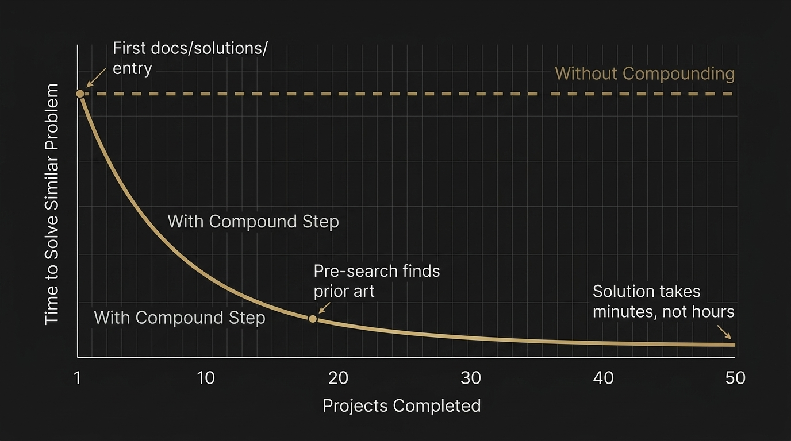

# Agent Harness Papers, Part 5: Compound Engineering Plugin (CEP) — The Framework That Remembers

**Series:** Agent Harness Papers
**Author:** Research notes compiled from public repositories and documentation
**Subject:** Compound Engineering Plugin by Every Inc. (~22,900 ★)



---

> *"Each unit of engineering work should make subsequent units easier — not harder."*
> — Compound Engineering Plugin, core philosophy

---

## The Hook

Most frameworks focus on the quality of current code. They ask: is this function correct? Is this test passing? Is this PR clean?

CEP asks a deeper question: **did today's work make tomorrow easier?**

It's a question that sounds almost philosophical — the kind of thing you'd expect from a management consultant, not a `.md` file in a GitHub repository. But the Compound Engineering Plugin, built by Every Inc. and sitting at roughly 22,900 stars, has turned this philosophy into a concrete, executable workflow. And the results are genuinely interesting.

Where other frameworks in this series have focused on discipline (Superpowers), operational completeness (ECC), anti-shortcutting (Agent Skills), or architectural purity (12-Factor Agents), CEP focuses on something none of them directly address: **institutional memory**. The idea that every bug you fix, every architectural decision you make, every problem you solve should leave behind a trail that makes the *next* occurrence of that problem trivially easy.

This is the framework that refuses to let knowledge evaporate.

---

## 1. The Compounding Philosophy

The name is not an accident. "Compound Engineering" is a direct reference to compound interest — the most powerful force in finance, where returns generate their own returns, and small advantages accumulate into enormous ones over time.

CEP applies this principle to software engineering. The argument goes like this:

1. Most engineering teams solve the same problems repeatedly. Not identical problems, but problems in the same *family*. The same category of race condition. The same pattern of API misuse. The same architectural anti-pattern rediscovered by each new team member.

2. Each time a problem is solved, the solution exists in exactly one place: the developer's head (or the AI agent's context window). When the session ends, the solution evaporates. The next person who hits the same problem starts from scratch.

3. This is a compounding *failure*. Not only does the team not benefit from prior work — the prior work actively contributes nothing to the future. You're running on a treadmill.

4. CEP's intervention is simple: after every meaningful unit of work, **document what you learned in a structured, discoverable format**. Then, before starting any new work, **search that documentation for prior art**.

The math is straightforward. If each solution takes 2 hours and you document it in 15 minutes, the second occurrence takes 15 minutes instead of 2 hours. The third occurrence takes 5 minutes (you already know where the doc is). By the fifth occurrence, it's essentially free. That 15-minute investment compounds.

This sounds obvious. It's the kind of thing every engineering team claims to do ("we have a wiki!"). The difference is that CEP doesn't *suggest* documentation — it **embeds documentation as a mandatory step in the workflow**, and it gives the AI agent a structured protocol for both writing and retrieving it.

---

## 2. The Core Loop: Brainstorm → Plan → Work → Simplify → Review → Compound

CEP's workflow is a six-step loop, and each step is a distinct skill with its own execution protocol:

### Brainstorm (`ce-brainstorm`)

The exploratory phase. Before any code is written, the agent and developer discuss requirements, explore approaches, and identify edge cases. The output is a requirements document — not a formal PRD, but a shared understanding of what "done" looks like.

This step is intentionally conversational. CEP recognizes that many engineering failures happen not because of bad code, but because of bad requirements. The brainstorm phase is designed to surface ambiguity *before* it becomes a bug.

### Plan (`ce-plan`)

The requirements become an execution plan. CEP's planning phase includes threat modeling (what could go wrong?), verification gates (how do we know each step worked?), and dependency ordering (what has to happen first?).

The plan is a first-class artifact — a document that can be reviewed, modified, and referenced throughout execution. This is a deliberate contrast to the "just start coding" approach that many AI agents default to.

### Work (`ce-work`)

The implementation phase. Code is written, tests are created, features are built. CEP doesn't impose a particular coding methodology here — it delegates to the developer's preferences and the project's conventions.

What it *does* impose is discipline around verification. Each unit of work must have a clear verification step. "I wrote the code" is not sufficient; "I wrote the code and the tests pass" is the minimum bar.

### Simplify (`ce-simplify-code`)

This is where CEP gets genuinely interesting, and where version 3.19 introduced a significant innovation.

After code is written but *before* it's reviewed, CEP runs a **simplification pass**. Three parallel reviewer agents examine the code from different angles:

- **Code-reuse reviewer**: Is there existing code that does the same thing? Are we duplicating logic that already exists elsewhere in the codebase?
- **Code-quality reviewer**: Is the code readable? Are the abstractions appropriate? Are there unnecessary complications?
- **Efficiency reviewer**: Are there performance concerns? Is the code doing unnecessary work?

These three agents run in parallel, and their findings are merged into a single simplification report. The developer then applies the simplifications before the code goes to review.

The insight here is that code review is expensive — it requires human attention, which is a scarce resource. If the AI can catch and fix obvious issues *before* review, the reviewer can focus on the things that actually require human judgment: architectural decisions, business logic correctness, and long-term maintainability.

This is the "clean your room before Mom inspects it" principle, systematized.

### Review (`ce-code-review`)

Multi-persona code review. CEP uses tiered persona agents — each with a different expertise and a different set of concerns — to review the code from multiple angles. Findings are confidence-gated (the reviewer must state how confident they are in each finding) and merged through a deduplication pipeline.

The confidence gating is important. It prevents the review from drowning in low-confidence nitpicks while ensuring high-confidence issues are never missed.

### Compound (`ce-compound`)

The final step — and the one that gives the framework its name. This is where knowledge is extracted, documented, and made discoverable. We'll go deep on this in the next section.

---

## 3. The Compound Step: Deep Dive

The `ce-compound` step is CEP's signature contribution. Here's how it works:

### Trigger Points

`ce-compound` is designed to trigger automatically — the agent doesn't wait for the developer to ask. The trigger conditions are:

- You modified ≥2 files in a session
- A design decision was made after multiple iterations (rejected approach A, adopted approach B)
- A bug was fixed that took more than one iteration to solve
- The user confirms the solution works ("looks good", "that fixed it")

The key insight is that `ce-compound` fires at the moment when knowledge is *freshest*. If you wait until the end of the sprint, or the end of the quarter, the context is gone. The developer has moved on. The agent's context window has been cleared. The solution exists in the git history, but good luck finding it.

### The Documentation Protocol

When `ce-compound` fires, it runs a structured extraction process:

1. **Context Analyzer**: What was the problem? What was the environment? What were the symptoms?
2. **Solution Extractor**: What was the fix? Why did it work? What alternatives were considered and rejected?
3. **Related Docs Finder**: Does existing documentation cover part of this? Does this solution update or supersede a previous one?

These three analyses can run in parallel (as subagents), and their output is merged into a solution document saved to `docs/solutions/[category]/`.

### The INDEX.md Requirement

Here's the detail that separates CEP from a glorified wiki: every solution document must be immediately registered in `docs/solutions/INDEX.md`. This is not optional. The documentation explicitly states:

> *"Without an INDEX entry, the doc is invisible to future agents."*

This is a design choice that reveals deep understanding of how AI agents actually work. An agent searching for prior art doesn't crawl the filesystem hoping to stumble on relevant documents. It reads the INDEX, identifies potentially relevant entries by keyword matching, and then reads the specific documents. No INDEX entry = no discoverability = the documentation might as well not exist.

### The Pre-Search Protocol (Solutions Recall)

The other half of the compound equation is **retrieval**. Before starting any non-trivial task, the agent silently checks the solutions store:

1. Read the global solutions registry (which lists all known solution stores and their paths)
2. For each registered store, check `INDEX.md` for category overview
3. Search relevant categories with keywords from the current task

If a match is found, the agent surfaces it: *"📋 Found relevant prior art: {filename}"* and injects the guidance into the current context.

If no match is found, the agent silently continues. This is important — the pre-search should be invisible when it doesn't find anything. No one wants to see "I checked and found nothing" on every task.

### The Compounding Math

Over time, the solutions store grows. Each new entry makes the next similar problem cheaper to solve. But more importantly, the *quality* of solutions improves — because each new solution can reference and build on previous ones. Solution #3 for a category isn't written from scratch; it's written with awareness of Solutions #1 and #2.

This is genuine compounding. Not linear accumulation (1, 2, 3, 4…) but exponential improvement (1, 2, 4, 8…) as solutions cross-reference and reinforce each other.

---

## 4. The Deletion Test

CEP v3.19 introduced a deceptively simple quality principle for skill instructions:

> *"If removing an instruction wouldn't change the output, it's a no-op — delete it."*

This is the **Deletion Test**, and it's one of the most practically useful ideas in the entire framework.

The problem it solves is **instruction bloat**. AI agent configurations tend to accumulate instructions over time. Each new edge case gets a new rule. Each new failure mode gets a new guard. Eventually, the configuration file is 500 lines of instructions, half of which are redundant, contradictory, or simply ignored by the model.

The Deletion Test provides a systematic way to prune this bloat:

- **Delete generic adjectives**: Words like "comprehensive", "thorough", "carefully" don't change model behavior. They're the instruction equivalent of empty calories. "Carefully analyze the code" produces the same output as "analyze the code." Delete them.

- **Delete instructions that repeat existing context**: If the system prompt already says "follow the project's coding conventions," a skill that also says "follow the project's coding conventions" is a no-op. Delete it.

- **Every instruction must verifiably change behavior**: If you can't point to a specific, observable difference in the agent's output that results from an instruction, that instruction is noise. Delete it.

This principle has implications beyond CEP. It's a general hygiene practice for anyone writing AI agent configurations, system prompts, or skill files. The Deletion Test is to prompt engineering what "YAGNI" is to software engineering — a systematic bias toward less.

---

## 5. CONCEPTS.md and the Repo Profile Cache

### CONCEPTS.md: The Shared Vocabulary

One of the subtler problems in AI-assisted development is **terminology drift**. The developer calls it a "subscription." The AI calls it a "membership." The codebase uses "plan." These are all the same thing, but the inconsistency creates confusion, naming collisions, and bugs.

CEP's solution is the `CONCEPTS.md` file — a shared vocabulary document placed at the project root that defines project-specific terminology:

```markdown
# Project Concepts

## Subscription
A recurring billing arrangement between a user and the platform.
NOT the same as a "plan" (which defines pricing tiers) or a
"membership" (which defines access levels).
```

During the grounding phase of any skill execution (brainstorm, plan, work, review, compound), if a `CONCEPTS.md` exists, the agent **must** read it. This ensures that all agents — across all skills, across all sessions — use the same vocabulary.

The mechanism is simple, but the problem it solves is real. In large codebases with multiple contributors (human or AI), terminology drift is a constant source of friction. `CONCEPTS.md` is a low-cost, high-impact intervention.

### Repo Profile Cache

CEP also maintains a **Repo Profile Cache** — a git-keyed cache of project characteristics. This includes things like:

- Primary language and framework
- Test runner and conventions
- Directory structure patterns
- Code style preferences

The cache is keyed to the git repository, so it persists across sessions and is invalidated when the repository changes significantly. This prevents the agent from re-discovering basic project facts on every interaction.

The Profile Cache is less glamorous than the Compound step, but it solves a real usability problem: without it, the agent wastes time (and context window) re-learning that "this project uses pytest" and "this project uses tabs, not spaces" on every session.

---

## 6. The Behavior Change Contract

CEP v3.19 introduced a requirement that any behavior change must come with **verification evidence**:

- The names and results of relevant tests
- New or modified tests that cover the change
- Red/green failure evidence
- Output from verification runs

The rule is stark: **no verification_evidence = unverified = untrustworthy**.

This is CEP's answer to a common failure mode in AI-assisted development: the agent says "done," but the definition of "done" is "I wrote the code." Not "the tests pass." Not "the feature works." Not "I verified my changes against the requirements." Just "I wrote the code."

The Behavior Change Contract makes verification a mandatory deliverable, not an optional add-on. You can't claim a behavior change without proving it works.

---

## 7. C31 Integration: From Plugin to Philosophy

The relationship between CEP and the C31 configuration (covered in earlier parts of this series) is one of the more interesting stories in the framework ecosystem.

C31 didn't just *adopt* CEP — it **absorbed** it. The integration went deep:

### Direct Adoption

- `ce-compound` became `C31-compound`: The entire compound workflow was adopted wholesale, with C31-specific customizations layered on top.
- The full core loop (brainstorm → plan → work → simplify → review → compound) was integrated into C31's workflow engine.
- CEP's skills became C31 skills, maintaining their original structure but operating within C31's session management and state persistence framework.

### Principles Imported from v3.19

C31 imported four specific principles from CEP v3.19:

1. **The Deletion Test**: Applied not just to skill instructions but to all C31 configuration — rules, instincts, and session state.
2. **CONCEPTS.md grounding**: Made mandatory in C31's skill execution protocol.
3. **Inline the Trigger, Not the Content**: YAML frontmatter contains only trigger information; execution logic lives in the body; large reference material goes to `references/` subdirectories.
4. **Runtime vs. Authoring Separation**: Runtime rules (how the agent behaves) are separated from authoring rules (how to write skills), preventing circular dependencies.

### The Meta-Lesson

The C31 integration demonstrates a meta-property of well-designed frameworks: they're **composable**. CEP wasn't designed as a monolithic system that demands exclusive control. It was designed as a set of principles and skills that could be adopted individually, mixed with other frameworks, and customized for specific contexts.

This composability is itself a form of compounding. CEP's ideas don't just compound within a single project — they compound across the ecosystem, as other frameworks adopt and adapt them.

---

## 8. Limitations

CEP is not without weaknesses, and intellectual honesty demands we name them:

### Documentation Overhead

The Compound step adds time to every task. For small fixes — a one-line typo correction, a simple config change — the documentation overhead can exceed the value of the fix itself. CEP doesn't have a clear threshold for when compounding is worth the cost, which can lead to either over-documentation (every trivial fix gets a solution doc) or under-documentation (developers skip the compound step because "this one's too small").

### Index Maintenance

The `INDEX.md` file is a single point of failure. If it falls out of sync with the actual solution documents — entries that point to deleted files, documents that exist without INDEX entries — the entire retrieval system degrades. CEP provides no automated consistency checking for the INDEX.

### Cold Start Problem

A new project has no solutions store. The compound loop provides zero value until enough solutions have accumulated to make pre-search useful. For short-lived projects (prototypes, hackathon entries, one-off scripts), the compound overhead is pure cost with no return.

### Vocabulary Enforcement

`CONCEPTS.md` defines terms, but it doesn't *enforce* them. An agent can read `CONCEPTS.md` and then still use inconsistent terminology in its output. The mechanism relies on the model's ability to internalize and apply the vocabulary — which is generally good but not guaranteed.

### Simplify Step Noise

The three parallel reviewer agents in the Simplify step can generate conflicting recommendations. The code-reuse reviewer might suggest extracting a function, while the efficiency reviewer might argue that the function call overhead isn't worth it. CEP's merge process handles obvious contradictions, but subtle conflicts can slip through.

### Scalability of Solutions Store

As the solutions store grows, keyword-based retrieval becomes less precise. With 10 solution documents, keyword matching is nearly perfect. With 1,000, you start getting false positives — irrelevant documents that happen to match keywords. CEP doesn't provide a semantic search mechanism for the solutions store, relying entirely on keyword matching against the INDEX.

---

## 9. Verdict

CEP's contribution to the AI engineering framework landscape is unique and genuine. While other frameworks focus on *how to do work* (discipline, architecture, orchestration), CEP focuses on *how to learn from work*. The compound loop is a simple idea executed with real rigor, and the results — a growing, discoverable institutional memory — are valuable in a way that's hard to achieve through other means.

The Deletion Test alone is worth the price of admission. It's a universally applicable quality principle that every framework and every prompt engineer should adopt.

But CEP is best understood as a *complement* to other frameworks, not a replacement. It provides the memory layer that other frameworks lack, but it doesn't provide the discipline layer (Superpowers), the operational layer (ECC), or the architectural layer (12-Factor Agents). The ideal setup is CEP's compound loop integrated into a broader framework — which is exactly what C31 did.

**Bottom line**: CEP is the only framework in this series that asks "what did we learn?" after every unit of work. That question, systematically asked and systematically answered, is worth more than most people realize.

---

## Twitter Thread: CEP in 8 Tweets

**🧵 1/8**
Most AI coding frameworks focus on code quality. The Compound Engineering Plugin (@EveryInc, ~22.9k ⭐) asks a different question: did today's work make TOMORROW easier?

The answer is usually no. CEP fixes that. Thread 👇

**🧵 2/8**
The core insight: engineering teams solve the same families of problems over and over. But solutions evaporate when sessions end.

CEP's "Compound step" forces documentation after every meaningful task. 15 min to write → hours saved on the next occurrence. Actual compound interest.

**🧵 3/8**
The 6-step loop:
Brainstorm → Plan → Work → Simplify → Review → Compound

The "Simplify" step (v3.19) is slick: 3 parallel agents (code-reuse, code-quality, efficiency) clean your code BEFORE review. Reviewers focus on what matters.

**🧵 4/8**
The Compound step runs automatically — no developer intervention needed.

Trigger: modified ≥2 files, fixed a multi-iteration bug, or got user confirmation.

Output: solution doc in docs/solutions/ + mandatory INDEX.md entry. No INDEX = invisible.

**🧵 5/8**
The other half: before starting ANY non-trivial task, the agent silently pre-searches the solutions store.

Hit → "📋 Found prior art: {file}" → injected into context
Miss → silent. No "I checked and found nothing" noise.

**🧵 6/8**
The Deletion Test might be CEP's best gift to the ecosystem:

"If removing an instruction wouldn't change the output, it's a no-op — delete it."

Kill "comprehensive." Kill "carefully." Kill redundant rules. The YAGNI of prompt engineering.

**🧵 7/8**
CONCEPTS.md = shared vocabulary. Define "subscription" vs "plan" vs "membership" once. All agents read it during grounding. Terminology drift → eliminated.

Simple mechanism, massive impact in large codebases.

**🧵 8/8**
Limitations are real: documentation overhead on small tasks, INDEX can fall out of sync, cold start problem on new projects.

But CEP is the ONLY framework that asks "what did we learn?" after every task. That question, systematically answered, compounds. 📈

---

# 中文版

# Agent Harness 论文系列，第五篇：Compound Engineering Plugin (CEP) — 会记忆的框架

**系列：** Agent Harness 论文
**作者：** 基于公开仓库与文档整理的研究笔记
**主题：** Every Inc. 的 Compound Engineering Plugin（约 22,900 ★）

---

> *"每一个工程工作单元，都应该让后续的工作变得更轻松——而不是更难。"*
> — Compound Engineering Plugin，核心理念

---

## 引子

大多数框架关注的是**当前**代码的质量。它们问：这个函数正确吗？测试通过了吗？这个 PR 干净吗？

CEP 问的是一个更深层的问题：**今天的工作，让明天变得更容易了吗？**

这个问题听起来几乎像哲学命题——你会以为它出自管理咨询顾问之口，而不是 GitHub 仓库里的一个 `.md` 文件。但 Compound Engineering Plugin，由 Every Inc. 开发，拥有大约 22,900 颗星，已经将这一理念转化为了一套具体的、可执行的工作流。而且结果确实很有意思。

在本系列的其他框架中，Superpowers 聚焦于纪律性，ECC 追求运营完备性，Agent Skills 强调反走捷径，12-Factor Agents 注重架构纯粹性——而 CEP 聚焦的是它们都没有直接涉及的领域：**机构记忆**。其核心思想是：你修复的每一个 bug、做出的每一个架构决策、解决的每一个问题，都应该留下一条轨迹，让*下一次*遇到同类问题时变得轻而易举。

这是一个拒绝让知识蒸发的框架。

---

## 1. Compounding 哲学

这个名字并非偶然。"Compound Engineering" 直接引用了复利（compound interest）的概念——金融领域最强大的力量：收益产生收益，微小的优势随时间累积成巨大的领先。

CEP 将这一原理应用于软件工程。其论证逻辑如下：

1. 大多数工程团队反复解决着同类问题。不是完全相同的问题，而是同一*家族*的问题：同一类竞态条件、同一模式的 API 误用、同一个被每个新成员重新发现的架构反模式。

2. 每次问题被解决后，解决方案只存在于一个地方：开发者的大脑（或 AI agent 的上下文窗口）。会话结束后，方案就蒸发了。下一个碰到同样问题的人，只能从头开始。

3. 这是一种 compounding 的**失败**。团队不仅没有从先前的工作中获益——先前的工作对未来毫无贡献。你在跑步机上原地踏步。

4. CEP 的干预方式很简单：在每一个有意义的工作单元完成后，**用结构化、可发现的格式记录你所学到的东西**。然后，在开始任何新工作之前，**搜索这些文档以寻找先例**。

数学很直白。如果每个解决方案需要 2 小时，而你花 15 分钟记录下来，第二次遇到同类问题只需 15 分钟而不是 2 小时。第三次只需 5 分钟（你已经知道文档在哪里了）。到第五次，几乎零成本。那 15 分钟的投入在不断复利增长。

这听起来显而易见。每个工程团队都声称自己在做这件事（"我们有 wiki！"）。区别在于：CEP 不是*建议*你写文档——它**将文档作为工作流中的强制步骤**，并给 AI agent 提供了一套结构化的协议来编写和检索文档。

---

## 2. 核心循环：Brainstorm → Plan → Work → Simplify → Review → Compound

CEP 的工作流是一个六步循环，每一步都是一个独立的 skill，拥有自己的执行协议：

### Brainstorm (`ce-brainstorm`)

探索阶段。在写任何代码之前，agent 和开发者讨论需求、探索方案、识别边界情况。输出是一份需求文档——不是正式的 PRD，而是对"完成"意味着什么的共识。

这一步有意设计为对话形式。CEP 认识到，许多工程失败的原因不是代码写得差，而是需求搞错了。Brainstorm 阶段的目标是在歧义变成 bug *之前*将其暴露出来。

### Plan (`ce-plan`)

需求转化为执行计划。CEP 的规划阶段包括威胁建模（什么可能出错？）、验证门控（如何确认每一步成功了？）和依赖排序（什么必须先完成？）。

计划是一个一等公民产物——一份可以被审查、修改、在执行过程中随时引用的文档。这是对许多 AI agent 默认的"直接开写"做法的刻意反击。

### Work (`ce-work`)

实现阶段。编写代码、创建测试、构建功能。CEP 在这里并不强制特定的编码方法论——它尊重开发者的偏好和项目的既有惯例。

它*确实*强制要求的是验证纪律。每一个工作单元都必须有明确的验证步骤。"我写了代码"不够；"我写了代码而且测试通过了"才是最低标准。

### Simplify (`ce-simplify-code`)

这是 CEP 真正有趣的地方，也是 v3.19 引入的重要创新。

代码写完之后、进入审查*之前*，CEP 运行一次**简化检查**。三个并行的审查 agent 从不同角度审视代码：

- **代码复用审查者**：是否已有代码做了同样的事情？我们是否在重复代码库中已存在的逻辑？
- **代码质量审查者**：代码可读性如何？抽象层次是否合理？是否存在不必要的复杂性？
- **效率审查者**：是否存在性能隐患？代码是否在做多余的工作？

这三个 agent 并行运行，其发现被合并为一份统一的简化报告。开发者在代码进入审查之前应用这些简化。

这里的洞察是：代码审查很昂贵——它需要人类的注意力，而这是稀缺资源。如果 AI 能在审查*之前*捕获并修复明显问题，审查者就可以专注于真正需要人类判断力的事情：架构决策、业务逻辑正确性和长期可维护性。

这就是"妈妈来检查之前先打扫房间"原则的系统化实现。

### Review (`ce-code-review`)

多角色代码审查。CEP 使用分层的角色 agent——每个拥有不同的专业知识和关注点——从多个角度审查代码。发现会经过置信度门控（审查者必须声明对每个发现的信心程度），并通过去重管道进行合并。

置信度门控很重要。它防止审查被大量低信心的鸡毛蒜皮淹没，同时确保高信心的问题永远不会被遗漏。

### Compound (`ce-compound`)

最终步骤——也是赋予该框架名称的步骤。这是知识被提取、记录和变得可发现的环节。我们将在下一节深入探讨。

---

## 3. Compound 步骤：深度解析

`ce-compound` 步骤是 CEP 的标志性贡献。它的工作方式如下：

### 触发时机

`ce-compound` 设计为自动触发——agent 不需要等待开发者要求。触发条件包括：

- 在一个会话中修改了 ≥2 个文件
- 经过多次迭代后做出了设计决策（否定了方案 A，采纳了方案 B）
- 修复了一个需要多次迭代才解决的 bug
- 用户确认方案有效（"看起来不错"，"修好了"）

关键洞察是：`ce-compound` 在知识*最新鲜*的时刻触发。如果等到 sprint 结束、或季度结束，上下文已经消失了。开发者已经去做别的事了。Agent 的上下文窗口已经被清空。解决方案存在于 git 历史中，但要找到它——祝你好运。

### 文档编写协议

当 `ce-compound` 触发时，它执行一个结构化的提取流程：

1. **Context Analyzer**：问题是什么？环境是什么？症状是什么？
2. **Solution Extractor**：修复方案是什么？为什么有效？考虑过并否决了哪些替代方案？
3. **Related Docs Finder**：已有的文档是否涵盖了部分内容？这个方案是否更新或取代了之前的方案？

这三个分析可以并行运行（作为子 agent），其输出被合并为一份解决方案文档，保存到 `docs/solutions/[category]/`。

### INDEX.md 要求

这个细节是 CEP 区别于美化版 wiki 的关键：每一份解决方案文档必须立即注册到 `docs/solutions/INDEX.md` 中。这不是可选项。文档中明确写道：

> *"没有 INDEX 条目的文档，对未来的 agent 来说就是不可见的。"*

这个设计选择揭示了对 AI agent 实际工作方式的深刻理解。Agent 搜索先例时不会遍历文件系统、碰运气找到相关文档。它读取 INDEX，通过关键词匹配识别潜在相关的条目，然后读取具体的文档。没有 INDEX 条目 = 不可发现 = 文档等于不存在。

### Pre-Search 协议（Solutions 召回）

Compound 等式的另一半是**检索**。在开始任何非平凡任务之前，agent 会静默检查 solutions 存储：

1. 读取全局 solutions 注册表（列出所有已知 solution store 及其路径）
2. 对每个已注册的 store，检查 `INDEX.md` 获取分类概览
3. 用当前任务的关键词搜索相关分类

如果找到匹配项，agent 会将其展示：*"📋 发现相关先例：{filename}"* 并将指导注入当前上下文。

如果没有找到匹配项，agent 静默继续。这一点很重要——当 pre-search 没有找到任何东西时，它应该是隐形的。没人想在每个任务上看到"我检查了但什么也没找到"。

### Compounding 数学

随着时间推移，solutions store 不断增长。每一个新条目都使下一个同类问题的解决成本更低。但更重要的是，解决方案的*质量*也在提升——因为每一个新方案都可以引用和建立在之前方案的基础上。某个分类的第 3 个解决方案不是从零写起的；它是在了解第 1 和第 2 个方案的基础上写出的。

这才是真正的 compounding。不是线性积累（1, 2, 3, 4…），而是指数级改进（1, 2, 4, 8…），因为解决方案之间相互引用和强化。

---

## 4. Deletion Test

CEP v3.19 引入了一条看似简单但影响深远的质量原则，用于衡量 skill 指令：

> *"如果删除一条指令不会改变输出，那它就是空操作——删掉它。"*

这就是 **Deletion Test**，它是整个框架中最具实用价值的理念之一。

它要解决的问题是**指令膨胀**。AI agent 配置往往随时间不断积累指令。每个新的边界情况增加一条新规则。每个新的故障模式增加一道新防线。最终，配置文件长达 500 行，其中一半是冗余的、矛盾的、或干脆被模型忽略的。

Deletion Test 提供了系统化的修剪方法：

- **删除泛泛的形容词**："comprehensive"（全面的）、"thorough"（彻底的）、"carefully"（仔细地）这类词不会改变模型行为。它们是指令中的空卡路里。"Carefully analyze the code" 和 "analyze the code" 产出相同的结果。删掉它们。

- **删除重复已有上下文的指令**：如果系统提示词已经说了"遵循项目的编码规范"，一个 skill 再说一遍"遵循项目的编码规范"就是空操作。删掉它。

- **每条指令都必须可验证地改变行为**：如果你无法指出因某条指令而导致的具体、可观察的输出差异，那条指令就是噪声。删掉它。

这个原则的意义超越了 CEP 本身。它是一条通用的卫生准则，适用于所有编写 AI agent 配置、系统提示词或 skill 文件的人。Deletion Test 之于 prompt 工程，正如"YAGNI"之于软件工程——一种系统性的"做减法"倾向。

---

## 5. CONCEPTS.md 与 Repo Profile Cache

### CONCEPTS.md：共享词汇表

AI 辅助开发中一个较为微妙的问题是**术语漂移**。开发者管它叫"subscription"，AI 管它叫"membership"，代码库里用的是"plan"。这些说的都是同一件事，但不一致性会制造混乱、命名冲突和 bug。

CEP 的解决方案是 `CONCEPTS.md` 文件——一份放在项目根目录的共享词汇表文档，定义项目特有的术语：

```markdown
# Project Concepts

## Subscription
A recurring billing arrangement between a user and the platform.
NOT the same as a "plan" (which defines pricing tiers) or a
"membership" (which defines access levels).
```

在任何 skill 执行的 grounding 阶段（brainstorm、plan、work、review、compound），如果存在 `CONCEPTS.md`，agent **必须**读取它。这确保所有 agent——跨所有 skill、跨所有会话——使用相同的词汇。

机制很简单，但它解决的问题是真实存在的。在拥有多个贡献者（人类或 AI）的大型代码库中，术语漂移是持续的摩擦来源。`CONCEPTS.md` 是一种低成本、高回报的干预手段。

### Repo Profile Cache

CEP 还维护了一个 **Repo Profile Cache**——一个以 git 为键的项目特征缓存。它包含：

- 主要编程语言和框架
- 测试运行器和约定
- 目录结构模式
- 代码风格偏好

缓存以 git 仓库为键，所以它跨会话持久化，并在仓库发生重大变化时失效。这防止 agent 在每次交互时重新发现基本的项目事实。

Profile Cache 不如 Compound 步骤那么光彩照人，但它解决了一个真实的可用性问题：没有它，agent 每次会话都要浪费时间（和上下文窗口）重新学习"这个项目用 pytest"和"这个项目用 tab 不用空格"。

---

## 6. Behavior Change Contract

CEP v3.19 引入了一个要求：任何行为变更都必须附带**验证证据**：

- 相关测试的名称和结果
- 覆盖变更的新增或修改的测试
- 红/绿失败证据
- 验证运行的输出

规则很明确：**没有 verification_evidence = 未验证 = 不可信**。

这是 CEP 对 AI 辅助开发中一种常见失败模式的回答：agent 说"完成了"，但"完成"的定义是"我写了代码"。不是"测试通过了"。不是"功能正常了"。不是"我根据需求验证了我的改动"。只是"我写了代码"。

Behavior Change Contract 将验证变成了强制交付物，而不是可选的附加项。你不能声称发生了行为变更而不证明它有效。

---

## 7. C31 集成：从插件到哲学

CEP 和 C31 配置（本系列前几篇已涵盖）之间的关系，是框架生态中最有趣的故事之一。

C31 不只是*采用*了 CEP——它**吸收**了 CEP。集成深入到了骨髓：

### 直接采纳

- `ce-compound` 变成了 `C31-compound`：整个 compound 工作流被整体采纳，C31 特有的定制叠加在上面。
- 完整的核心循环（brainstorm → plan → work → simplify → review → compound）被集成到 C31 的工作流引擎中。
- CEP 的 skill 成为了 C31 的 skill，保留其原始结构，但在 C31 的会话管理和状态持久化框架内运行。

### 从 v3.19 引入的原则

C31 从 CEP v3.19 引入了四个具体原则：

1. **Deletion Test**：不仅应用于 skill 指令，还应用于所有 C31 配置——规则、instinct 和会话状态。
2. **CONCEPTS.md grounding**：在 C31 的 skill 执行协议中被设为强制项。
3. **Inline the Trigger, Not the Content**：YAML frontmatter 只包含触发信息；执行逻辑放在正文中；大量参考材料放到 `references/` 子目录。
4. **Runtime vs. Authoring 分离**：运行时规则（agent 如何行为）与编写时规则（如何编写 skill）分离，防止循环依赖。

### 元层面的启示

C31 的集成展示了设计良好的框架的一个元属性：它们是**可组合的**。CEP 并非设计为一个要求独占控制权的单体系统。它被设计为一组可以单独采纳、与其他框架混合使用、并针对特定场景定制的原则和 skill。

这种可组合性本身就是 compounding 的一种形式。CEP 的理念不只在单个项目内 compound——它们在整个生态中 compound，随着其他框架的采纳和改编而扩散。

---

## 8. 局限性

CEP 并非没有弱点，知识诚实要求我们直面它们：

### 文档开销

Compound 步骤为每个任务增加了额外时间。对于小修改——一行拼写纠错、一个简单的配置更改——文档开销可能超过修复本身的价值。CEP 没有一个清晰的阈值来判断 compounding 何时值得付出代价，这可能导致过度文档化（每个琐碎修复都生成一份解决方案文档）或文档不足（开发者因为"这个太小了"而跳过 compound 步骤）。

### Index 维护

`INDEX.md` 文件是一个单点故障。如果它与实际的解决方案文档不同步——指向已删除文件的条目、存在但没有 INDEX 条目的文档——整个检索系统就会退化。CEP 没有为 INDEX 提供自动化的一致性检查。

### 冷启动问题

新项目没有 solutions store。Compound 循环在积累足够多的解决方案使 pre-search 变得有用之前，提供零价值。对于短期项目（原型、黑客松作品、一次性脚本），compound 开销是纯成本，没有回报。

### 词汇执行力

`CONCEPTS.md` 定义了术语，但它不*强制执行*这些术语。Agent 可以读了 `CONCEPTS.md` 然后在输出中依然使用不一致的术语。该机制依赖模型内化并应用词汇的能力——这通常不错，但不能保证。

### Simplify 步骤的噪声

Simplify 步骤中三个并行审查 agent 可能生成相互矛盾的建议。代码复用审查者可能建议提取一个函数，而效率审查者可能认为函数调用的开销不值得。CEP 的合并流程能处理明显的矛盾，但微妙的冲突可能会漏掉。

### Solutions Store 的可扩展性

随着 solutions store 的增长，基于关键词的检索会变得不够精确。10 份解决方案文档时，关键词匹配几乎完美。1,000 份时，你会开始遇到误报——碰巧匹配了关键词的无关文档。CEP 没有为 solutions store 提供语义搜索机制，完全依赖对 INDEX 的关键词匹配。

---

## 9. 结论

CEP 对 AI 工程框架版图的贡献是独特且真实的。当其他框架聚焦于*如何做工作*（纪律、架构、编排）时，CEP 聚焦于*如何从工作中学习*。Compound 循环是一个简单的想法，但执行得很严谨，其成果——一个不断增长的、可发现的机构记忆——以其他方式难以实现的方式创造着价值。

仅 Deletion Test 一项就值回票价。它是一个普适性的质量原则，每一个框架和每一位 prompt 工程师都应该采纳。

但 CEP 最好被理解为其他框架的*补充*，而不是替代品。它提供了其他框架所缺乏的记忆层，但它不提供纪律层（Superpowers）、运营层（ECC）或架构层（12-Factor Agents）。理想的配置是将 CEP 的 compound 循环集成到一个更广泛的框架中——而这正是 C31 所做的。

**底线**：CEP 是本系列中唯一一个在每个工作单元完成后追问"我们学到了什么？"的框架。这个问题，被系统性地提出并系统性地回答，其价值远超大多数人的认知。

---

## 推特线程：8 条推文说清 CEP

**🧵 1/8**
大多数 AI 编码框架关注代码质量。Compound Engineering Plugin（@EveryInc，约 22.9k ⭐）问的是一个不同的问题：今天的工作让明天变得更容易了吗？

答案通常是否定的。CEP 改变了这一点。线程 👇

**🧵 2/8**
核心洞察：工程团队反复解决同一家族的问题。但会话结束后，解决方案就蒸发了。

CEP 的"Compound 步骤"在每次有意义的任务后强制记录文档。15 分钟的编写 → 下次遇到时省下数小时。真正的复利。

**🧵 3/8**
六步循环：
Brainstorm → Plan → Work → Simplify → Review → Compound

"Simplify"步骤（v3.19）很精巧：3 个并行 agent（代码复用、代码质量、效率）在审查之前清理你的代码。审查者只需关注真正重要的事。

**🧵 4/8**
Compound 步骤自动运行——不需要开发者干预。

触发条件：修改了 ≥2 个文件、修复了多轮迭代的 bug、或得到用户确认。

输出：docs/solutions/ 中的解决方案文档 + 强制的 INDEX.md 条目。没有 INDEX = 不可见。

**🧵 5/8**
另一半：在开始任何非平凡任务之前，agent 会静默地预搜索 solutions store。

命中 → "📋 发现先例：{file}" → 注入上下文
未命中 → 静默。没有"我查了但什么也没找到"的噪音。

**🧵 6/8**
Deletion Test 可能是 CEP 对生态的最大礼物：

"如果删除一条指令不会改变输出，那它就是空操作——删掉它。"

干掉"comprehensive"。干掉"carefully"。干掉冗余规则。Prompt 工程界的 YAGNI。

**🧵 7/8**
CONCEPTS.md = 共享词汇表。只定义一次"subscription" vs "plan" vs "membership"。所有 agent 在 grounding 阶段读取。术语漂移 → 消除。

机制简单，在大型代码库中效果巨大。

**🧵 8/8**
局限性确实存在：小任务的文档开销、INDEX 可能不同步、新项目的冷启动问题。

但 CEP 是唯一一个在每个任务后追问"我们学到了什么？"的框架。这个问题，被系统性地回答，会 compound。📈
