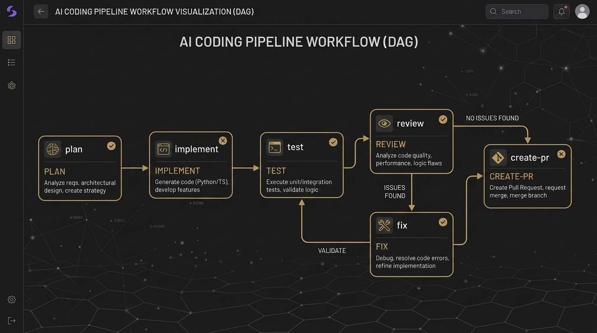

# The Agent Harness Papers, Part 6: Archon — Dockerfiles for AI Coding

*Series: The Agent Harness Papers — 7 frameworks, 1 personal AI operating system, 5 months of production use*



---

If GitHub Actions standardized CI/CD, Archon is trying to standardize AI coding workflows. The pitch is simple and audacious: define your development process in YAML. Execute it the same way every time. Replace the unpredictable "mood" of LLM sessions with deterministic, repeatable pipelines.

This is the most infrastructure-oriented framework in our survey. While others provide principles, psychology, or skills, Archon provides a literal **workflow engine**.

---

## The Analogy That Explains Everything

Think about how software deployment evolved:

- **2005**: SSH into server, run commands manually. Hope you remember all the steps.
- **2013**: Write a Dockerfile. Declare your environment. Deterministic execution.
- **2024**: Push code, CI/CD runs automatically. Same pipeline every time.

Now think about how AI coding works today:

- **2025**: Open a chat window, type your requirements. Hope the AI follows your conventions. Hope it doesn't skip tests. Hope it reviews its own work.

Archon's argument: this is the SSH-into-server era of AI coding. We need a Dockerfile.

---

## The YAML Workflow

An Archon workflow looks like this:

```yaml
name: feature-development
steps:
  - name: plan
    type: ai
    prompt: "Analyze the requirements and create an implementation plan"
    
  - name: implement
    type: ai
    prompt: "Implement the plan from the previous step"
    depends_on: [plan]
    
  - name: test
    type: bash
    command: "npm test"
    depends_on: [implement]
    
  - name: review
    type: ai
    prompt: "Review the implementation for bugs, security issues, and style"
    depends_on: [test]
    
  - name: fix-review-issues
    type: ai
    prompt: "Fix any issues found in the review"
    depends_on: [review]
    condition: "review.issues_found > 0"
    
  - name: create-pr
    type: bash
    command: "gh pr create --title '$TITLE' --body '$BODY'"
    depends_on: [fix-review-issues]
```

This is the core innovation. Your development process becomes **declarative**. You're not describing *how* to write code — you're describing *what sequence of operations* constitutes your workflow.

---

## Seven Node Types

Archon's power comes from mixing deterministic and non-deterministic nodes in the same workflow:

| Node Type | Deterministic? | What It Does |
|-----------|---------------|--------------|
| `ai` | No | LLM-driven generation, planning, review |
| `bash` | Yes | Shell commands — tests, builds, deployments |
| `git` | Yes | Branch creation, commits, PR operations |
| `condition` | Yes | Control flow gating based on previous outputs |
| `loop` | Mixed | Repeat steps until condition is met |
| `parallel` | Mixed | Execute multiple steps concurrently |
| `human` | No | Pause for human approval before continuing |

The insight: AI coding isn't *all* AI. Real development workflows are a mix of:
- AI decisions (what to build, how to structure it)
- Deterministic operations (run tests, check lint, create branches)
- Human gates (approve the plan, approve the PR)

Archon lets you compose all three into a single pipeline.

---

## The DAG Executor

Workflows don't execute linearly — they're compiled into a **DAG** (Directed Acyclic Graph). The `depends_on` field creates the execution graph. Steps with no dependencies run in parallel. Steps with dependencies wait.

```
plan ──→ implement ──→ test ──→ review ──→ fix ──→ create-pr
                                  │
                                  └──→ (skip fix if no issues)
```

This is categorically different from chat-based workflows where you type one instruction at a time. The entire workflow is pre-defined, optimized for parallelism, executed in deterministic order.

### Error Handling in the DAG

When a node fails, Archon doesn't simply crash. Behavior depends on configuration:

- **retry**: Re-execute the node (good for flaky tests or API timeouts)
- **fallback**: Execute an alternative node
- **abort**: Stop the entire workflow
- **continue**: Mark as failed but keep going (good for non-critical steps like lint warnings)

This is CI/CD thinking applied to AI coding. Jenkins figured this out a decade ago. Archon brings it to LLM workflows.

---

## Git Worktree Isolation

Every Archon workflow execution gets its own **git worktree**. This is the same isolation pattern Superpowers uses — not a coincidence. Two frameworks independently reached the same conclusion: AI coding needs sandboxing.

Why worktrees instead of branches?

- Branches exist in the same working directory. If the AI modifies files, your main checkout is affected.
- Worktrees are separate directories linked to the same repository. The AI can write code, compile, test, even break things — without touching your current work.

```
my-project/           ← your main checkout (untouched)
my-project-wt-feat-1/ ← Archon-created worktree for feature-1
my-project-wt-fix-2/  ← Archon-created worktree for fix-2
```

Multiple workflows can run in parallel, each in their own worktree, completely isolated.

---

## Multi-Entry Triggers

One workflow definition, multiple trigger points:

| Trigger | How |
|---------|-----|
| CLI | `archon run feature-development` |
| Web UI | Dashboard with workflow visualization |
| Slack | `/archon run feature-development` |
| Telegram | Bot commands |
| GitHub | PR event webhooks |
| Cron | Scheduled execution |

This is where the Dockerfile analogy is most apt. You write the workflow once, trigger it from anywhere. The execution is identical regardless of the entry point.

---

## The Full Python → TypeScript Rewrite

Archon recently completed a full rewrite from Python to TypeScript. This is worth noting because it signals the project's direction:

- **TypeScript** aligns with the web-first ecosystem (VS Code extensions, browser-based UI, npm distribution)
- The rewrite brought stronger typing for workflow definitions
- Better async/await support for parallel node execution
- Native integration with the npm ecosystem

The rewrite is also a confidence signal. The team was willing to throw out their entire codebase to build the right thing. That takes conviction.

---

## What C31 Takes From Archon

Archon's contribution to C31 isn't its workflow engine — C31 uses a skill-based architecture, not YAML pipelines. Instead, C31 extracts two **behavioral principles**:

### Rollback-First Thinking

> Before making high-risk changes, plan the rollback path first.

This sounds obvious. It isn't. The human instinct is: plan change → execute → hope it works → figure out rollback if it doesn't.

Archon inverts this: plan rollback → verify rollback is feasible → then execute the change. If you can't articulate how to undo something, the change is too risky to make.

In C31, this becomes part of the Pre-Action Checklist:
```
3. Reversibility: Can this be undone without damage? 
   If not → inform the user before executing.
```

### No Autonomous Lifecycle Mutation

> When you can't reliably distinguish "another process is still running" from "it's crashed and left an orphan," don't autonomously mark it as failed.

This principle addresses a specific failure mode in multi-agent systems: Agent A spawns Agent B. Agent B goes quiet. Is it still working? Did it crash? Agent A doesn't know — and guessing wrong is dangerous.

Archon's rule: **surface ambiguous state to humans**. Don't guess. Provide one-click actions and let humans decide.

In C31, this becomes part of Error Handling:
```
Escalate: When you can't reliably determine process state, 
surface the ambiguity to the user with actionable options.
```

---

## Honest Limitations

### 1. Workflow Rigidity

YAML workflows are deterministic by design. But real development is messy. Sometimes you discover mid-implementation that the plan was wrong. Archon handles "throw out the plan and start over" less gracefully than freeform chat sessions.

### 2. Learning Curve

Defining workflows in YAML requires thinking through your process *before* you start. Most developers don't work this way. The overhead of workflow definition only pays off for repeatable processes — one-off tasks get no benefit.

### 3. No Knowledge Compounding

Archon executes workflows but doesn't learn from them. There's no equivalent to CEP's Compound step. A workflow that succeeded yesterday doesn't make today's execution smarter.

### 4. Opacity of LLM Nodes

When an `ai` node produces unexpected output, debugging requires inspecting the LLM's response — which is inherently non-deterministic. The deterministic *pipeline* wraps a non-deterministic *core*. The shell helps, but the fundamental unpredictability remains.

### 5. Adoption Friction

Switching from chat-based AI coding to workflow-based AI coding requires a habit change. Most developers prefer the flexibility of conversation to the structure of pipelines. Archon is optimized for teams and repeatable processes, not individual exploration.

---

## The Verdict

Archon is for teams that want **repeatable, auditable AI coding pipelines**. If you repeatedly do the same class of work — feature development, bug fixes, PR reviews — and you want consistency, Archon's YAML workflows deliver it.

If you're exploring, prototyping, or doing one-off work, Archon's overhead doesn't justify itself.

The Dockerfile analogy is apt but incomplete. Dockerfiles standardize *environment* (objective: this OS, these packages). Archon standardizes *process* (subjective: this planning style, this review depth). Whether YAML can capture the nuance of good engineering judgment remains an open question.

---

*Next: [Part 7 — GSD Core: The Last Line of Defense Against Context Rot](part7_gsd_core.md)*

---

## 🧵 Twitter Thread

**1/** If your AI coding workflow could be defined in YAML and executed identically every time — what would that change?

That's Archon's bet. Here's why it matters. 🧵

**2/** The analogy:
- 2005: SSH into servers, run commands manually
- 2013: Write a Dockerfile, deterministic execution
- 2024: Push code, CI/CD runs automatically

2025 AI coding is still in the SSH era. Archon wants to bring it to 2024.

**3/** The killer feature: 7 node types in one workflow:
- `ai`: LLM-driven decisions
- `bash`: deterministic operations (tests, builds)
- `git`: branching/commits/PRs
- `condition`: control flow gates
- `human`: approval pauses

Real development isn't all AI. Archon lets you mix.

**4/** Every workflow runs in its own git worktree.
Complete isolation. Your main checkout is untouched.
Multiple workflows can run in parallel.

Same conclusion as Superpowers — reached independently.

**5/** C31 didn't adopt Archon's workflow engine.
It extracted two behavioral principles:

① Rollback-First Thinking: plan the undo before you execute
② No Autonomous Lifecycle Mutation: when in doubt, ask humans

**6/** Best for: teams wanting repeatable AI coding pipelines
Not for: individual exploration or one-off tasks

The Dockerfile analogy is apt but incomplete.
Dockerfiles standardize environment (objective).
Archon standardizes process (subjective).

github.com/coleam00/Archon

---

# 中文版

# Agent Harness 论文系列，第六篇：Archon — AI 编程的 Dockerfile

*系列：Agent Harness 论文 — 7 个框架，1 套个人 AI 操作系统，5 个月的生产实战*

---

如果说 GitHub Actions 标准化了 CI/CD，那 Archon 正在尝试标准化 AI 编程工作流。它的主张简单而大胆：用 YAML 定义你的开发流程，每次以相同方式执行。用确定性、可重复的 pipeline 取代 LLM 会话中不可预测的「情绪波动」。

这是本系列调研中最偏基础设施的框架。其他框架提供原则、心理学或技能体系，Archon 提供的是一个字面意义上的**工作流引擎**。

---

## 一个解释一切的类比

想想软件部署是怎么演进的：

- **2005 年**：SSH 到服务器，手动执行命令。祈祷自己记住了所有步骤。
- **2013 年**：写一个 Dockerfile。声明式地定义环境。确定性执行。
- **2024 年**：推送代码，CI/CD 自动运行。每次相同的 pipeline。

再想想今天的 AI 编程是什么状态：

- **2025 年**：打开聊天窗口，输入需求。祈祷 AI 遵守你的规范。祈祷它不跳过测试。祈祷它会审查自己的代码。

Archon 的论点：这就是 AI 编程的「SSH 登录服务器」时代。我们需要 Dockerfile。

---

## YAML 工作流

一个 Archon 工作流长这样：

```yaml
name: feature-development
steps:
  - name: plan
    type: ai
    prompt: "Analyze the requirements and create an implementation plan"
    
  - name: implement
    type: ai
    prompt: "Implement the plan from the previous step"
    depends_on: [plan]
    
  - name: test
    type: bash
    command: "npm test"
    depends_on: [implement]
    
  - name: review
    type: ai
    prompt: "Review the implementation for bugs, security issues, and style"
    depends_on: [test]
    
  - name: fix-review-issues
    type: ai
    prompt: "Fix any issues found in the review"
    depends_on: [review]
    condition: "review.issues_found > 0"
    
  - name: create-pr
    type: bash
    command: "gh pr create --title '$TITLE' --body '$BODY'"
    depends_on: [fix-review-issues]
```

这就是核心创新。你的开发流程变成了**声明式**的。你不是在描述*怎么*写代码，而是在描述*什么操作序列*构成了你的工作流。

---

## 七种节点类型

Archon 的强大之处在于在同一个工作流中混合确定性和非确定性节点：

| 节点类型 | 确定性？ | 功能 |
|-----------|---------------|-------------|
| `ai` | 否 | LLM 驱动的生成、规划、审查 |
| `bash` | 是 | Shell 命令 — 测试、构建、部署 |
| `git` | 是 | 分支创建、提交、PR 操作 |
| `condition` | 是 | 基于前序输出的控制流门控 |
| `loop` | 混合 | 重复步骤直到条件满足 |
| `parallel` | 混合 | 并发执行多个步骤 |
| `human` | 否 | 暂停等待人类审批后继续 |

洞察在于：AI 编程并不*全是* AI。真实的开发工作流是三者的混合：
- AI 决策（构建什么、如何组织结构）
- 确定性操作（运行测试、检查 lint、创建分支）
- 人类门控（批准计划、批准 PR）

Archon 让你把这三者组合成一条 pipeline。

---

## DAG 执行器

工作流不是线性执行的 — 它们被编译成一个 **DAG**（有向无环图）。`depends_on` 字段创建执行图。没有依赖的步骤并行运行，有依赖的步骤等待。

```
plan ──→ implement ──→ test ──→ review ──→ fix ──→ create-pr
                                  │
                                  └──→ (skip fix if no issues)
```

这与基于聊天的工作流有本质区别。整个工作流预先定义，针对并行性优化，以确定性的顺序执行。

---

## Git Worktree 隔离

每次 Archon 工作流执行都有自己的 **git worktree**。完全隔离，你的主检出纹丝不动。多个工作流可以并行运行，各自在自己的 worktree 中，互不干扰。这与 Superpowers 使用的隔离模式相同 — 两个框架独立得出了同一个结论：AI 编程需要沙箱。

---

## C31 从 Archon 学到了什么

Archon 对 C31 的贡献不是它的工作流引擎，而是两条**行为原则**：

### Rollback-First Thinking

> 在进行高风险变更之前，先规划回滚路径。

Archon 反转了直觉顺序：规划回滚 → 验证回滚可行 → 然后再执行变更。如果你说不清楚怎么回滚，这个变更就太冒险了。

在 C31 中：
```
3. Reversibility: Can this be undone without damage? 
   If not → inform the user before executing.
```

### No Autonomous Lifecycle Mutation

> 当你无法可靠区分「另一进程/子代理正在运行」与「已崩溃孤儿」时，不得自主将其状态标为失败。

Archon 的规则：**把模糊状态上报给人类**，提供一键操作，让人类来决定。

---

## 诚实的局限性

1. **工作流的刚性**：YAML 工作流是确定性的，但真实开发是混乱的。
2. **学习曲线**：需要在开始之前就想清楚流程，大多数开发者不这么做。
3. **没有 Knowledge Compounding**：执行工作流，但不从中学习。
4. **LLM 节点的不透明性**：确定性的 pipeline 包裹了非确定性的核心。
5. **采用摩擦**：从对话式转向工作流式，需要改变习惯。

---

## 总评

Archon 适合想要**可重复、可审计 AI 编程 pipeline** 的团队。如果你反复做同类工作，Archon 的 YAML 工作流提供了一致性。如果你在探索或处理一次性任务，Archon 的额外开销得不偿失。

Dockerfile 的类比贴切但不完整。Dockerfile 标准化的是*环境*（客观的），Archon 标准化的是*流程*（主观的）。YAML 能否捕捉到优秀工程判断力的微妙之处，仍是一个开放性问题。

---

## 🧵 推特帖

**1/** 如果你的 AI 编程工作流能用 YAML 定义，并且每次以相同方式执行——这会改变什么？这就是 Archon 的赌注。🧵

**2/** 类比：2005 年 SSH 手动执行 → 2013 年 Dockerfile 确定性执行 → 2024 年 CI/CD 自动运行。2025 年的 AI 编程还停留在 SSH 时代。Archon 想把它带到 2024。

**3/** 杀手级特性：7 种节点类型混合于一条 pipeline — ai、bash、git、condition、human。真实开发不全是 AI，Archon 让你混合搭配。

**4/** 每个工作流运行在自己的 git worktree 中，完全隔离。和 Superpowers 的结论一样——各自独立得出。

**5/** C31 没有采用 Archon 的工作流引擎，提取了两条行为原则：① Rollback-First Thinking：先计划撤销再执行操作；② No Autonomous Lifecycle Mutation：拿不准时，问人类。

**6/** 最适合：想要可重复 AI 编程 pipeline 的团队。Dockerfile 的类比贴切但不完整——Dockerfile 标准化环境（客观），Archon 标准化流程（主观）。github.com/coleam00/Archon
