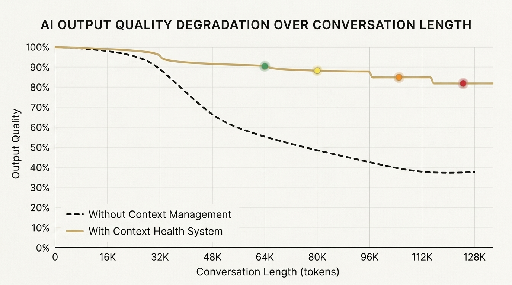

# The Agent Harness Papers, Part 7: GSD Core — The Last Line of Defense Against Context Rot

*Series: The Agent Harness Papers — 7 frameworks, 1 personal AI operating system, 5 months of production use*

---



---

Have you noticed that AI gets dumber the longer you talk to it?

Not gradually. Not gracefully. It's more like a slow leak. After an hour of complex work, the AI starts contradicting decisions it made 20 minutes ago. It forgets the naming convention you agreed on. It proposes approaches you explicitly rejected earlier. It hallucinates function names that don't exist — or worse, function names that *used to* exist before you refactored them out.

This isn't a model bug. It isn't a capability limitation. It's a structural property of how transformers process attention over long sequences.

GSD Core is the only framework that treats this as its **central design problem**. And it gives the problem a name: **Context Rot**.

---

## Naming the Enemy

Context Rot is the progressive degradation of AI output quality as the context window fills up. The mechanism is well-understood:

1. **Attention diffusion**: Transformer attention spreads across all tokens. As the context grows, attention per-token decreases. Early instructions get less attention weight.
2. **Recency bias**: The model disproportionately attends to recent tokens. Your carefully crafted system prompt from 50,000 tokens ago? It's background noise now.
3. **Contradictory accumulation**: Long conversations accumulate corrections, changes of direction, and updated decisions. The model sees all of them — including the outdated ones — and can't reliably distinguish "current truth" from "superseded decision."

The result: after enough back-and-forth, your AI assistant is working from a corrupted understanding of your project. It's not lying. It's not lazy. It's literally losing access to the context that would make it effective.

Most developers respond to context rot the same way: `/clear`. Start over. Re-establish context. Lose everything from the previous session.

GSD Core's thesis: this is the wrong response. The right response is **architectural**.

---

## The .planning/ Directory

GSD Core's most concrete contribution is a directory pattern: `.planning/`.

```
my-project/
├── .planning/
│   ├── spec.md           ← what we're building (survives /clear)
│   ├── plan.md           ← how we're building it (survives /clear)  
│   ├── progress.md       ← what's done, what's next (survives /clear)
│   ├── decisions.md      ← architectural decisions log
│   └── concerns.md       ← known risks and open questions
├── src/
├── tests/
└── package.json
```

The insight is deceptively simple: **conversation history is volatile; files are persistent.**

When you `/clear` a conversation, the chat history disappears. But `.planning/spec.md` remains. When a new session starts, the AI reads the spec, plan, and progress log, then resumes work from *exactly* where you left off.

No re-explaining. No context rebuilding. No re-making decisions.

### What Goes in .planning/

GSD Core is prescriptive about what deserves to be persisted:

| File | Contents | Update Frequency |
|------|---------|-----------------|
| `spec.md` | Requirements, acceptance criteria, scope boundaries | Set once, rarely changed |
| `plan.md` | Implementation approach, component breakdown, dependencies | Updated when approach changes |
| `progress.md` | Completed items, current work, blockers | Updated after each work unit |
| `decisions.md` | Architectural decisions and their rationale | Append-only |
| `concerns.md` | Risks, open questions, unresolved tradeoffs | Updated as discovered |

The most important file is `progress.md`. It's the **recovery point**. After `/clear`, after a crash, after sleeping — `progress.md` tells the next session exactly where the work stands.

---

## Artifacts Over Memory

GSD Core's second principle is behavioral:

> **Write results to files, not to conversation history.**

This sounds obvious. It isn't. The default behavior for most developers (and most AI agents) is to keep results in the conversation:

```
User: "Can you analyze the performance bottlenecks?"
AI: "Here are the 5 bottlenecks I found: [detailed analysis]"
User: "Good. Now fix the top 3."
AI: [fixes]
```

The analysis exists in the conversation. After `/clear`, it's gone. Open a new session tomorrow — that analysis doesn't exist.

GSD Core's alternative:

```
User: "Can you analyze the performance bottlenecks?"
AI: [writes analysis to .planning/analysis-perf.md]
    "I've saved the analysis to .planning/analysis-perf.md. 
     Here's a summary: [brief overview]"
User: "Good. Now fix the top 3."
AI: [reads .planning/analysis-perf.md, fixes]
```

The analysis persists. The next session can reference it. The next developer can read it. The next AI can build on it.

**Files are permanent records. Conversations are ephemeral.**

In retrospect, this principle seems obvious. But look at your actual AI coding sessions. How much critical information lives only in the chat? How much have you lost?

---

## Fresh-Context Subagent Delegation

GSD Core's third mechanism attacks Context Rot directly: **delegate heavy work to subagents with fresh context windows.**

The pattern:

1. **Main session** handles coordination, planning, and lightweight decisions
2. **Heavy research, implementation, or analysis** is delegated to a subagent
3. Subagent starts with a fresh context window — no Context Rot
4. Subagent results are written to files (Artifacts Over Memory)
5. Main session reads the files and continues

```
Main Session (context: 60% full, yellowing)
│
├── "Research the 3 authentication libraries"
│   └── Subagent A (fresh context) → writes .planning/auth-research.md
│
├── "Implement option B from the research"  
│   └── Subagent B (fresh context) → writes code + tests
│
└── "Review the implementation"
    └── Main session reads code, provides lightweight review
```

The main session stays lean. Heavy work gets done in clean context. Files act as the bridge.

This is particularly effective for long-running projects. Instead of a single conversation that runs for 4 hours and gradually rots, you have a coordinator that delegates to fresh executors. The coordinator's context stays manageable. The executors start from zero.

---

## The Five-Phase Cycle

GSD Core organizes work into five phases:

```
Discuss → Plan → Execute → Verify → Ship
```

Each phase has explicit entry/exit criteria:

| Phase | Entry Condition | Exit Condition |
|-------|----------------|----------------|
| **Discuss** | User has a vague idea | Requirements are clear enough to plan |
| **Plan** | Requirements are clear | Implementation plan written to `.planning/plan.md` |
| **Execute** | Plan exists | Code written and compiling |
| **Verify** | Code compiles | Tests passing, review done |
| **Ship** | Tests passing | Changes merged/deployed |

The phases are **enforced**. You can't skip Discuss and go straight to Execute. You can't skip Verify and go straight to Ship. Each phase gate prevents the AI from shortcutting.

This isn't as novel as GSD Core's context management — most frameworks have some version of a phase cycle. But GSD Core's contribution is binding the phases **to .planning/ artifacts**: each phase updates specific files, and those files themselves constitute the phase gate (no `plan.md` = can't enter Execute).

---

## What C31 Takes From GSD Core

GSD Core's influence on C31 is pervasive:

### Context Health 🟢🟡🟠🔴

GSD Core named the problem (Context Rot) and pointed toward the solution (proactive monitoring). C31 merged this with ECC's color system to create four-state monitoring:

| Status | Threshold | Automatic Behavior |
|--------|-----------|-------------------|
| 🟢 Green | <50% | Normal operation |
| 🟡 Yellow | 50–70% | Start compressing completed work into summaries |
| 🟠 Orange | 70–85% | Active compression: move decisions to files, archive assumptions |
| 🔴 Red | >85% | Forced checkpoint: write all state to files before continuing |

The key innovation is **behavior that automatically senses degradation**. The AI doesn't wait for the developer to notice quality declining. It proactively monitors its own context utilization and takes corrective action.

### Artifacts Over Memory

This became a core C31 principle. Session results go into `session_state.json`. Instinct evolution goes into `instincts/`. Diary entries go into `diary/`. Solutions go into `docs/solutions/`.

Conversations are ephemeral. The filesystem is truth.

### Plan Quality Gate

Before spawning a subagent, C31 checks three conditions (adapted from GSD Core):

```
- [ ] Can a brand-new agent execute this plan without additional questions?
- [ ] Does each step have clear verification criteria (definition of done)?
- [ ] Is the context payload minimized (no unnecessary information)?
```

If any check fails, the plan needs more work before it can be delegated.

---

## Honest Limitations

### 1. Smallest Community

~6,200 stars. Compare to Superpowers (249k) or ECC (225k). GSD Core's ideas are valuable, but the adoption surface is limited. Fewer users means fewer battle-tested case studies, fewer community-contributed improvements, less ecosystem support.

### 2. No Knowledge Compounding

Like Archon, GSD Core has no Compound step. `.planning/` persists project state, but it doesn't build institutional knowledge. Solved problems aren't indexed for future reference. There's no equivalent to a `docs/solutions/` directory.

### 3. .planning/ Doesn't Scale to Teams

`.planning/` works beautifully for individual developers. For teams, it raises questions: who owns `plan.md`? What happens when two developers update `progress.md` simultaneously? GSD Core doesn't address multi-developer workflows.

### 4. Context Monitoring is Approximate

The 🟢🟡🟠🔴 thresholds are heuristics, not precise measurements. LLMs don't expose "context utilization" as a queryable metric. Monitoring is based on message counts, token estimates, and behavioral signals — useful but imprecise.

### 5. Fresh-Context Delegation Has Overhead

Spawning a subagent with a fresh context requires re-establishing project context. The subagent reads `.planning/` files, but it still needs to understand the codebase. That startup time isn't free. For small tasks, delegation overhead might exceed the cost of Context Rot.

---

## The Underrated Framework

GSD Core has the fewest stars of any framework in this series. But it arguably has **the most universally applicable insight**. Context Rot affects *every* developer using *any* AI tool, in *every* session longer than 30 minutes.

The `.planning/` pattern costs zero to implement. No npm install. No framework dependencies. Create a directory. Put your spec in it. Update your progress log. Done.

That this simple idea — files outlast conversations — needed to be formalized as a principle says something about how poorly we collectively think about persistence. We treat AI sessions as stateless interactions when they should be treated as **chapters in an ongoing process**.

GSD Core named the disease and prescribed the simplest possible cure.

---

*Next: [Part 8 — The Ultimate Framework Comparison](part8_comparison.md)*
