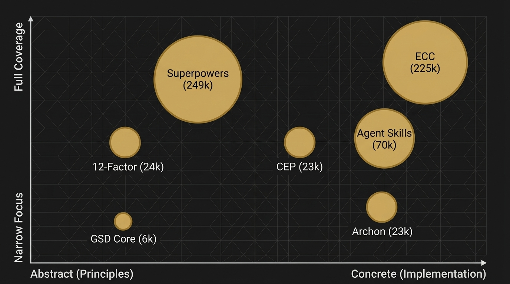

# Agent Harness Papers, Part 8: Seven Frameworks Compared — The State of AI Engineering, Mid-2026

**Series:** Agent Harness Papers
**Author:** Research notes compiled from public repositories and documentation
**Subject:** Comparative analysis of seven AI agent engineering frameworks



---

> *"7 frameworks, 7 philosophies, 1 goal: stop AI from being a disposable tool."*

---

## Introduction

Over the course of this series, we've examined seven frameworks that each attempt to answer the same fundamental question: **how do you make AI agents reliably useful for real engineering work?**

Each framework comes from a different starting point, serves a different audience, and makes different bets about what matters most. But as we'll see, they've converged — independently, without coordination — on a set of shared principles that amount to a 2026 consensus on what AI-assisted engineering should look like.

This article maps the full landscape. We'll compare all seven frameworks across eight dimensions, trace the philosophical spectrum from manifesto to implementation, provide a practical selection guide, identify the five points of consensus, and — perhaps most importantly — name what's still missing from all of them.

No favorites. No rankings. Just an honest assessment of what each framework does well, where it falls short, and where the field is heading.

---

## 1. The Frameworks at a Glance

Before diving into the comparison, here's the field:

| Framework | Stars | Type | Primary Focus | Unique Mechanism |
|-----------|-------|------|---------------|------------------|
| **Superpowers** | ~249k | Skills/Methodology | Engineering discipline | Cialdini persuasion psychology |
| **ECC** | ~225k | Agent Harness | Comprehensive ops layer | Sub-agent context delegation |
| **Agent Skills** | ~70k | Skill Library | Anti-shortcutting | Anti-Rationalization Tables |
| **12-Factor Agents** | ~24k | Design Manifesto | Architecture principles | Stateless Reducer pattern |
| **CEP** | ~23k | Plugin/Workflow | Knowledge compounding | Compound step + Institutional Memory |
| **Archon** | ~23k | Workflow Engine | Deterministic execution | YAML workflow definitions |
| **GSD Core** | ~6k | Context Framework | Session management | Context rot prevention + `.planning/` |

The star counts tell one story: mass appeal correlates with accessibility. Superpowers and ECC are approachable — you can start using them in minutes. 12-Factor Agents and GSD Core require deeper architectural investment.

But stars don't tell you which framework solves *your* problem. For that, we need a richer comparison.

---

## 2. The Full Comparison: Eight Dimensions

### Dimension 1: Philosophy

What does the framework believe is the root problem?

| Framework | Core Belief |
|-----------|------------|
| **Superpowers** | The AI needs *motivation* and *discipline* — treat it like a talented but easily distracted engineer |
| **ECC** | The AI needs *infrastructure* — context management, session state, error classification are engineering problems |
| **Agent Skills** | The AI needs *guardrails* — without them, it will rationalize shortcuts every time |
| **12-Factor Agents** | The AI needs *architecture* — the same way web apps needed the 12-factor methodology |
| **CEP** | The AI needs *memory* — solving problems repeatedly without learning is the core waste |
| **Archon** | The AI needs *determinism* — creative freedom leads to unpredictable results |
| **GSD Core** | The AI needs *continuity* — without session management, every conversation starts from zero |

These beliefs aren't mutually exclusive. In fact, a complete AI engineering setup probably needs all of them. But each framework prioritizes its core belief, and this prioritization shapes every design decision downstream.

### Dimension 2: Architecture Model

How does the framework organize the AI's behavior?

| Framework | Architecture | Key Pattern |
|-----------|-------------|------------|
| **Superpowers** | Flat skill library with behavioral rules | Rules injected into system prompt; skills triggered by context |
| **ECC** | Hierarchical agent orchestration | Parent agent delegates to specialized sub-agents with minimal context |
| **Agent Skills** | Modular skill definitions with guard tables | Skills + anti-rationalization tables that explicitly list forbidden shortcuts |
| **12-Factor Agents** | Stateless reducer + tool loop | `f(context) → action` — no hidden state, every decision derived from context |
| **CEP** | Sequential workflow pipeline | Brainstorm → Plan → Work → Simplify → Review → Compound |
| **Archon** | YAML-defined workflow engine | Workflows are data (YAML), not code — deterministic step execution |
| **GSD Core** | Phase-based session management | `.planning/` directory + context health monitoring + session state |

### Dimension 3: Multi-Agent Strategy

How does the framework handle multiple AI agents?

| Framework | Multi-Agent Approach | Coordination Model |
|-----------|---------------------|-------------------|
| **Superpowers** | Implicit — single agent with multiple personas | Persona switching within one context |
| **ECC** | Explicit parent-child delegation | Parent sends minimal context; child returns results; parent integrates |
| **Agent Skills** | Minimal — single agent focus | Skills compose but don't orchestrate multiple agents |
| **12-Factor Agents** | Prescribed — stateless agents communicate through shared state | Each agent is a pure function; coordination through external state |
| **CEP** | Parallel reviewers in Simplify + Review steps | 3 simplification agents + multi-persona review agents run concurrently |
| **Archon** | Workflow-defined agent chains | YAML specifies which agents run, in what order, with what inputs |
| **GSD Core** | Lightweight — subagents for specific phases | Phase-specific subagents; context rot monitoring applies to all |

### Dimension 4: State Management

How does the framework handle persistence across sessions?

| Framework | State Strategy | Persistence Mechanism |
|-----------|---------------|----------------------|
| **Superpowers** | Minimal — relies on rules being re-injected each session | System prompt + rules files |
| **ECC** | Comprehensive — session state, project state, agent memory | `session_state.json` + memory files + diary entries |
| **Agent Skills** | Light — skill definitions persist, execution state doesn't | Skill files in `.claude/` or equivalent |
| **12-Factor Agents** | Zero in-agent state — everything external | All state in files/databases; agent derives everything from context |
| **CEP** | Solutions store + Repo Profile Cache | `docs/solutions/` with INDEX.md + git-keyed profile cache |
| **Archon** | Workflow state tracked in YAML | Workflow execution state persisted between runs |
| **GSD Core** | Session state + planning artifacts | `session_state.json` + `.planning/` directory + diary |

### Dimension 5: Quality Assurance

How does the framework prevent bad output?

| Framework | QA Mechanism | Verification Approach |
|-----------|-------------|----------------------|
| **Superpowers** | Persuasion psychology — make the AI *want* to write quality code | Cialdini principles (consistency, authority, social proof) embedded in prompts |
| **ECC** | Multi-tier error handling + confidence scoring | Recoverable → Fixable → Escalate; confidence scores on all assertions |
| **Agent Skills** | Anti-Rationalization Tables — pre-enumerate forbidden shortcuts | Explicit "if you're tempted to do X, the correct action is Y" tables |
| **12-Factor Agents** | Architectural constraints — bad patterns are structurally impossible | Stateless design prevents hidden state bugs; tool schemas prevent malformed calls |
| **CEP** | Behavior Change Contract + Deletion Test | No verification_evidence = untrustworthy; remove instructions that don't change output |
| **Archon** | Deterministic workflow execution | YAML-defined workflows can't deviate; each step has explicit success/failure criteria |
| **GSD Core** | Context health monitoring | Color-coded context usage (🟢🟡🟠🔴); forced checkpoint at >85% |

### Dimension 6: Learning & Adaptation

Does the framework get better over time?

| Framework | Learning Mechanism | Scope |
|-----------|-------------------|-------|
| **Superpowers** | None — static rules | No adaptation; same behavior session after session |
| **ECC** | Instinct system with confidence scoring | Instincts promoted from candidate → verifying → instinct based on repeated validation |
| **Agent Skills** | None — static skill definitions | Skills can be manually updated but don't self-improve |
| **12-Factor Agents** | None — deliberately stateless | Learning happens outside the agent, in external systems |
| **CEP** | Compound loop — institutional memory accumulation | Solutions store grows over time; pre-search becomes more effective |
| **Archon** | Workflow refinement — YAML can be updated based on results | Workflows can be versioned and improved, but manually |
| **GSD Core** | Session state carryover + diary system | Completed tasks and open todos persist; diary captures daily learnings |

### Dimension 7: Ease of Adoption

How hard is it to start using the framework?

| Framework | Time to First Value | Adoption Complexity |
|-----------|-------------------|-------------------|
| **Superpowers** | Minutes | Copy rules into system prompt. Immediate benefit. |
| **ECC** | Hours | Install configuration files. Learn session management. Moderate setup. |
| **Agent Skills** | Minutes | Copy skill definitions. Immediate benefit. |
| **12-Factor Agents** | Days–Weeks | Rearchitect agent infrastructure. Significant investment. |
| **CEP** | Hours | Install skills. Create initial `docs/solutions/` structure. Moderate setup. |
| **Archon** | Hours–Days | Define YAML workflows. Learn workflow syntax. Moderate-to-high investment. |
| **GSD Core** | Hours | Set up `.planning/` directory. Configure session state. Moderate setup. |

### Dimension 8: Composability

Can the framework be combined with others?

| Framework | Composability | Integration Pattern |
|-----------|--------------|-------------------|
| **Superpowers** | High — rules can be mixed with any system | Rules layer on top of any existing setup |
| **ECC** | Medium — comprehensive but modular | Individual components (error tiers, session state) can be extracted |
| **Agent Skills** | High — skills are independent units | Individual skills can be adopted without the full library |
| **12-Factor Agents** | High — principles apply to any architecture | Principles guide design without requiring specific implementation |
| **CEP** | High — skills are modular and self-contained | Individual skills (especially ce-compound) can be used independently |
| **Archon** | Low — workflow engine is an all-or-nothing commitment | Switching to YAML workflows requires significant refactoring |
| **GSD Core** | Medium — session management integrates but requires conventions | `.planning/` pattern can be adopted; context health monitoring is portable |

---

## 3. The Philosophy Spectrum: From Manifesto to Implementation

The seven frameworks occupy different positions on a spectrum from *abstract principles* to *concrete implementation*:

```
Abstract ◄────────────────────────────────────────────► Concrete

12-Factor    Superpowers    Agent Skills    GSD Core    ECC    CEP    Archon
 Agents                                                              
(Principles) (Behaviors)   (Guardrails)   (Session)  (Ops) (Workflow)(Engine)
```

### Left Side: Principles and Behaviors

**12-Factor Agents** is the most abstract. It provides architectural principles — "Agent as Stateless Reducer," "Own Your Context Window" — but doesn't ship runnable code. It's a design manifesto, not a product. This is both its strength (universally applicable) and its weakness (requires significant interpretation).

**Superpowers** is slightly more concrete. It provides specific behavioral rules that can be directly injected into system prompts. But the rules are still at the behavior level — they tell the AI *how to act*, not *what to do*.

### Middle: Guardrails and Sessions

**Agent Skills** occupies the middle ground. Skill definitions are concrete and executable, but the Anti-Rationalization Tables are at the guardrail level — they constrain behavior rather than prescribing it.

**GSD Core** adds session management infrastructure — the `.planning/` directory, context health monitoring, session state persistence. This is concrete infrastructure, but it's still a *framework* that developers use to organize their own workflows.

### Right Side: Operations and Workflows

**ECC** provides a comprehensive operational layer — error classification, confidence scoring, sub-agent delegation patterns. This is ready-to-use infrastructure with minimal customization needed.

**CEP** provides a complete workflow pipeline. The six-step loop (brainstorm → plan → work → simplify → review → compound) is a concrete, opinionated process that the team follows.

**Archon** is the most concrete: YAML-defined workflows where every step, every branch, every decision point is specified in data. There's almost no room for the AI to deviate — which is either a feature or a bug, depending on your perspective.

### The Tradeoff

The spectrum reveals a fundamental tradeoff: **flexibility vs. predictability**.

Frameworks on the left give the AI maximum creative latitude — which is great when the AI is competent and terrible when it's not. Frameworks on the right constrain the AI to predetermined paths — which is great for reliability and terrible for novel problems.

Most mature teams end up using a combination: abstract principles for overall guidance, concrete workflows for routine tasks, and guardrails for known failure modes.

---

## 4. Selection Guide: If You Want X, Use Y

This is the practical section. Based on the analysis above, here's a decision tree:

### "I want to start with something simple and see immediate results."
→ **Superpowers** or **Agent Skills**. Both can be adopted in minutes by copying rules/skills into your agent configuration. Superpowers is better for general behavioral improvement; Agent Skills is better for preventing specific known failure modes.

### "I want a complete operational framework for a production AI agent."
→ **ECC**. It's the most comprehensive operational layer, covering session management, error handling, sub-agent delegation, and confidence scoring. The setup investment is moderate, and the payoff is substantial.

### "I want my team to stop solving the same problems over and over."
→ **CEP**. The compound loop is specifically designed for institutional memory. If knowledge loss between sessions is your primary pain point, CEP directly addresses it.

### "I'm building a new AI agent system from scratch and want to get the architecture right."
→ **12-Factor Agents**. The architectural principles will guide your design decisions and prevent common structural mistakes. Complement with a more concrete framework (CEP, ECC) for day-to-day operations.

### "I need deterministic, repeatable workflows — the same input must produce the same output."
→ **Archon**. YAML-defined workflows provide the strongest guarantees about execution order and decision points. This is the right choice for regulated environments, compliance-sensitive domains, and production pipelines where predictability trumps flexibility.

### "I'm working on a long-running project with many sessions, and I keep losing context."
→ **GSD Core**. Context rot prevention and session state management are its core strengths. The `.planning/` directory and diary system maintain continuity across sessions.

### "I want all of the above."
→ **Start with a composition.** CEP's compound loop + ECC's operational layer + Superpowers' behavioral rules + 12-Factor's architectural principles. This is essentially what C31 did, and it works — but the integration effort is significant.

---

## 5. The 2026 Consensus: Five Points of Agreement

Despite their different philosophies, all seven frameworks have converged — independently — on five shared principles. This convergence is significant because it wasn't coordinated. These principles emerged from the practical experience of building AI agent systems at scale.

### Consensus 1: Architecture Over Prompts

Every framework in this comparison has moved beyond "just write a better prompt." All seven recognize that reliable AI behavior requires *structural* interventions — configuration files, workflow definitions, state management systems, review pipelines — not just clever instructions.

This is the 2026 equivalent of the software industry's shift from "just write better code" to "use design patterns, testing frameworks, and CI/CD pipelines." The individual instruction is still important, but the system around it is what determines reliability.

**Evidence across frameworks:**
- Superpowers: behavioral rules, not ad-hoc prompts
- ECC: session state infrastructure, error classification tiers
- Agent Skills: structured skill definitions with guard tables
- 12-Factor: explicit architectural principles
- CEP: six-step workflow pipeline
- Archon: YAML workflow definitions
- GSD Core: `.planning/` directory structure, context health monitoring

### Consensus 2: Multi-Agent Orchestration

Six of the seven frameworks (all except 12-Factor Agents, which prescribes it without implementing it) provide some form of multi-agent orchestration. The consensus is clear: a single monolithic AI agent is insufficient for complex engineering work.

The patterns differ — ECC uses hierarchical delegation, CEP uses parallel reviewers, Archon uses workflow-defined chains — but the principle is the same: decompose complex tasks into specialized roles, let each role operate with focused context, and merge the results.

This mirrors the evolution of software architecture from monoliths to microservices. The AI agent ecosystem is going through the same transition, for the same reasons: specialization enables higher quality, and bounded contexts enable better reasoning.

### Consensus 3: Human-in-the-Loop as Standard

None of these frameworks advocate for fully autonomous AI operation. All seven include explicit human checkpoints — decision boundaries, verification gates, approval requirements, escalation protocols.

The consensus position is nuanced: AI agents should be **autonomous within a bounded scope** and **pause for human input at scope boundaries**. The scope varies by framework (Archon's scope is narrow and rigid; Superpowers' scope is broad and fluid), but the principle is universal.

This is a meaningful departure from the "AGI will do everything" narrative. The frameworks that have survived real-world usage all agree: the human is not optional.

### Consensus 4: Persistent State Across Sessions

Every framework except Superpowers (which is purely behavioral) provides some mechanism for persisting state across sessions. The consensus is that a "memoryless" AI agent — one that starts fresh every conversation — is fundamentally limited.

The persistence mechanisms vary widely:
- ECC/GSD Core: `session_state.json` + diary files
- CEP: `docs/solutions/` with INDEX.md
- Archon: workflow state in YAML
- 12-Factor: external state stores (prescribed but not implemented)

But the underlying principle is the same: knowledge, context, and progress must survive the session boundary.

### Consensus 5: Knowledge Compounding

This is the newest consensus point and arguably the most important. While CEP made it explicit (it's in the name), every framework has some version of it:

- **ECC**: instinct system where patterns are promoted based on repeated validation
- **Agent Skills**: skill library that grows over time
- **GSD Core**: diary system that accumulates daily learnings
- **CEP**: compound loop with structured documentation and pre-search
- **Archon**: workflow refinement based on execution results

The consensus is that **AI-assisted engineering should be a learning system**, not a static one. Each unit of work should contribute to a growing base of knowledge that makes future work easier.

This is the compounding principle, and the fact that all seven frameworks implement some version of it — despite their very different architectures — suggests it's not just a nice idea but a structural necessity.

---

## 6. What's Missing from ALL of Them

Consensus tells us what the field has figured out. The gaps tell us where it's going.

### Gap 1: Cross-Team Knowledge Sharing

All seven frameworks operate within a single team or single developer's context. None of them provide mechanisms for sharing knowledge *across* teams or across organizational boundaries.

CEP's compound loop builds institutional memory for one project. But what if five teams in the same company are all solving similar problems? There's no cross-project knowledge network. The solutions store is local, not distributed.

This is a hard problem — it involves permissions, relevance filtering, and trust — but it's also an enormous opportunity. The company that cracks cross-team knowledge compounding will have a genuine competitive advantage.

### Gap 2: Cost-Awareness

None of the seven frameworks incorporate cost as a first-class constraint. How many tokens did this operation consume? How much did this sub-agent delegation cost? Is the Simplify step worth its token cost for a one-line change?

AI compute is expensive, and costs scale with usage. A framework that optimizes for *value per token* — not just output quality — would be genuinely useful. Today, none of them do this.

### Gap 3: Quantitative Self-Assessment

The frameworks provide qualitative self-assessment (confidence scoring, Critic Gates) but no quantitative measurement. How much time did the compound loop save over the last month? How often did the pre-search find relevant prior art? What's the false-positive rate of the Anti-Rationalization Tables?

Without metrics, it's impossible to know whether the framework overhead is worth its cost. This is ironic — these are engineering frameworks, and engineering demands measurement.

### Gap 4: Model-Agnostic Design

Most frameworks are implicitly designed for a specific class of models (large-context LLMs with strong instruction-following). None of them address how their principles should adapt to different model capabilities.

What happens when context windows are 10x larger? When models have native tool use? When multi-modal models can directly observe code execution? The current frameworks will need significant adaptation, and none of them have a clear migration path.

### Gap 5: Security and Trust Boundaries

The frameworks address code quality, process discipline, and knowledge management — but none of them seriously address security. What happens when a sub-agent is given access to sensitive code? How do you prevent prompt injection through the solutions store? What are the trust boundaries between agents in a multi-agent system?

CEP's Behavior Change Contract ensures that changes are verified — but verified by whom? By another AI agent, whose judgment could also be compromised. The security model of AI agent systems is still largely undefined.

### Gap 6: Graceful Degradation

What happens when the AI model degrades — slower responses, lower quality output, rate limiting? None of the seven frameworks have a graceful degradation strategy. They assume the underlying model is always available and always capable.

In production environments, this assumption doesn't hold. A framework that could detect model degradation and adjust its workflow accordingly (e.g., simplifying the Review step when response quality is low, or batching Compound operations during rate limiting) would be significantly more robust.

---

## 7. Future Predictions

Based on the patterns observed across all seven frameworks, here's where the field is heading:

### Prediction 1: Convergence into Composable Standards

The seven frameworks will not remain seven separate projects. They'll converge — either through explicit integration (as C31 integrated CEP) or through the emergence of interoperability standards. Within 18 months, we'll see a de facto standard for skill definition format, state persistence schema, and inter-agent communication protocol.

### Prediction 2: Cost-Aware Execution

Framework-level cost tracking and optimization will become table stakes. Agents will be able to report "this task cost $X in compute" and frameworks will provide cost budgets with automatic degradation strategies when budgets are exceeded.

### Prediction 3: Continuous Learning Becomes Default

CEP's compound loop will be recognized as the minimum viable learning mechanism, and more sophisticated approaches — automated solution quality scoring, semantic search over institutional memory, cross-project knowledge graphs — will emerge.

### Prediction 4: Security-First Frameworks

The first serious AI agent security incident will trigger a wave of security-focused framework development. Trust boundaries, agent sandboxing, and adversarial robustness testing will become mandatory features, not afterthoughts.

### Prediction 5: The "Standard Stack" Emerges

Just as the web development world converged on a standard stack (React + Node + PostgreSQL, or equivalent), the AI agent world will converge on a standard stack:
- **Behavioral layer**: Superpowers-style rules
- **Operational layer**: ECC-style infrastructure
- **Workflow layer**: CEP-style pipeline with Archon-style determinism for critical paths
- **Memory layer**: CEP-style compound loop with cross-project sharing
- **Architecture layer**: 12-Factor principles governing the overall design

This stack doesn't exist as a unified product today, but all the pieces are present in the seven frameworks analyzed here.

---

## 8. Conclusion: The Field Matures

The existence of seven serious frameworks for AI agent engineering — all independently developed, all battle-tested, all converging on shared principles — is itself the most important finding.

It means the field has moved past the "prompt engineering is all you need" phase. Past the "AI agents are magic" phase. Into the "AI agents are engineering systems that require engineering discipline" phase.

This is maturity. Not glamorous, not revolutionary, not the singularity. Just the quiet, persistent work of making a powerful tool actually reliable.

The seven frameworks disagree on many things — how much autonomy to give the AI, how to structure multi-agent systems, how to handle state, how deterministic workflows should be. But they agree on the fundamentals: architecture matters, memory matters, humans matter, and the quality of today's work should make tomorrow's work easier.

That consensus, hard-won through real-world failure and iteration, is the most valuable output of the entire AI agent engineering movement so far.

---

## Appendix: Quick Reference Matrix

For teams evaluating which framework(s) to adopt:

| If Your Priority Is... | Primary Choice | Secondary Choice | Avoid |
|------------------------|---------------|-----------------|-------|
| Quick wins, low investment | Superpowers | Agent Skills | 12-Factor (too abstract for quick wins) |
| Production reliability | ECC | Archon | Superpowers (too behavioral for production) |
| Team knowledge retention | CEP | GSD Core | 12-Factor (no implementation) |
| Architectural correctness | 12-Factor | ECC | Archon (too rigid for architectural thinking) |
| Session continuity | GSD Core | ECC | Agent Skills (no session management) |
| Deterministic pipelines | Archon | CEP | Superpowers (too flexible for pipelines) |
| Preventing AI shortcuts | Agent Skills | Superpowers | Archon (constraints are structural, not behavioral) |
| Everything (kitchen sink) | C31 integration | Build your own composition | Any single framework alone |
