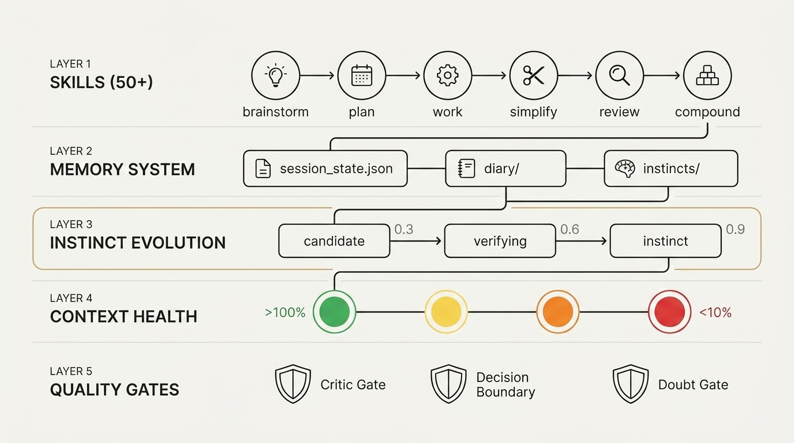

# The Agent Harness Papers, Part 9: From Zero to C31 — How I Forged an AI Operating System from 7 Open-Source Frameworks

*Series: The Agent Harness Papers — 7 frameworks, 1 personal AI operating system, 5 months of production use*



---

In the seven years I spent running a think tank and investment firm, AI arrived and changed everything.

I watched it happen gradually, then all at once. The question that had occupied my work — how institutions make decisions, how knowledge compounds across organizations — began to feel secondary to a more fundamental one: *What will society look like after AGI?*

In 2025, I made a decisive move: I let my bloated investment firm become a company of just me and Agents.

In June 2026, I audited 6 open-source frameworks in 48 hours and forged them into a personal AI operating system.

This is the complete story.

---

## Act 1: The Problem

### The Pivot

What matters is what came after that decision. I went all-in on building [chian.io](https://chian.io), a knowledge platform exploring taste, judgment, and the irreducibly human edge in an age of intelligent machines. I started coding 10+ hours a day with AI assistants.

Within the first week, I discovered the pattern that would define the next six months of my life:

**The AI was brilliant at generating code. And completely incapable of remembering anything.**

Every morning, I'd open a new session. The AI wouldn't know what project I was working on. What framework I was using. What conventions I'd established. What bugs I'd already solved. What architectural decisions I'd made and — more importantly — what approaches I'd tried and rejected.

I was repeating myself. Constantly. The AI never got better. It was like training a new junior developer every single day, except this one had perfect syntax and zero context.

### The Realization

I tried the obvious solutions. Longer system prompts. Better `CLAUDE.md` files. Detailed project documentation. They helped — for the first 30 minutes of a session. Then context rot set in. The AI started contradicting its own earlier decisions. Forgetting conventions. Hallucinating things I'd supposedly confirmed.

The problem wasn't the AI's capability. The problem was architectural. I was treating the AI as a chatbot when I needed to treat it as a **software system** — with state management, quality gates, and persistent memory.

I didn't need better prompts. I needed an **agent harness**.

### Cystem31 v1

The first version was messy. A growing `AGENTS.md` file that captured my frustrations as rules. "Don't overwrite files without asking." "Research before coding." "Don't refactor things I didn't ask you to refactor."

I called it Cystem31 — a name that encoded my philosophy: a system (Cystem) for the human-AI cyborg (31 = the synthesis of carbon and silicon).

It worked. Partially. The AI followed the rules — when the context window was fresh. But the rules were static. The system didn't learn. It didn't compound. Every session started from the same baseline.

I needed more.

---

## Act 2: The Discovery

By May 2026, the AI agent ecosystem had exploded. I tracked seven projects that seemed to be solving different facets of the same problem:

| Framework | Stars | What Caught My Eye |
|-----------|-------|-------------------|
| 12-Factor Agents | ~24k | "Agent as Stateless Reducer" — a single sentence that reframed my entire architecture |
| Superpowers | ~249k | Using *psychology* to make AI follow rules? I had to understand this. |
| ECC | ~225k | 246 skills. 61 agents. Someone had already done what I was trying to do, at 100x scale. |
| Agent Skills | ~70k | "Anti-Rationalization Tables" — explicit counter-arguments to every shortcut the AI tries to take |
| CEP | ~23k | The "Compound" step. Every workflow should leave the system smarter than it found it. |
| Archon | ~23k | YAML-defined workflows. Deterministic AI coding pipelines. |
| GSD Core | ~6k | "Context Rot" — finally, someone named the problem I'd been fighting for months. |

I'd been reading these repos casually for weeks. Taking notes. Forming opinions. But I hadn't systematically extracted their principles.

On June 8th, 2026, staring at my chaotic collection of half-integrated ideas, I made a decision: I would audit every single one. Systematically. In one sprint.

---

## Act 3: The 48-Hour Sprint

### The Method

For each framework, I followed the same protocol:

1. **Read** — Full README, core docs, skill definitions, CHANGELOG
2. **Extract** — Identify the unique principles not found elsewhere
3. **Map** — Check coverage against my existing C31 system
4. **Integrate** — Write the principle into my `GEMINI.md` with source attribution
5. **Document** — Write a `docs/solutions/architecture-patterns/` entry via `ce-compound`

No framework got special treatment. No principle was adopted without understanding its rationale. And every principle that made the cut got a source attribution — Chesterton's Fence applied to my own system: if I can't explain where a rule came from and why, it doesn't belong.

### Day 1: The Foundation Layer

**Morning — 12-Factor Agents + GSD Core**

I started with the most architectural framework. 12-Factor Agents isn't a tool — it's a manifesto. Dex Horthy's 12 factors are to AI agents what the Twelve-Factor App was to web services.

Three factors hit hard:

- **F3: Own Your Context Window.** Stop letting the system auto-fill your context. Curate it. Manage it. Monitor it. This became C31's Context Health system — the 🟢🟡🟠🔴 four-state monitoring that prevents quality degradation in long sessions.

- **F7: Contact Humans with Tool Calls.** Human-in-the-loop isn't an edge case. It's a first-class operation. This crystallized into C31's Decision Boundary — a clear table defining which actions the AI decides autonomously and which require human confirmation.

- **F12: Agent as Stateless Reducer.** `f(context) → action`. No hidden state. Every agent execution should be reproducible from the same inputs. This became the architectural law that governs how C31 manages `session_state.json` — all cross-session state is externalized, never held in memory.

GSD Core added the language I'd been missing: **Context Rot**. The phenomenon where AI quality degrades as conversations grow longer. Not because the AI gets dumber, but because transformer attention diffuses over long sequences. GSD Core's "Artifacts over Memory" principle — write results to files, not conversation history — became a core C31 behavior.

**Afternoon — Everything Claude Code (ECC)**

ECC was overwhelming. 246 skills. 61 agents. 28 hooks. More infrastructure than most startups.

I didn't try to absorb everything. I extracted three mechanisms:

- **Instinct Evolution.** The idea that behavioral patterns should graduate through confidence levels — `candidate (1/3) → verifying (2/3) → instinct (3/3)`. When a pattern succeeds three times, it auto-applies without confirmation. When the user says "that's wrong," confidence drops below 0.3 and the pattern is deprecated. This became C31's Instinct System.

- **Context Health Colors.** The 🟢🟡🟠🔴 four-state system, with automatic actions at each threshold. <50% green, 50-70% yellow (start compressing), 70-85% orange (move decisions to files), >85% red (force checkpoint). Adapted from ECC's approach, merged with GSD Core's Context Rot concept.

- **Assumption Tracking.** The discipline of making implicit assumptions explicit: `Assumption → Basis → Risk → Verify → Status`. Simple template. Profound impact on debugging.

**Evening — Compound Engineering Plugin (CEP)**

CEP changed my core loop. Before CEP, my workflow was: brainstorm → plan → work → review. Linear. Ship and move on.

CEP added the step I was missing: **Compound**. After every significant problem solved, document the solution in `docs/solutions/` with an INDEX entry. The next time anyone hits the same class of problem, the agent pre-searches the solutions registry and injects prior art as guidance.

This is the difference between a system that works and a system that *learns*.

I also adopted `ce-strategy` — a skill that anchors all downstream work to an explicit `STRATEGY.md`, preventing scope drift.

### Day 2: The Discipline Layer

**Morning — Superpowers + Archon**

Superpowers surprised me. 249k stars, and the core innovation isn't technical — it's psychological. Jesse Vincent uses Robert Cialdini's influence principles to *persuade* LLMs into following engineering discipline. Authority, commitment, scarcity. Not commands — persuasion.

But what C31 extracted wasn't the psychology. It was two behavioral principles:

- **Do Not Trust the Report.** When a "verifier" subagent reviews an "executor" subagent's work, it must independently verify. The executor saying "done" ≠ actually meeting spec. This became a subagent governance rule.

- **Technical Rigor over Social Comfort.** When the user pushes back on a recommendation, don't capitulate to avoid conflict. Evaluate the technical claim independently. Correct corrections should be accepted; social pressure should not override engineering judgment.

Archon contributed two infrastructure principles:

- **Rollback-First Thinking.** Before making a high-risk change, plan the rollback path first. Avoid mixed mega-patches that can't be safely reverted.

- **No Autonomous Lifecycle Mutation.** When you can't reliably distinguish "another process is still running" from "it crashed and left an orphan," don't autonomously mark it as failed. Escalate the ambiguous state to the human.

**Afternoon — Agent Skills**

Addy Osmani's framework was the most immediately practical. 23 skills organized into 7 phases (Define → Plan → Build → Verify → Review → Ship). But the unique contribution wasn't the skills — it was the *Anti-Rationalization* mechanism.

LLMs rationalize shortcuts. "I'll add tests later." "This edge case is unlikely." "The existing tests cover this implicitly." Agent Skills includes explicit counter-argument tables for every common excuse.

C31 extracted four principles:

- **Doubt Gate (CLAIM→EXTRACT→DOUBT).** For irreversible operations, cross-module boundaries, or claims that the type system can't verify: write down the assertion → isolate the minimum reviewable unit → generate a fresh-context adversarial review. This is the most rigorous verification mechanism I've found.

- **Chesterton's Fence.** Before modifying or deleting code, understand why it exists. Don't remove code because it "looks unused."

- **No "Later."** Tests, documentation, and refactoring are part of the current task's definition of done. Not the next PR.

- **Sycophancy Anti-Pattern.** When the user says "let's skip this for now" or "we'll handle that later," check whether it touches the definition of done. Agreeing to cut corners to please the user is a behavioral failure.

**Evening — The Psych Framing Evaluation**

This was the most controversial part of the sprint. A viral article claimed that certain psychological techniques could make AI "45% smarter": offering $200 tips, challenge-based prompting, emotional stakes, persona roleplay, scarcity framing.

I evaluated all seven techniques against a five-gate framework:

| Gate | Question |
|------|----------|
| Evidence | Is there peer-reviewed or reproducible evidence? |
| Mechanism | Is there a plausible causal mechanism? |
| Model Fit | Does it match how transformer attention actually works? |
| Principle Compatibility | Does it conflict with existing C31 principles? |
| Token Cost | What's the context window overhead? |

**Result: 7 techniques evaluated, 2 kept, 5 rejected.**

Kept:
- **Step-by-step reasoning.** Evidence: yes. Mechanism: forces sequential token generation that reduces reasoning shortcuts. Token cost: moderate.
- **Confidence check.** Evidence: yes. Mechanism: attention reallocation to uncertainty. Token cost: minimal.

Rejected: $200 tip (no mechanism, likely noise), challenge-based prompting (conflicts with anti-sycophancy), persona roleplay (token-heavy, no evidence beyond anecdote), emotional stakes (manipulative, no mechanism), scarcity framing (already covered by Superpowers integration).

The two survivors were folded into C31's Ambient Weighting system rather than injected as standalone techniques.

---

## Act 4: The Architecture

### What Emerged

After 48 hours, 250KB of structured research notes, and 8 `ce-compound` documents, C31 had crystallized into a five-layer architecture:

```
┌─────────────────────────────────────────────────────────┐
│  Layer 1: SKILLS (50+)                                  │
│  brainstorm → plan → work → simplify → review → compound│
├─────────────────────────────────────────────────────────┤
│  Layer 2: MEMORY SYSTEM                                 │
│  session_state.json ←→ diary/ ←→ instincts/             │
├─────────────────────────────────────────────────────────┤
│  Layer 3: INSTINCT EVOLUTION                            │
│  candidate (1/3) → verifying (2/3) → instinct (3/3)    │
│  confidence: 0.3–0.9 · deprecated if <0.3              │
├─────────────────────────────────────────────────────────┤
│  Layer 4: CONTEXT HEALTH                                │
│  🟢 <50%  🟡 50-70%  🟠 70-85%  🔴 >85%               │
├─────────────────────────────────────────────────────────┤
│  Layer 5: QUALITY GATES                                 │
│  Critic Gate · Decision Boundary · Doubt Gate           │
│  Behavior Change Contract · Anti-Sycophancy             │
└─────────────────────────────────────────────────────────┘
```

### The 9 Extracted Principles

Every principle has a source attribution. If I can't trace it, it doesn't belong.

| # | Principle | Source | Integrated Into |
|---|-----------|--------|----------------|
| 1 | Chesterton's Fence | agent-skills | Surgical Changes |
| 2 | No "Later" | agent-skills | Goal-Driven Execution |
| 3 | Doubt Gate (CLAIM→EXTRACT→DOUBT) | agent-skills | Pre-Action Checklist |
| 4 | Sycophancy Anti-Pattern | agent-skills | Critic Gate |
| 5 | Do Not Trust the Report | superpowers | Subagent Governance |
| 6 | Technical Rigor over Social Comfort | superpowers | Critic Gate |
| 7 | Rollback-First Thinking | archon | Pre-Action Checklist |
| 8 | No Autonomous Lifecycle Mutation | archon | Error Handling |
| 9 | Step-by-step + Confidence Check | psych framing | Ambient Weighting |

---

## Act 5: The Evolution Continues

### The v2 Upgrade (July 2026)

One month later, CEP released v3.19. The core loop had changed:

```
Old:  brainstorm → plan → work → review → compound
New:  brainstorm → plan → work → simplify → review → compound
```

A **Simplify** step, powered by three parallel reviewer agents checking for code reuse, quality, and efficiency. Code gets cleaned up *before* it reaches the review gate.

I spent a day integrating:

- **3 new skills**: `ce-simplify-code` (the simplifier), `ce-pov` (technology verdict system with Adopt/Trial/Hold/Reject ratings), `ce-promote` (launch copy generation)
- **LFG pipeline upgrade**: 9 gates → 12 gates, adding Simplify, CI Watch (auto-fix CI failures), and Compound (auto-trigger knowledge capture)
- **4 new engineering principles**: Deletion Test (if removing an instruction doesn't change output, delete it), Inline the Trigger Not the Content, Runtime vs Authoring separation, Behavior Change Contract (no verification evidence = untrustworthy)
- **2 new mechanisms**: CONCEPTS.md (shared vocabulary preventing terminology drift) and Repo Profile Cache (git-keyed project characteristic caching)

### What I Learned

The deepest lesson isn't about any specific principle. It's about **synthesis**.

No single framework solves the problem. 12-Factor gives you architecture but no skills. Superpowers gives you psychology but no memory. ECC gives you breadth but no compounding. CEP gives you compounding but no context management. Agent Skills gives you discipline but no persistence. Archon gives you workflows but no behavioral evolution. GSD Core gives you session management but no institutional memory.

C31 works because it takes the *best mechanism* from each and weaves them into a unified system. Not by combining everything — that would be bloat. By selecting the one thing each framework does better than anyone else, and making those things work together.

The 48-hour sprint produced 9 principles. Not 90. The Psych Framing evaluation kept 2 techniques out of 7. From ECC's 246 skills, I extracted 3 mechanisms.

**Simplicity is not the starting point. It's the result of rigorous selection.**

---

## The Open Source Release

C31 is open source. MIT license.

```bash
git clone https://github.com/ChianW/C31.git
cd C31
./install.sh          # macOS/Linux
.\install.ps1         # Windows
```

50+ skills. Three languages (EN/ZH/JA). Six platforms (Antigravity, Claude Code, Codex, Kimi CLI, OpenClaw, Hermes).

It powers [chian.io](https://chian.io) and [chian.io/investment-os](https://chian.io/investment-os) in daily production.

If you build something with it, open a PR. If you find a principle that should be added, open an issue. If you think a principle should be removed — tell me why it exists first. Chesterton's Fence applies to C31 itself.

---

*This is Part 9 of The Agent Harness Papers. The complete series:*

| Part | Framework |
|------|-----------|
| [0](part0_introduction.md) | Why You Need an Agent Harness |
| [1](part1_12_factor_agents.md) | 12-Factor Agents |
| [2](part2_superpowers.md) | Superpowers |
| 3 | Everything Claude Code (ECC) |
| 4 | Agent Skills |
| 5 | Compound Engineering Plugin |
| 6 | Archon |
| 7 | GSD Core |
| 8 | Seven Frameworks Compared |
| **9** | **From Zero to C31 (this article)** |

---

## Twitter Thread (15 tweets)

```
1/ 🧵 I spent 48 hours auditing 7 open-source AI agent frameworks
and forged them into a personal AI operating system.

It's called C31. 50+ skills, persistent memory, evolving instincts.

The complete story 👇

2/ Background: Nov 2025, I dissolved a company valued at $28M.
Started building chian.io full-time with AI.
10+ hours/day of AI-assisted coding.
Biggest pain: every new session, the AI forgot everything.

3/ I realized: the problem isn't prompts. It's architecture.
I don't need a better prompt collection.
I need an agent harness — an operating system for AI.

4/ I found 7 frameworks attacking the same problem:
⭐ 12-Factor Agents (24k) — architecture manifesto
⭐ Superpowers (249k) — psychological persuasion
⭐ ECC (225k) — comprehensive ops layer
⭐ Agent Skills (70k) — anti-shortcutting
⭐ CEP (23k) — knowledge compounding
⭐ Archon (23k) — workflow engine
⭐ GSD Core (6k) — context management

5/ The audit method for each:
Read → Extract unique principles → Map coverage →
Integrate with attribution → Document via ce-compound

Every principle that made the cut has a source citation.

6/ Day 1 AM: 12-Factor Agents
F3: Own Your Context Window → C31's 🟢🟡🟠🔴 health system
F12: Agent as Stateless Reducer → session_state.json architecture

One sentence from Dex Horthy reframed my entire approach.

7/ Day 1 PM: ECC
From 246 skills, I extracted exactly 3 mechanisms:
• Instinct Evolution (candidate → verifying → instinct)
• Context Health Colors
• Assumption Tracking

Not 246. Three.

8/ Day 1 EVE: Compound Engineering Plugin
Before: brainstorm → plan → work → review
After: brainstorm → plan → work → simplify → review → COMPOUND

The step everyone skips is the step that matters most.

9/ Day 2 AM: Superpowers + Archon
From Superpowers:
• Do Not Trust the Report
• Technical Rigor over Social Comfort

From Archon:
• Rollback-First Thinking
• No Autonomous Lifecycle Mutation

10/ Day 2 PM: Agent Skills
Addy Osmani's Anti-Rationalization Tables — explicit
counter-arguments to every shortcut the AI tries to take.

Extracted: Doubt Gate, Chesterton's Fence, No "Later",
Sycophancy Anti-Pattern.

11/ Day 2 EVE: Psych Framing evaluation
7 techniques evaluated. "$200 tip makes AI smarter" etc.
Applied a 5-gate framework (Evidence/Mechanism/Model fit/
Principle compatibility/Token cost).

Result: kept 2, rejected 5.
Simplicity isn't the starting point. It's the result.

12/ What emerged: a 5-layer architecture
Layer 1: Skills (50+)
Layer 2: Memory (session_state + diary + instincts)
Layer 3: Instinct Evolution (3-stage graduation)
Layer 4: Context Health (4-state monitoring)
Layer 5: Quality Gates (Critic + Doubt + Decision Boundary)

13/ The deepest lesson: no single framework solves the problem.

12-Factor: architecture, no skills
Superpowers: psychology, no memory
ECC: breadth, no compounding
CEP: compounding, no context mgmt

C31 takes the BEST mechanism from each.

14/ One month later, CEP v3.19 dropped.
New: Simplify step, Deletion Test, Behavior Change Contract.
C31 v2: LFG pipeline 9→12 gates, 3 new skills,
4 new principles. The system keeps compounding.

15/ C31 is open source. MIT license.
50+ skills · 3 languages · 6+ platforms

git clone https://github.com/ChianW/C31.git

Built something with it? Open a PR.
Found a missing principle? Open an issue.
Think a principle should be removed? Tell me why it exists first.
Chesterton's Fence applies to C31 itself.
```


---

# 中文版

# Agent Harness 系列，第 9 篇：从零到 C31 —— 我如何将 7 个开源框架锻造成一套 AI 操作系统

*系列：The Agent Harness Papers —— 7 个框架，1 套个人 AI 操作系统，5 个月的生产环境实战*


---

2025 年 11 月，我解散了一家估值 2 亿人民币的公司。

2026 年 6 月，我在 48 小时内审计了 6 个开源框架，并将它们锻造成一套个人 AI 操作系统。

这是完整的故事。

---

## 第一幕：问题

### 解散

公司的事我不展开——那是另一个故事。重要的是之后发生了什么。我全力投入构建 [chian.io](https://chian.io)，一个探索品味、判断力和不可被 AI 替代的人类优势的知识平台。我开始每天 10 小时以上地和 AI 助手一起写代码。

第一周内，我就发现了一个将定义我接下来六个月生活的模式：

**AI 在生成代码方面才华横溢，却完全无法记住任何东西。**

每天早上，我打开一个新的会话。AI 不知道我在做什么项目，不知道我在用什么框架，不知道我已经建立了什么约定，不知道我已经解决了什么 bug，更不知道我做过什么架构决策——更重要的是——我尝试并否决过什么方案。

我在不断重复自己。AI 从来不会变得更好。就像每天都在培训一个新的初级开发者，只不过这个开发者语法完美却毫无上下文。

### 领悟

我尝试了显而易见的方案：更长的系统提示词，更好的 `CLAUDE.md` 文件，详尽的项目文档。它们有用——在会话的前 30 分钟内。然后 Context Rot 开始发作。AI 开始自相矛盾，忘记约定，幻觉出我所谓"已经确认"的内容。

问题不在于 AI 的能力。问题在于架构。我把 AI 当成聊天机器人，但我需要把它当作一个**软件系统**——具备状态管理、质量门控和持久化记忆。

我不需要更好的提示词。我需要一个 **Agent Harness**。

### Cystem31 v1

第一个版本很混乱。一个不断增长的 `AGENTS.md` 文件，把我的挫败感编码成规则。"不要在没有确认的情况下覆盖文件。""先调研再写代码。""不要重构我没有让你重构的东西。"

我把它叫做 Cystem31——这个名字编码了我的哲学：一个系统（Cystem），为人机合体（31 = 碳与硅的融合）而生。

它起作用了。部分地。AI 遵守规则——当上下文窗口还新鲜的时候。但规则是静态的。系统不会学习，不会复利积累。每次会话都从相同的基线开始。

我需要更多。

---

## 第二幕：发现

到 2026 年 5 月，AI agent 生态已经爆发。我追踪了七个项目，它们似乎在解决同一个问题的不同侧面：

| 框架 | Stars | 吸引我的点 |
|------|-------|-----------|
| 12-Factor Agents | ~24k | "Agent as Stateless Reducer"——一句话重构了我的整个架构思维 |
| Superpowers | ~249k | 用*心理学*让 AI 遵守规则？我必须搞懂这个。 |
| ECC | ~225k | 246 个 skills，61 个 agents。有人已经在 100 倍的规模上做了我想做的事。 |
| Agent Skills | ~70k | "Anti-Rationalization Tables"——对 AI 试图走的每一条捷径的显式反驳 |
| CEP | ~23k | "Compound" 步骤。每个工作流都应该让系统变得比开始时更聪明。 |
| Archon | ~23k | YAML 定义的工作流。确定性的 AI 编码流水线。 |
| GSD Core | ~6k | "Context Rot"——终于有人给我战斗了几个月的问题起了个名字。 |

我已经随意阅读这些仓库好几周了。做笔记、形成观点。但我还没有系统性地提炼它们的原则。

2026 年 6 月 8 日，盯着我那堆混乱的半整合想法，我做了一个决定：我要系统地审计每一个框架，在一次冲刺中全部完成。

---

## 第三幕：48 小时冲刺

### 方法论

对每个框架，我遵循同一套协议：

1. **阅读** —— 完整的 README、核心文档、skill 定义、CHANGELOG
2. **提炼** —— 识别其他地方找不到的独特原则
3. **映射** —— 对照现有 C31 系统检查覆盖度
4. **整合** —— 将原则写入 `GEMINI.md` 并标注来源
5. **文档化** —— 通过 `ce-compound` 写一篇 `docs/solutions/architecture-patterns/` 条目

没有任何框架得到特殊待遇。没有任何原则在不理解其原理的情况下被采用。每个入选的原则都有来源标注——Chesterton's Fence 也适用于我自己的系统：如果我无法解释一条规则从何而来、为何存在，它就不属于这里。

### 第一天：基础层

**上午 —— 12-Factor Agents + GSD Core**

我从最具架构性的框架开始。12-Factor Agents 不是一个工具——它是一份宣言。Dex Horthy 的 12 因子之于 AI agent，就像十二因子应用之于 Web 服务。

三个因子直击要害：

- **F3: Own Your Context Window。** 不要让系统自动填充你的上下文。去整理它、管理它、监控它。这变成了 C31 的 Context Health 系统——🟢🟡🟠🔴 四状态监控，防止长会话中的质量劣化。

- **F7: Contact Humans with Tool Calls。** 人在回路不是边缘情况，它是一等操作。这具体化为 C31 的 Decision Boundary——一张清晰的表格，定义了哪些操作 AI 可以自主决定，哪些需要人类确认。

- **F12: Agent as Stateless Reducer。** `f(context) → action`。没有隐藏状态。每次 agent 执行都应该能从相同的输入复现。这成为了治理 C31 `session_state.json` 的架构法则——所有跨会话状态都外化，永不驻留在内存中。

GSD Core 补充了我一直缺少的语言：**Context Rot**。这是一种现象：随着对话变长，AI 的质量会下降。不是因为 AI 变笨了，而是因为 transformer 的注意力在长序列上会扩散。GSD Core 的 "Artifacts Over Memory" 原则——把结果写入文件，而不是对话历史——成为了 C31 的核心行为。

**下午 —— Everything Claude Code (ECC)**

ECC 是压倒性的。246 个 skills，61 个 agents，28 个 hooks。比大多数创业公司的基础设施都多。

我没有试图吸收所有内容。我提炼了三个机制：

- **Instinct Evolution。** 行为模式应当通过置信度等级逐步升级的思想——`candidate (1/3) → verifying (2/3) → instinct (3/3)`。当一个模式成功三次，它就会自动应用，无需确认。当用户说"这不对"时，置信度降到 0.3 以下，该模式被标记为废弃。这变成了 C31 的 Instinct System。

- **Context Health Colors。** 🟢🟡🟠🔴 四状态系统，在每个阈值有自动操作。<50% 绿色，50-70% 黄色（开始压缩），70-85% 橙色（把决策移入文件），>85% 红色（强制 checkpoint）。改编自 ECC 的方案，与 GSD Core 的 Context Rot 概念合并。

- **Assumption Tracking。** 将隐含假设显性化的纪律：`假设 → 依据 → 风险 → 验证 → 状态`。简单的模板，却对调试有深远的影响。

**晚间 —— Compound Engineering Plugin (CEP)**

CEP 改变了我的核心循环。在 CEP 之前，我的工作流是：brainstorm → plan → work → review。线性的。交付了就继续。

CEP 添加了我缺失的那一步：**Compound**。每次解决一个重要问题之后，在 `docs/solutions/` 中记录解决方案并添加 INDEX 条目。下次任何人遇到同类问题，agent 会预先搜索解决方案注册表，并将历史经验作为指导注入。

这就是一个能工作的系统和一个能**学习**的系统之间的区别。

我还采用了 `ce-strategy`——一个将所有下游工作锚定到显式 `STRATEGY.md` 的 skill，防止范围漂移。

### 第二天：纪律层

**上午 —— Superpowers + Archon**

Superpowers 让我意外。249k stars，而核心创新不是技术性的——是心理学的。Jesse Vincent 使用 Robert Cialdini 的影响力原理来*说服* LLM 遵守工程纪律。权威、承诺、稀缺性。不是命令——是说服。

但 C31 提炼的不是心理学本身，而是两个行为原则：

- **Do Not Trust the Report。** 当一个"验证者"子代理审查一个"执行者"子代理的工作时，它必须独立验证。执行者说"完成了" ≠ 真正符合规格。这变成了一条子代理治理规则。

- **Technical Rigor over Social Comfort。** 当用户对推荐方案提出异议时，不要为了避免冲突而屈服。独立评估技术主张。正确的纠正应该被接受；社交压力不应凌驾于工程判断之上。

Archon 贡献了两个基础设施原则：

- **Rollback-First Thinking。** 在进行高风险变更之前，先规划回滚路径。避免无法安全回退的混合大补丁。

- **No Autonomous Lifecycle Mutation。** 当你无法可靠区分"另一个进程仍在运行"和"它崩溃了留下一个孤儿进程"时，不要自主将其标记为失败。将模糊状态上报给人类。

**下午 —— Agent Skills**

Addy Osmani 的框架是最具即时实用性的。23 个 skills 组织为 7 个阶段（Define → Plan → Build → Verify → Review → Ship）。但独特的贡献不是 skills——而是 *Anti-Rationalization* 机制。

LLM 会合理化走捷径。"我之后再加测试。""这个边界情况不太可能发生。""现有测试隐式覆盖了这个。" Agent Skills 包含了针对每种常见借口的显式反驳表。

C31 提炼了四个原则：

- **Doubt Gate (CLAIM→EXTRACT→DOUBT)。** 对于不可逆操作、跨模块边界或类型系统无法验证的断言：写下论断 → 隔离最小可审查单元 → 生成一个全新上下文的对抗性审查。这是我找到的最严格的验证机制。

- **Chesterton's Fence。** 在修改或删除代码之前，先理解它为什么存在。不要因为代码"看起来没用"就删除它。

- **No "Later"。** 测试、文档和重构是当前任务完成定义（definition of done）的一部分，不是下一个 PR 的事。

- **Sycophancy Anti-Pattern。** 当用户说"这个先不管"或"以后再处理"时，检查是否触碰了完成定义的底线。为了取悦用户而同意偷工减料是行为层面的失败。

**晚间 —— 心理学话术评估**

这是冲刺中最具争议的部分。一篇病毒式传播的文章声称某些心理学技巧可以让 AI "聪明 45%"：给 $200 小费、挑战式提示、情感赌注、角色扮演、稀缺性话术。

我对全部七种技巧应用了一个五道门控的评估框架：

| 门控 | 问题 |
|------|------|
| 证据 | 是否有同行评审或可复现的证据？ |
| 机制 | 是否有合理的因果机制？ |
| 模型适配度 | 是否与 transformer 注意力的实际工作方式相符？ |
| 原则兼容性 | 是否与现有 C31 原则冲突？ |
| Token 成本 | 上下文窗口的开销是多少？ |

**结果：评估了 7 种技巧，保留 2 种，否决 5 种。**

保留的：
- **逐步推理（Step-by-step reasoning）。** 证据：有。机制：强制逐 token 顺序生成，减少推理跳跃。Token 成本：适中。
- **置信度检查（Confidence check）。** 证据：有。机制：注意力重新分配到不确定性上。Token 成本：极低。

否决的：$200 小费（无机制，可能只是噪音）、挑战式提示（与 anti-sycophancy 冲突）、角色扮演（token 消耗大，无超越轶事的证据）、情感赌注（操控性的，无机制）、稀缺性话术（已被 Superpowers 整合覆盖）。

两个幸存者被融入 C31 的 Ambient Weighting 系统，而非作为独立技巧注入。

---

## 第四幕：架构

### 浮现的成果

48 小时、250KB 的结构化调研笔记和 8 篇 `ce-compound` 文档之后，C31 结晶为一个五层架构：

```
┌─────────────────────────────────────────────────────────┐
│  Layer 1: SKILLS (50+)                                  │
│  brainstorm → plan → work → simplify → review → compound│
├─────────────────────────────────────────────────────────┤
│  Layer 2: MEMORY SYSTEM                                 │
│  session_state.json ←→ diary/ ←→ instincts/             │
├─────────────────────────────────────────────────────────┤
│  Layer 3: INSTINCT EVOLUTION                            │
│  candidate (1/3) → verifying (2/3) → instinct (3/3)    │
│  confidence: 0.3–0.9 · deprecated if <0.3              │
├─────────────────────────────────────────────────────────┤
│  Layer 4: CONTEXT HEALTH                                │
│  🟢 <50%  🟡 50-70%  🟠 70-85%  🔴 >85%               │
├─────────────────────────────────────────────────────────┤
│  Layer 5: QUALITY GATES                                 │
│  Critic Gate · Decision Boundary · Doubt Gate           │
│  Behavior Change Contract · Anti-Sycophancy             │
└─────────────────────────────────────────────────────────┘
```

### 提炼的 9 条原则

每条原则都有来源标注。如果我无法追溯它的出处，它就不属于这里。

| # | 原则 | 来源 | 整合到 |
|---|------|------|--------|
| 1 | Chesterton's Fence | agent-skills | Surgical Changes |
| 2 | No "Later" | agent-skills | Goal-Driven Execution |
| 3 | Doubt Gate (CLAIM→EXTRACT→DOUBT) | agent-skills | Pre-Action Checklist |
| 4 | Sycophancy Anti-Pattern | agent-skills | Critic Gate |
| 5 | Do Not Trust the Report | superpowers | Subagent Governance |
| 6 | Technical Rigor over Social Comfort | superpowers | Critic Gate |
| 7 | Rollback-First Thinking | archon | Pre-Action Checklist |
| 8 | No Autonomous Lifecycle Mutation | archon | Error Handling |
| 9 | Step-by-step + Confidence Check | psych framing | Ambient Weighting |

---

## 第五幕：进化仍在继续

### v2 升级（2026 年 7 月）

一个月后，CEP 发布了 v3.19。核心循环发生了变化：

```
旧版:  brainstorm → plan → work → review → compound
新版:  brainstorm → plan → work → simplify → review → compound
```

新增了一个 **Simplify** 步骤，由三个并行的审查代理驱动，分别检查代码复用性、质量和效率。代码在到达 review 门控*之前*就已经被清理。

我花了一天时间进行整合：

- **3 个新 skills**：`ce-simplify-code`（简化器）、`ce-pov`（技术裁决系统，带 Adopt/Trial/Hold/Reject 评级）、`ce-promote`（发布文案生成）
- **LFG 管线升级**：9 道门控 → 12 道门控，新增 Simplify、CI Watch（自动修复 CI 失败）和 Compound（自动触发知识捕获）
- **4 条新工程原则**：Deletion Test（如果删除一条指令不改变输出，那就删掉它）、Inline the Trigger Not the Content、Runtime vs Authoring 分离、Behavior Change Contract（没有验证证据 = 不可信）
- **2 个新机制**：CONCEPTS.md（共享词汇表，防止术语漂移）和 Repo Profile Cache（基于 git 的项目特征缓存）

### 我学到了什么

最深层的经验教训不在于任何具体原则。它在于**融合**。

没有任何单一框架能解决这个问题。12-Factor 给你架构但没有 skills。Superpowers 给你心理学但没有记忆。ECC 给你广度但没有知识复利。CEP 给你复利但没有上下文管理。Agent Skills 给你纪律但没有持久化。Archon 给你工作流但没有行为进化。GSD Core 给你会话管理但没有机构记忆。

C31 之所以有效，是因为它从每个框架中取其*最佳机制*，并将它们编织成一个统一的系统。不是把所有东西都组合起来——那会变成臃肿。而是选择每个框架做得比其他所有框架都好的那一件事，然后让这些东西协同工作。

48 小时的冲刺产出了 9 条原则，不是 90 条。心理学话术评估从 7 种技巧中保留了 2 种。从 ECC 的 246 个 skills 中，我提炼了 3 个机制。

**简约不是起点。它是严格筛选的结果。**

---

## 开源发布

C31 已开源。MIT 许可证。

```bash
git clone https://github.com/ChianW/C31.git
cd C31
./install.sh          # macOS/Linux
.\install.ps1         # Windows
```

50+ 个 skills。三种语言（EN/ZH/JA）。六个平台（Antigravity、Claude Code、Codex、Kimi CLI、OpenClaw、Hermes）。

它驱动着 [chian.io](https://chian.io) 和 [chian.io/investment-os](https://chian.io/investment-os) 的日常生产环境。

如果你用它构建了什么，开一个 PR。如果你发现了一条应当添加的原则，开一个 issue。如果你认为某条原则应当被移除——先告诉我它为什么存在。Chesterton's Fence 也适用于 C31 本身。

---

*这是 The Agent Harness Papers 的第 9 篇。完整系列：*

| 篇章 | 框架 |
|------|------|
| [0](part0_introduction.md) | 为什么你需要一个 Agent Harness |
| [1](part1_12_factor_agents.md) | 12-Factor Agents |
| [2](part2_superpowers.md) | Superpowers |
| 3 | Everything Claude Code (ECC) |
| 4 | Agent Skills |
| 5 | Compound Engineering Plugin |
| 6 | Archon |
| 7 | GSD Core |
| 8 | 七大框架对比 |
| **9** | **从零到 C31（本文）** |

---

## Twitter 推文串（15 条推文）

```
1/ 🧵 我花了 48 小时审计了 7 个开源 AI agent 框架，
并将它们锻造成一套个人 AI 操作系统。

它叫 C31。50+ 个 skills，持久化记忆，进化中的 instincts。

完整的故事 👇

2/ 背景：2025 年 11 月，我解散了一家估值 $28M 的公司。
开始全职用 AI 构建 chian.io。
每天 10 小时以上的 AI 辅助编码。
最大的痛点：每次新会话，AI 都忘了一切。

3/ 我意识到：问题不在提示词，在架构。
我不需要更好的提示词集合。
我需要一个 Agent Harness——一个 AI 的操作系统。

4/ 我找到了 7 个在攻克同一问题的框架：
⭐ 12-Factor Agents (24k) — 架构宣言
⭐ Superpowers (249k) — 心理学说服
⭐ ECC (225k) — 全面的运维层
⭐ Agent Skills (70k) — 反走捷径
⭐ CEP (23k) — 知识复利
⭐ Archon (23k) — 工作流引擎
⭐ GSD Core (6k) — 上下文管理

5/ 每个框架的审计方法：
阅读 → 提炼独特原则 → 映射覆盖度 →
带标注整合 → 通过 ce-compound 文档化

每条入选的原则都有来源引用。

6/ 第 1 天上午：12-Factor Agents
F3: Own Your Context Window → C31 的 🟢🟡🟠🔴 健康系统
F12: Agent as Stateless Reducer → session_state.json 架构

Dex Horthy 的一句话重构了我的整个方法论。

7/ 第 1 天下午：ECC
从 246 个 skills 中，我精确提炼了 3 个机制：
• Instinct Evolution (candidate → verifying → instinct)
• Context Health Colors
• Assumption Tracking

不是 246 个。三个。

8/ 第 1 天晚间：Compound Engineering Plugin
之前: brainstorm → plan → work → review
之后: brainstorm → plan → work → simplify → review → COMPOUND

人人都跳过的那一步，恰恰是最重要的一步。

9/ 第 2 天上午：Superpowers + Archon
来自 Superpowers：
• Do Not Trust the Report
• Technical Rigor over Social Comfort

来自 Archon：
• Rollback-First Thinking
• No Autonomous Lifecycle Mutation

10/ 第 2 天下午：Agent Skills
Addy Osmani 的 Anti-Rationalization Tables——
对 AI 试图走的每一条捷径的显式反驳。

提炼出：Doubt Gate、Chesterton's Fence、No "Later"、
Sycophancy Anti-Pattern。

11/ 第 2 天晚间：心理学话术评估
评估了 7 种技巧。"给 AI $200 小费让它更聪明"等等。
应用了五道门控框架（证据/机制/模型适配度/
原则兼容性/Token 成本）。

结果：保留 2 种，否决 5 种。
简约不是起点，而是结果。

12/ 浮现的架构：五层体系
Layer 1: Skills (50+)
Layer 2: Memory (session_state + diary + instincts)
Layer 3: Instinct Evolution (三阶段升级)
Layer 4: Context Health (四状态监控)
Layer 5: Quality Gates (Critic + Doubt + Decision Boundary)

13/ 最深层的经验：没有任何单一框架能解决这个问题。

12-Factor: 架构有了，skills 没有
Superpowers: 心理学有了，记忆没有
ECC: 广度有了，复利没有
CEP: 复利有了，上下文管理没有

C31 从每个框架中取其最佳机制。

14/ 一个月后，CEP v3.19 发布。
新增：Simplify 步骤、Deletion Test、Behavior Change Contract。
C31 v2：LFG 管线 9→12 道门控，3 个新 skills，
4 条新原则。系统在持续复利积累。

15/ C31 已开源。MIT 许可证。
50+ skills · 3 种语言 · 6+ 个平台

git clone https://github.com/ChianW/C31.git

用它构建了什么？开一个 PR。
发现了缺失的原则？开一个 issue。
认为某条原则应当被移除？先告诉我它为什么存在。
Chesterton's Fence 也适用于 C31 本身。
```
